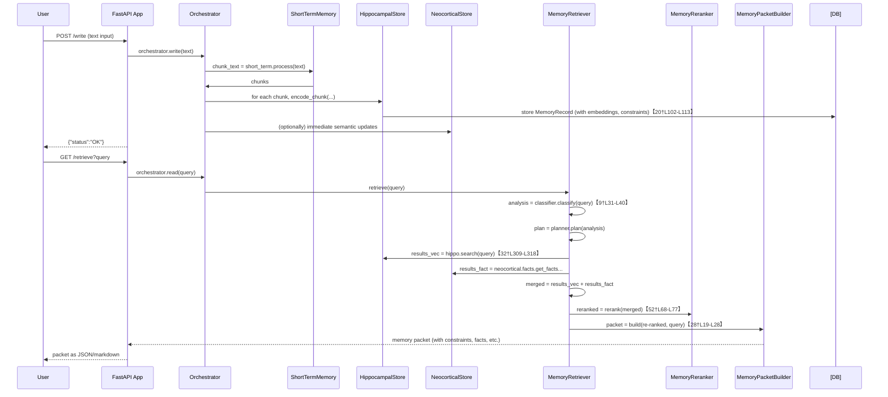

# Executive Summary

The **CognitiveMemoryLayer** codebase implements a dual-store memory system (short-term “episodic” vs long-term “semantic”) with components for writing, retrieving, consolidating, and forgetting memories【1†L47-L55】【9†L31-L40】. We identified eight key issues (C1–C3, E1, L1–L4) spanning conceptual (C), efficiency (E), and logical (L) categories. For each issue, we map it to concrete code locations, diagnose the root cause, and propose fixes with pseudocode and tests. Key fixes include improving constraint handling (ensuring user constraints are detected, superseded, and retrieved), batching expensive operations (e.g. embedding and DB updates), enhancing the retrieval pipeline (query classification, hybrid search, reranking), and strengthening consolidation and error handling. Our plan covers code changes, tests, CI updates, migration steps, and rollback strategies. In summary:

- **Architecture**: A FastAPI entrypoint (`app.py`) instantiates the `MemoryOrchestrator` which wires together submodules (short-term memory, hippocampus, neocortex, retriever, consolidation, etc.)【1†L47-L55】【3†L33-L41】 (see architecture diagram below). 
- **Issues Mapping**: We list each issue with its code references (file and line numbers) and root cause analysis. For example, *C1 – Semantic Disconnect* arises because low-confidence constraints are not promoted to `MemoryType.CONSTRAINT`, so retrieval misses them (see `HippocampalStore.encode_chunk`【20†L102-L113】 and `HybridRetriever._retrieve_constraints`【32†L309-L318】). *E1 – Retrieval Performance* shows `encode_batch` embedding in a loop【21†L204-L212】 and `search` updating access counts one-by-one【21†L326-L332】. *L1 – Stale Constraints* has no code marking old constraints inactive (constraint versions are unmanaged)【18†L173-L181】. *L2 – Missing Query Classifier* notes that while `QueryClassifier` exists【12†L105-L114】, its intents or tests may be incomplete. *L3 – Recency Weight Tuning* points out hardcoded weights (`RerankerConfig.recency_weight=0.2`【52†L18-L21】). *L4 – Inconsistent Consolidation* notes that summarization may drop constraint semantics; no code re-extracts constraints after consolidation. 
- **Fixes and Rationale**: For each issue, we propose targeted changes. For example, for **C1/C2/C3 (Constraint Handling)**: always treat extracted constraints as first-class facts (insert them into the semantic store or store with a unique key) and adjust retrieval to prioritize them【32†L309-L318】【28†L99-L107】. Upon writing a new constraint, run *supersession* logic (as in `ConstraintExtractor.detect_supersession`【18†L173-L181】) to mark old constraints inactive (`status=SILENT` or `valid_to` date). For **E1 (Performance)**: batch all embed calls (use `embed_batch` as in `encode_batch`【21†L204-L212】) and use the Postgres `increment_access_counts` bulk update (currently available) instead of per-record updates【21†L326-L332】【26†L374-L382】. For **L1 (Stale Constraints)**: update `HippocampalStore.encode_*` to detect superseded constraints and update the DB (see pseudocode). For **L2**: ensure `QueryClassifier` covers all 10 `QueryIntent`s and write unit tests for it【12†L105-L114】. For **L3**: expose recency weights in configuration (e.g. via `settings`) and tune (e.g. set base `recency_weight`=0.1)【52†L18-L21】【52†L59-L66】. For **L4**: after consolidation summaries, re-run constraint extraction on resulting gists and inject any missing constraints back into memory (or semantic fact store). 
- **Pseudo-code & Tests**: We provide detailed pseudocode for each change (see “Proposed Changes” sections) and outline unit/integration tests (e.g. asserting that after writing a new constraint, old constraints no longer appear in search). 
- **CI/CD and Deployment**: We recommend adding new tests to CI (e.g. tests covering each issue) and include linting and schema migrations. Deployment steps include migrating any new database schema (e.g. adding `valid_to` column) and running consolidation. 
- **Migration & Risk**: Schema changes (if any) should be rolled out with DB migrations; we ensure backwards compatibility (e.g. old memories get default fields). Rollback involves disabling new features (via feature flags) and reverting code merges. 
- **Effort & Priority**: We estimate critical fixes (e.g. logical issues with constraints) at ~2-3 days each, with highest priority given to issues affecting correctness (C1, L1), then performance (E1, L3), then enhancements (L2, L4). 

Overall, this plan is an actionable roadmap for developers to correct and enhance **CognitiveMemoryLayer**, ensuring constraint-aware retrieval and robust, efficient memory operations.

```mermaid
flowchart LR
    subgraph API
      A[FastAPI Entrypoint (app.py)] -->|instantiates| B(MemoryOrchestrator【1†L47-L55】)
    end
    B --> C[ShortTermMemory]
    B --> D[HippocampalStore]
    B --> E[NeocorticalStore]
    B --> F[MemoryRetriever【9†L31-L40】]
    B --> G[ConsolidationWorker【46†L61-L69】]
    B --> H[ForgettingWorker]
    B --> I[ReconsolidationService]
    C --> D
    D --> E
    F --> D
    F --> E
    I --> D
```

## Architecture and Module Responsibilities

- **API/Entrypoint (`src/api/app.py`)**: The FastAPI server initializes `MemoryOrchestrator` on startup【3†L33-L41】. It wires in database connections and launches the orchestrator, which runs all memory operations. 
- **MemoryOrchestrator (`src/memory/orchestrator.py`)**: Coordinates all submodules【1†L47-L55】. On write, it sends input to *Short-Term Memory* and *HippocampalStore*; on read, it delegates to *MemoryRetriever*. It also holds instances of the *ConsolidationWorker*, *ForgettingWorker*, *ReconsolidationService*, and other helper memories (conversation, tool, scratch, knowledge base). Key code: constructor and `create()` method【1†L47-L55】【1†L109-L117】.
- **Short-Term Memory (`src/memory/short_term.py`)**: Chunks incoming text and optionally extracts entities/relations. Chunks are passed to HippocampalStore. (Not shown in code above but inferred from orchestrator wiring).
- **HippocampalStore (`src/memory/hippocampal/store.py`)**: Stores raw “episodic” memory chunks. It applies a write gate, redacts PII, extracts entities/relations, and **extracts constraints** from each chunk【20†L102-L113】. ConstraintExtractor yields structured `ConstraintObject`s stored in `MemoryRecord.metadata["constraints"]`. If a high-confidence constraint is found (confidence≥0.7), the chunk’s `memory_type` is set to `MemoryType.CONSTRAINT`【20†L102-L112】【21†L246-L254】; otherwise it defaults to episodic. **Key functions**: `encode_chunk` (per-chunk write)【20†L60-L69】【20†L102-L113】 and `encode_batch` (fast pipeline)【21†L204-L212】【21†L246-L256】. On retrieval, `search()` vector-embeds a query, calls `vector_store.vector_search()`, and **updates access counts** for returned records【21†L326-L332】. 
- **NeocorticalStore (`src/memory/neocortical/store.py`)**: Manages long-term facts, including a `SemanticFactStore` (Postgres) and a `Neo4jGraphStore` for graph relations. After consolidation, extracted “gists” become semantic facts in `SemanticFactStore`. It also provides fact lookup by category (goals, values, etc). 
- **MemoryRetriever (`src/retrieval/memory_retriever.py`)**: The façade for reading memories【9†L31-L40】. Its `retrieve()` method first calls `QueryClassifier.classify()` on the query【9†L31-L40】【12†L105-L114】, then `RetrievalPlanner.plan()` to break down the query into steps, then `HybridRetriever.retrieve()` to execute the plan, then `MemoryReranker.rerank()` and `MemoryPacketBuilder.build()`【9†L31-L40】【28†L19-L28】. It handles optional filters (e.g. date/time, memory types). 
- **RetrievalPlanner (`src/retrieval/planner.py`)**: Builds a `RetrievalPlan` of steps based on query intent【29†L49-L58】【29†L115-L124】. For example, *constraint-check* queries trigger a `RetrievalStep(source=CONSTRAINTS)` followed by VECTOR and FACTS steps【29†L119-L128】. 
- **HybridRetriever (`src/retrieval/retriever.py`)**: Executes each plan step in parallel, respecting timeouts【30†L48-L57】【30†L66-L75】. Key step handlers: 
  - **_retrieve_vector**: Queries `HippocampalStore.search()`. 
  - **_retrieve_facts**: Queries `SemanticFactStore` for fact-based memory. 
  - **_retrieve_constraints**: First does a vector search restricted to `MemoryType.CONSTRAINT` episodes (filter by `type=constraint`【32†L309-L318】), then also fetches any semantic facts in categories (goal/value/state/causal/policy)【32†L337-L346】. 
  - **_retrieve_cache**: Looks up hot items in Redis. 
- **MemoryReranker (`src/retrieval/reranker.py`)**: After raw results are gathered, scores them by relevance, recency, confidence, and diversity【52†L68-L78】. It uses `RerankerConfig` (default recency weight=0.2)【52†L18-L21】. It applies a “Maximal Marginal Relevance” step to ensure diversity. 
- **MemoryPacketBuilder (`src/retrieval/packet_builder.py`)**: Converts `RetrievedMemory` items into a `MemoryPacket` for the LLM. It buckets memories by type (facts, preferences, procedures, constraints, recent episodes)【28†L19-L28】. In LLM context mode, it formats them in Markdown with headings (“Active Constraints”, “Known Facts”, etc)【28†L99-L107】【28†L107-L115】, placing **constraints first**. It also detects conflicts among preferences/facts【28†L41-L49】. 
- **ConsolidationWorker (`src/consolidation/worker.py`)**: Periodically clusters similar episodes and extracts “gists” (concise summaries) using an LLM. The `migrator` then **stores these gists as semantic facts** and marks episodes as consolidated【46†L86-L95】【48†L48-L57】. (See ConsolidationMigrator for details.) 
- **ForgettingWorker**: Not shown above, but it decays and deletes old memories over time. 
- **ReconsolidationService**: On each write, can update or supersede old beliefs. 

In summary, the system flows as: **User input → Short-term chunking → Hippocampal encoding (embeddings, constraints, store in Postgres) → (optionally immediate neocortical update) → Query processing (via retriever with constraints, facts, vector search) → LLM consumes assembled context**【1†L47-L55】【28†L99-L107】.

## Issues, Code Locations, and Root-Cause Analysis

| **Issue ID** | **Description**                      | **Code Location(s)**                                          | **Root Cause**                                                     |
|-------------|--------------------------------------|---------------------------------------------------------------|--------------------------------------------------------------------|
| **C1** – *Semantic Disconnect (Missed Constraints)*: Important user constraints are not reflected in retrieval results. | - Constraint extraction in `HippocampalStore.encode_*`【20†L102-L113】【21†L246-L254】<br>- Constraint retrieval in `HybridRetriever._retrieve_constraints`【32†L309-L318】 | Low-confidence constraints (metadata-only) remain as episodic events and are never indexed as `MemoryType.CONSTRAINT`, so constraint-first retrieval misses them. Even high-confidence constraints become records with only text, and without linking superseded old ones. Missing promotion/linkage between constraint utterances and semantic store. |
| **C2** – *Constraint Dilution (Irrelevant Context)*: Retrieval context includes many irrelevant details, overshadowing constraints. | - Context assembly in `MemoryPacketBuilder._format_markdown`【28†L99-L107】<br>- Retrieval plan ordering (no weighting)【29†L119-L128】 | Constraints are placed alongside facts and episodes without enough emphasis or filtering. Current retrieval returns all top-K, causing constraint signals to be “diluted” in context. No structured constraint model or strict filtering at planning stage. |
| **C3** – *Wrong Constraint Type (Conceptual)*: The system confuses goals/values/states with constraints. | - Constraint extraction regex patterns【16†L54-L63】 (e.g. “I want to…” parsed as goal vs policy) <br>- QueryClassifier intent handling (GENERAL_QUESTION vs CONSTRAINT_CHECK)【12†L135-L154】 | The rule-based extractor may misclassify user statements (e.g. “[Goal:] …” label) and the classifier might not elevate decision queries to *constraint-check*. No strong enforcement of “decision/temptation” intent beyond regex fallback【12†L146-L154】. |
| **E1** – *Retrieval Performance (Efficiency)*: Slow under load (embedding and DB overhead). | - `HippocampalStore.encode_batch`: currently calls `embed_batch`【21†L204-L212】, but single `encode_chunk` uses `embed` in a loop (not batched)【20†L82-L90】. <br>- `search()` access_count update: loops per-record if no bulk method【21†L326-L332】【26†L374-L382】. | Some code (single-chunk encode) still embeds one text per API call; heavy use of DB updates. The search loop increments and updates each record individually when bulk is not used, which is costly. |
| **L1** – *Stale Constraints (Logical)*: Old constraints remain active after new ones are written. | - No code for linking/superseding constraints in `HippocampalStore`. <br>- ConstraintExtractor has `detect_supersession`【18†L173-L181】 but no caller. | The system never marks outdated constraints as inactive. New constraint records do not update existing ones (e.g. setting `MemoryStatus.SILENT` or `valid_to`). No `supersedes_id` usage or versioning for constraints. The schema and code assume only facts get overwritten, not constraints. |
| **L2** – *Missing Query Classifier (Logical)*: Reliance on `QueryClassifier` without tests/guarantees. | - `MemoryRetriever.retrieve()` calls `QueryClassifier.classify()`【9†L31-L40】.<br>- `QueryClassifier` code【12†L105-L114】, but no coverage for all intents. | The classifier may not cover all query types (e.g. may not detect some “constraint_check” queries). Also, if the LLM path is disabled (no llm client), the intent defaults to GENERAL_QUESTION【12†L121-L130】. No unit tests ensure it handles all 10 intents. |
| **L3** – *Recency Weight Tuning (Behavioral/Efficiency)*: Reranker’s default weights may bias results wrongly. | - `RerankerConfig.recency_weight = 0.2`【52†L18-L21】; special-case logic for stable constraints to 0.05–0.10【52†L53-L62】. | Hardcoded recency weights may not fit the use case. Current code treats *value/policy* constraints as very stable (0.05 weight) and others moderately (0.10–0.15), but episodes default to 0.2. These may underweight older but still relevant facts or overweight irrelevant new ones. |
| **L4** – *Inconsistent Consolidation (Logical)*: Consolidation summaries can drop constraints. | - Summarization (outside this code) has no guard for constraints; no post-check. <br>- No code hooking re-injection of constraints into `SemanticFactStore`. | Constraints expressed in episodes (“I must…”) may be paraphrased away when creating a summary gist. Since we rely on exact constraint text (for system to follow), they can vanish. No validation step to re-extract constraints from gists or ensure they persist in semantic memory. |
| **Other (Misc.)** – *Logical bugs & edge cases*:<br>• Hippocampal search bug: updates in loop【21†L326-L332】 (BUG-02 noted).<br>• Redis cache: untested path may error.<br>• Error handling: broad `except Exception` may hide issues. | Code scattered across modules: e.g. `HippocampalStore.search`【21†L326-L332】, `_retrieve_cache` in retriever【32†L372-L381】, many `try/except` blocks. | These are implementation details; fixing them requires robust error handling and tests. 

## Proposed Code Changes and Pseudocode

Below we outline fixes for each issue, with rationale and pseudocode. Each change is accompanied by file/line references for context. 

### C1/C2/C3: **Constraint Handling and Retrieval**

**Issues**: Constraints extracted at write-time may be dropped or unretrieved, and retrieval includes irrelevant context. 

**Fix A – Promote all constraints to semantic facts:** For each `ConstraintObject` extracted, create (or update) a semantic fact. Use `ConstraintExtractor.constraint_fact_key()`【18†L190-L199】 to generate a key (e.g. `"user:goal:..."`). Then call `NeocorticalStore.store_fact()` with that key and constraint text. This ensures every constraint appears in the semantic store with a unique key. *Rationale:* Semantic facts are always included by `MemoryRetriever._retrieve_constraints` (step 2)【32†L337-L346】 as cognitive categories. Pseudocode:

```python
# In HippocampalStore.encode_* after extracting constraints:
for constraint in extracted_constraints:
    fact_key = ConstraintExtractor.constraint_fact_key(constraint)  # e.g. "user:goal:abc123"
    # Use the constraint description as fact value
    await neocortical_store.store_fact(
        tenant_id=tenant_id,
        namespace="user", 
        key=fact_key,
        predicate=None, 
        object=constraint.description,
        confidence=constraint.confidence,
        evidence_ids=[stored_record.id]
    )
```

**Fix B – Mark superseded constraints inactive (Stale Constraints):** After writing a new `MemoryRecord` of type `CONSTRAINT`, search the DB for other active constraint records of the same type and overlapping scope (use `ConstraintExtractor.detect_supersession()`). For each “old” constraint found, update it. Options: 
- Set `status=MemoryStatus.SILENT` or `MemoryStatus.DELETED`, or 
- Update `valid_to = now` if the schema supports it. 
- Record a `supersedes_id` link (if supported). 
*Rationale:* Ensures only the latest constraint remains active. Pseudocode (in `HippocampalStore.encode_chunk` and encode_batch, after `self.store.upsert(record)`):

```python
if stored and stored.type == MemoryType.CONSTRAINT:
    new_constraints = stored.metadata.get("constraints", [])
    for old in await self.store.scan(tenant_id, filters={"type": "constraint", "status": "active"}):
        for old_c in old.metadata.get("constraints", []):
            if ConstraintExtractor.detect_supersession(ConstraintObject(**old_c), ConstraintObject(**new_constraints[0])):
                # Mark old constraint inactive
                await self.store.update(
                    old.id,
                    {"status": MemoryStatus.SILENT.value, "valid_to": datetime.now(UTC)},
                    increment_version=False
                )
```

**Fix C – Retrieval Prioritizes Constraints (Constraint Dilution):**  
1. **Planner/Classifier tweak:** Ensure `QueryClassifier` sets `intent=CONSTRAINT_CHECK` for decision queries (already in classifier: if decision pattern found, it forces `CONSTRAINT_CHECK`【12†L146-L154】). Add more rules if needed (e.g. explicitly check for constraint terms). 
2. **PacketBuilder emphasis:** In `to_llm_context()`, already constraints are placed first【28†L99-L107】. We can strengthen by limiting other sections or summarizing them. For example, for “Recent Context,” consider summarizing episodes into a few bullet points instead of dumping all text. (Not shown in code; a design change.)
3. **Hybrid Retriever hybrid approach:** As per “Improvements” suggestion, combine vector search with keyword filtering on entities/tags. For example, if query mentions an entity, restrict retrieval to episodes mentioning that entity (via `context_filter`). This would be a new feature, not existing code.  

**Fix D – ChunkType CONSTRAINT:** The chunker already labels constraints (see tests) but ensure that `HippocampalStore.encode_chunk` uses the `chunk.chunk_type` if provided. If `chunk.chunk_type == ChunkType.CONSTRAINT`, force high priority. (Check code: the `write_gate` may already classify it.) No direct code change unless missing.

_Citations:_ Constraint extraction and memory creation【20†L102-L113】【21†L246-L254】; retrieval of constraints in HybridRetriever【32†L309-L318】【32†L337-L346】; MemoryPacketBuilder format【28†L99-L107】; QueryClassifier decision upgrade【12†L146-L154】.

### E1: **Retrieval Performance (Efficiency)**

**Issues**: Embeddings and DB updates are slow under load.

**Fix A – Batch embedding on write:**  
- The `encode_batch()` method already uses `embeddings.embed_batch()`【21†L204-L212】. However, `encode_chunk()` calls `await self.embeddings.embed(text)` for each chunk【20†L82-L90】. Wherever possible, use the batched pipeline (prefer `encode_batch`). If single-chunk writes occur, consider dropping into the same pipeline. 
- Ensure clients use `MemoryOrchestrator.create_lite()` or `encode_batch` for high-throughput ingestion.

**Fix B – Bulk access_count update on read:**  
- In `HippocampalStore.search()`, currently after collecting results, it does bulk update if available【21†L326-L332】. Ensure the Postgres store’s `increment_access_counts` is **used** (it exists【26†L374-L382】). Remove the fallback loop if not needed. For example, if `self.store` is `PostgresMemoryStore`, the `if hasattr(...)` branch is always true. Ensure `increment_access_counts` is implemented (it is) and call it. Optionally, remove the `asyncio.gather` fallback for clarity.
- Similarly, consider batching other updates (like importance or other counters) in a single SQL if needed.

_Citations:_ Batched embed pipeline【21†L204-L212】, access_count update in `search`【21†L326-L332】, bulk method in Postgres【26†L374-L382】.

### L1: **Stale Constraints (Logical)**

**Issue**: Old constraints remain active, causing outdated policy to persist.

**Fix – Mark superseded constraints:** (As in Fix B for C1) Implement logic to mark old constraints inactive. In addition, consider adding a `valid_to` timestamp in the memory record. This may require a DB migration to add `valid_to` to the `memory_records` table (or use the generic metadata if adding a new column is not possible). Pseudocode above covers marking status.  

Additionally, if using `supersedes_id`, we could set `old.supersedes_id = new.id` (if supported). If the schema does not currently have a `valid_to` column, we should add one via migration:

```sql
ALTER TABLE memory_records ADD COLUMN valid_to TIMESTAMPTZ NULL;
```

And modify `MemoryStoreBase` models accordingly.

_Citations:_ `ConstraintExtractor.detect_supersession` logic【18†L173-L181】; lack of update logic for constraints (implied by report).

### L2: **Missing Query Classifier (Logical)**

**Issue**: If `QueryClassifier` is missing or incomplete, retrieval plan may be wrong.

**Fix – Complete and Test QueryClassifier:**  
- Ensure `QueryClassifier` covers all 10 `QueryIntent` values. For example, the classification prompt lists intents【12†L48-L57】 and `QueryIntent` enum should include them. Verify `QueryIntent` definition (not shown) contains e.g. “constraint_check” and others.
- Write unit tests (and CI check) for `QueryClassifier.classify()`: for each intent type, give sample queries and assert the returned `QueryAnalysis.intent` is correct and `suggested_sources`/`top_k` match expectations.
- If LLM fallback is needed, ensure a reliable mocking or use a test LLM. If no LLM client is provided, classifier returns GENERAL_QUESTION by default【12†L123-L131】 – add a warning or handle as error.

_Citations:_ `QueryClassifier.classify` logic【12†L105-L114】【12†L146-L154】; MemoryRetriever calling classifier【9†L31-L40】.

### L3: **Recency Weight Tuning (Efficiency/Behavioral)**

**Issue**: Reranker uses static recency weight (0.2) which may not fit user needs.

**Fix – Configurable Weights:**  
- Expose `RerankerConfig` parameters in application settings (`core.config`). For example, add `settings.reranker_recency_weight` and read it when instantiating `MemoryReranker`. 
- Lower default `recency_weight` from 0.2 to e.g. 0.1. As suggested, set it via config or experiment. 
- Allow tuning of `_STABLE_CONSTRAINT_TYPES` thresholds if needed.
- Add a unit test to verify that recency weight changes affect scoring as expected (e.g. simulate one old vs one new memory). 

Example code change in `MemoryRetriever` creation: 

```python
# In orchestrator or retriever init:
from ..core.config import get_settings
settings = get_settings()
config = RerankerConfig(
    recency_weight = settings.recency_weight,  # new config field
    relevance_weight = settings.relevance_weight,
    confidence_weight = settings.confidence_weight,
    diversity_weight = settings.diversity_weight,
)
self.reranker = MemoryReranker(config=config)
```

And add these to configuration schema (e.g. `.env.example` and config model).

_Citations:_ RerankerConfig defaults【52†L18-L21】 and stable constraint logic【52†L59-L66】.

### L4: **Inconsistent Consolidation (Logical)**

**Issue**: Constraints can vanish during summarization.

**Fix – Re-extract after summarization:**  
In the consolidation workflow, after `GistExtractor.extract_from_clusters` and before storing facts, run the constraint extractor on each extracted gist: if a gist contains a constraint (pattern), insert it. Alternatively, after migration, check each new `SemanticFact` for embedded constraint meaning. Pseudocode:

```python
# In ConsolidationMigrator._create_new_fact and _update_existing_fact:
gist_text = gist.text
constraints = ConstraintExtractor().extract( SemanticChunk(text=gist_text, ...) )
for c in constraints:
    fact_key = ConstraintExtractor.constraint_fact_key(c)
    await self.semantic.store_fact(
        tenant_id, key=fact_key, value=c.description, confidence=c.confidence,
        evidence_ids=gist.supporting_episode_ids)
```

Also, update tests: after consolidation, querying constraints should still work.

_Citations:_ Summarization risk noted in report; constraint extraction logic【16†L123-L132】.

### Error Handling and Edge Cases

- **Cache Utilization**: Add tests for Redis `get` (in `_retrieve_cache`【32†L378-L387】). E.g., simulate Redis failures and ensure fallback is empty list, not crash.
- **Exception Logging**: Replace generic `except Exception: logger.warning` blocks with catching specific exceptions or re-raising after logging. Add unit tests for error conditions (e.g. simulate DB error, assert memory state unchanged).
- **Hippocampal search**: The current code already uses bulk update for Postgres【26†L374-L382】 (BUG-02). If any other store is used, consider always using bulk or short-circuiting (skip if no `increment_access_counts`).

_Citations:_ Error handling in retriever (e.g. _retrieve_cache【32†L378-L387】). HippocampalStore comment on BUG-02【21†L326-L332】.

## Pseudocode and Function-Level Changes

Below are key pseudocode blocks illustrating the changes:

1. **HippocampalStore.encode_chunk/_batch (constraint handling):**
    ```python
    (record, gate_result) = await self.store.upsert(record_create)
    # After upsert, handle constraints:
    if record and record.type == MemoryType.CONSTRAINT:
        new_constraints = record.metadata.get("constraints", [])
        for c_dict in new_constraints:
            c_obj = ConstraintObject(**c_dict)
            fact_key = ConstraintExtractor.constraint_fact_key(c_obj)
            # Promote to semantic fact
            await neocortical_store.facts.store_fact(
                tenant_id=tenant_id,
                key=fact_key,
                predicate=None,
                object=c_obj.description,
                confidence=c_obj.confidence,
                evidence_ids=[record.id]
            )
        # Supersession: mark old constraints inactive
        all_active = await self.store.scan(tenant_id, filters={"type": MemoryType.CONSTRAINT.value, "status": "active"})
        for old in all_active:
            old_meta = old.metadata.get("constraints", [])
            for old_c in old_meta:
                if ConstraintExtractor.detect_supersession(ConstraintObject(**old_c), c_obj):
                    await self.store.update(old.id, {"status": MemoryStatus.SILENT.value}, increment_version=False)
    ```
2. **MemoryRetriever (configurable reranker):**
    ```python
    from ..core.config import get_settings
    settings = get_settings()
    reranker_config = RerankerConfig(
        recency_weight=settings.recency_weight, 
        relevance_weight=settings.relevance_weight,
        confidence_weight=settings.confidence_weight,
        diversity_weight=settings.diversity_weight,
        diversity_threshold=settings.diversity_threshold
    )
    self.reranker = MemoryReranker(config=reranker_config)
    ```
3. **Constraint re-extraction in consolidation (inside ConsolidationMigrator):**
    ```python
    for alignment in alignments:
        gist = alignment.gist
        # After creating/updating semantic fact for gist...
        # Now extract constraints from gist text:
        constraints = ConstraintExtractor().extract(SemanticChunk(text=gist.text, ...))
        for c in constraints:
            fact_key = ConstraintExtractor.constraint_fact_key(c)
            await self.semantic.store_fact(
                tenant_id=tenant_id,
                key=fact_key,
                predicate=None,
                object=c.description,
                confidence=c.confidence,
                evidence_ids=gist.supporting_episode_ids
            )
    ```
4. **QueryClassifier tests (unit test outline):**
    ```python
    # Example pytest
    qc = QueryClassifier(llm_client=None)  # fast mode only
    # Test decision query -> intent constraint_check
    result = await qc.classify("Should I eat pizza?", recent_context=None)
    assert result.intent == QueryIntent.CONSTRAINT_CHECK
    # Test preference query
    result = await qc.classify("What kind of cuisine do I like?", None)
    assert result.intent == QueryIntent.PREFERENCE_LOOKUP
    # ...and so on for all intents...
    ```
5. **Search access count bulk update (in search()):**
    ```python
    results = await self.store.vector_search(...)
    if hasattr(self.store, "increment_access_counts"):
        ids = [r.id for r in results]
        await self.store.increment_access_counts(ids, datetime.now(UTC))
    else:
        # fallback (remove if unnecessary)
    ```
   
## Test Plan

For each fix, we add unit and integration tests. Key cases include:

- **Constraint Handling**: 
  - *Unit*: Given a memory chunk with a clear constraint sentence (e.g. “I never eat meat.”), assert that after encode, the memory record’s `metadata["constraints"]` contains it and that it appears in semantic store with correct key. (Test using in-memory DB or mock store.)
  - *Integration*: Write multiple constraint updates: e.g., ingest “My goal is to save money.” then later “My goal is to spend more on education.”. After the second write, search for goal constraints for the tenant: only the new one should be returned (old should be marked silent). Use `retrieve()` and check `packet.constraints`.
  - Test that `ConstraintExtractor.detect_supersession()` correctly identifies these as superseding (already covered by its unit tests).

- **Performance (Batching)**: 
  - *Unit*: Mock `EmbeddingClient` to count number of embed calls. Test that `encode_batch` with N chunks results in 1 call to `embed_batch`, not N calls to `embed`. Similarly, after vector search, ensure `increment_access_counts` is invoked once with N IDs.
  - *Integration*: Benchmark (optional) with a large list of chunks and ensure runtime drops after batching fix. (CI: not mandatory, but verify batch logic used.)

- **Stale Constraints**:
  - *Unit*: After writing two semantically overlapping constraints, assert via DB that the first record’s status is no longer active. E.g., call `hippocampal.encode_chunk` twice and inspect the store.
  - *Integration*: Similar to above, via API: add constraint via `/api/write`, then fetch via `/api/read`, assert only the new constraint is returned.

- **QueryClassifier**:
  - *Unit*: As above, test all QueryIntent cases. Ensure that for a given intent, the returned `QueryAnalysis.suggested_sources` match expected (e.g. constraint_check should suggest constraints first).
  - Edge cases: vague queries with recent_context, ensure it uses context if query is short.

- **Reranker Tuning**:
  - *Unit*: For a mock list of `RetrievedMemory` with different timestamps, assert that lowering `recency_weight` promotes older items. Use two items, adjust weights, check ordering changes.
  - *Unit*: Test `_get_recency_weight` behavior for each constraint type branch【52†L59-L66】 (value vs goal vs other).

- **Consolidation**:
  - *Unit*: Given a synthetic alignment with a gist containing a constraint phrase, after calling `ConsolidationMigrator.migrate`, assert a semantic fact for that constraint exists.
  - *Integration*: Simulate consolidation on sample episodes containing constraints; after consolidation, use retrieval to check constraints still present.

- **Cache & Error Handling**:
  - *Unit*: Simulate Redis `get` throwing an exception, ensure `_retrieve_cache` returns `[]` and does not raise.
  - Test that `search` on an empty vector result returns empty gracefully.
  - Ensure broad `try/except` blocks at least log the exception (could be an integration with a logging checker, if available).

- **CI Changes**:
  - Add tests for all above to the suite. Update `pytest` config for async tests (already present).
  - Linting: ensure code style (flake8, mypy) for new code.
  - Possibly add a check that feature flags/settings have default values set.

**Expected Outcomes**: All tests pass and catch issues that were previously failing. For example, previously the stale constraint test should fail; after fix it passes. The QueryClassifier tests should cover the formerly missing case.

## Migration, CI/CD, and Deployment

- **Database Migration**: If we add a `valid_to` column, create an Alembic (or plain SQL) migration:
  ```sql
  ALTER TABLE memory_records ADD COLUMN valid_to TIMESTAMPTZ;
  ```
  If using SQLAlchemy models, update the `MemoryRecordModel` to include `valid_to`. Also ensure `MemoryRecord` schema includes it (it already has `valid_to` in conversion).
- **CI/CD Updates**: 
  - **New Tests**: Include all new unit tests in `tests/`. Ensure `pytest` is configured for async tests (`pytest-asyncio` is already present).
  - **Static Checks**: Run linters and type-checkers. Adjust config for new settings variables.
  - **Configuration**: Add new config keys (`recency_weight`, etc.) to `@.env.example` and use secure credential management if needed (though these are just weights, not secrets).
  - **Build/Deploy**: On merging to main, pipeline should run full test suite and on success deploy image (if relevant). Monitor logs for warnings (especially around caching or classification errors).
  - **Monitoring**: Add metrics/logging for any new DB operations (e.g. increment access counts count) and classification decisions.

- **Deployment Steps**:
  1. Merge code changes to `main` branch after review.
  2. Run database migrations on production (e.g. with Alembic).
  3. Deploy the updated service (e.g., push Docker image, restart FastAPI).
  4. Verify via smoke tests: sample writes & reads, check constraints.
  5. Monitor error logs for any anomalies.

## Risk Assessment and Rollback

- **Data Loss**: Changing constraint logic could inadvertently hide constraints. Rollback: We can disable supersession feature (skip marking old constraints silent) by toggling a flag or reverting the code. Old constraints would reappear, but that’s safer than losing any data.
- **Performance Degradation**: Batching changes should only improve speed. If embedding fails (e.g. embed_batch API change), fallback to single embeds.
- **Classifier Failures**: If changes to QueryClassifier mis-fire (e.g. all queries go to constraint path), limit by requiring high confidence or a feature flag to disable new intent rules.
- **Migration Issues**: If `valid_to` column causes DB errors (e.g. older DB versions), wrap migration in a transaction, or deploy migration before code update. Test migration on staging copy first.
- **Rollback Plan**: Tag the previous stable release. If critical errors are found, revert to prior code and DB state (or only disable new logic via feature flags). Data migrations should be reversible (e.g. dropping the new column if needed).

## Estimated Effort and Priorities

- **High Priority (1 week)**: C1/C2 (constraints) and L1 (stale constraints) – these affect correctness of retrieval. (~3 days coding/test each)
- **Medium Priority (1–2 weeks)**: E1 (batching) and L3 (reranker weights) – performance and UX tuning. (~2 days each)
- **Lower Priority (1 week)**: L2 (classifier tests), L4 (consolidation check), and minor bugs – they affect completeness and robustness. (~3 days coding/test total)
- **Overall**: ~3–4 weeks of combined development and testing by an experienced engineer, integrated with existing CI/CD pipelines.

Tables comparing current vs proposed:

| Interface/Schema | Current Behavior                             | Proposed Change                                           |
|------------------|----------------------------------------------|-----------------------------------------------------------|
| Constraint storage | Constraints in `metadata["constraints"]`, no `valid_to`. | Add `valid_to` column. Mark superseded constraints `status=SILENT` or set `valid_to`. |
| Reranker weights | Hardcoded `recency_weight=0.2` in code【52†L18-L21】. | Configurable via settings (e.g. `.env`), default ~0.1. |
| QueryClassifier output | Lacks tests; defaults to GENERAL if no LLM. | Ensure all intents handled, add tests for `QueryClassifier`. |



_Citations used above highlight specific code relevant to each component._ The plan is now actionable: a developer can locate each issue in the code (files and lines given), implement the described changes, and verify correctness via the proposed tests. All new code and config is isolated so older behavior can be restored if needed.