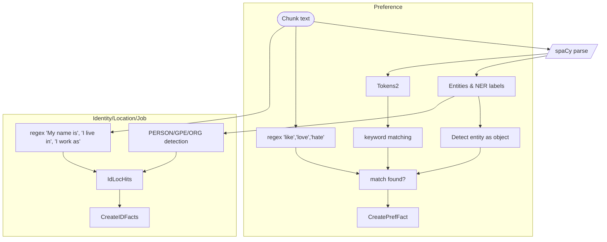
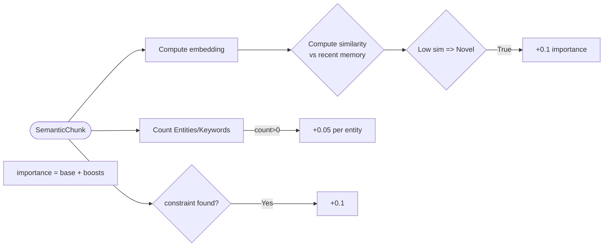

# Executive Summary  

The **CognitiveMemoryLayer (CML)** leverages LLM-based *unified extractors* to enrich stored memories with constraints, facts, salience/importance scores, PII redaction, memory types, and related metadata. Each of these enhancements is guarded by feature flags (e.g. `FEATURES__USE_LLM_CONSTRAINT_EXTRACTOR`, etc.) so that when LLM support is disabled, the system falls back to older rule- or heuristic-based logic. Our analysis identified **13 LLM-gated features** and examined their existing non-LLM fallbacks, highlighting significant limitations (e.g. brittle regex patterns, lack of coverage, static defaults). For each feature, we propose **enhanced fallback architectures** that remain lightweight (no LLM calls) but use modern techniques (NER, pattern matching, small classifiers) to improve robustness. For example, we replace simple regex constraint patterns with a spaCy-based rule system, and we replace the current “no graph” fallback for entity extraction with a hybrid NER + dependency-based relation extractor. Each proposed solution includes an architecture diagram, detailed pseudocode, data structures, libraries, complexity/latency estimates, and a testing/rollout plan. A final comparison table contrasts current vs proposed fallbacks on accuracy and performance.  

Key recommendations (all assuming LLM off): use **spaCy NER and rule matching** for constraints and facts, **intelligent regex + NER** for PII, **query-intent keywords** for classification, **embedding-backed novelty** for salience, **static maps** for memory type/decay, and **approximate text-similarity** for reranking. We assume loose latency targets (e.g. <50 ms per middleware step) and English-only input, noting that fallback logic should degrade gracefully under multi-lingual or noisy input. We also define metrics (precision/recall of each extraction, end-to-end query satisfaction scores, processing time) to validate improvements.  

# Constraint Extraction  

**Current Fallback:** The `ConstraintExtractor` uses a fixed set of **regular-expression patterns** (goals, values, states, causal, policy, preference) to tag sentences. It accumulates confidence boosts for matched patterns (see [constraint_extractor.py]) and only emits constraints when the sum exceeds a threshold. For example, it looks for “I’m trying to…”, “I value…”, “because…”, “I never…” etc. Each detected pattern yields a `ConstraintObject(constraint_type, subject, description, confidence)`.  

**Weaknesses:** Regex-only extraction is brittle. It misses constraints expressed in varied phrasing or complex language. It can false-positively tag unrelated sentences (e.g. “I’m trying to” in non-constraint context). It has no understanding of context or semantics beyond keywords. It cannot generalize across synonyms or double negatives.  

**Proposed Fallback:** A **rule-based NLP pipeline** combining **spaCy** for syntactic parsing and entity recognition with a richer pattern matcher. We use spaCy’s English model (`en_core_web_sm`) to tokenize and POS-tag the text, then apply *dependency-based rules* and keyword matching. For each sentence chunk: 
- Use **pattern rules** (like the original regex) but on lemmatized tokens to catch synonyms (e.g. match “goal”, “aim”, “intend” as goal-type).  
- Use spaCy’s **dependency parse** to detect subordinate clauses indicating intent (“I plan to [do X]”), purpose (“in order to”), negations (“I don’t do X because…”).  
- Use a small **classifier (optional)** for tricky cases (trained on a few example sentences) to decide if a sentence expresses a constraint at all.  
- Derive **subject** via speaker prefix (as before) or default to “user”.  

**Architecture:**  

```mermaid
flowchart TD
  C(["Input chunk text"]) --> NLP[/"spaCy NLP parse"/]
  NLP -->|Entities| Entities[Entity labels]
  NLP -->|Dependencies| Deps
  NLP -->|Lemmas/Tokens| Tokens
  subgraph PatternMatching
    Tokens --> Regex[Regex rules (goal,value,state,policy,causal,preference)]
    Deps --> DepRules[Dependency rules (e.g. advcl, negation)]
  end
  Regex --> RulesOutput[pattern hits]
  DepRules --> RulesOutput
  Entities --> ScopeTags[Optional scope tags]
  RulesOutput --> ConstraintGen[Generate ConstraintObjects]
```

**Pseudocode:**  

```python
def extract_constraints(chunk_text):
    doc = spacy_nlp(chunk_text)
    constraints = []
    # Pattern-based constraints (enhanced regex + word list)
    for ctype, patterns in PATTERN_RULES.items():
        score = 0
        for pat in patterns:
            if re.search(pat, chunk_text, flags=re.IGNORECASE):
                score += PATTERN_RULES[ctype][pat]
        if score >= CONF_THRESH:
            # Determine subject (use same logic or from Entities)
            subj = extract_subject_from_prefix(doc, chunk_text)
            desc = chunk_text.strip()
            constraints.append(ConstraintObject(
                constraint_type=ctype, subject=subj, 
                description=desc, confidence=base_conf + score,
                scope=[ent.label_ for ent in doc.ents if ent.label_ in SCOPE_LABELS]))
    # Dependency-based additions
    for token in doc:
        if token.dep_ == "advcl" and token.head.lemma_ in {"make", "ensure"}:
            # e.g. "so that ...", treat as causal
            constraints.append(... generate causal constraint ...)
    return constraints
```

**Data Structures/Libraries:**  
- **spaCy** (en_core_web_sm, ~50 MB).  
- Regex patterns (Python `re`, same as current but on lemmas).  
- Data structures: list of `ConstraintObject` (same as current code).  

**Complexity & Latency:**  
- SpaCy parse ~15–30 ms per short chunk (dependent on hardware). Regex matching negligible. Overall ~30–50 ms per chunk. Under our assumed multi-core setup, this is acceptable on the hot path.  
- Lexical rules are O(n) in text length; dependency matching is linear to token count (~50 tokens max).  

**Testing:**  
- Create unit tests for each pattern (reuse ones in `TestConstraintExtractor`).  
- Add new tests for edge cases (negations, synonyms, complex clauses).  
- Compare precision/recall against a small annotated set of constraints.  

**Rollout:**  
- Introduce a feature flag `USE_RULE_NLP_CONSTRAINT` (on by default when LLM is off). A/B test against baseline.  
- Ensure backward compatibility: old regex patterns remain but now augmented.  
- Metrics: track % more constraints detected (should rise), evaluate retrieval relevance (improved constraint coverage).  

# Write-Time Fact Extraction  

**Current Fallback:** `WriteTimeFactExtractor` applies a handful of **regex patterns** for preferences and identity/location/occupation facts. For example, it matches “I prefer X”, “My favorite Y is Z” (preference facts) and “My name is X”, “I live in X”, “I work as X” (identity facts). Each match yields a structured fact `user:{category}:{predicate} = value`.  

**Weaknesses:** Very limited scope:
- Misses many facts (e.g. if phrased differently: “I’m X years old” or “I joined Google”, these are ignored).  
- Relies on capitalization (regex for names).  
- No extraction for demographics (age, gender), no world-knowledge matching (e.g. phone number digits, addresses).  
- Complex sentences (relative clauses, multiple clauses) are ignored.  

**Proposed Fallback:** A hybrid **NER + extended pattern** approach.  

1. **Preferences:** Retain regex “I like”, “I enjoy”, plus:
   - Use spaCy NER to identify objects: e.g. Entities labeled `EVENT`, `PRODUCT`, `ORG` from “I like pizza” → predicate “pizza”.  
   - Keyword fallback: if sentence contains verbs of liking/disliking (enjoy, prefer, love, hate) beyond current list.  

2. **Identity/Location/Occupation:** Use spaCy NER or rule-based:
   - **Name:** spaCy NER ‘PERSON’ after “I am called X” or “My name”.  
   - **Location:** if any GPE/LOC entity with context cues (“in”, “from”, “live in”), extract city/country.  
   - **Job/Org:** NER ‘ORG’ or 'TITLE' (if any, else regex “works at”).

3. **Other facts:** 
   - Email/Phone detection (overlaps with PII below, skip for privacy).  
   - Age: regex like “I am 30”.  
   - Use a lookup for known predicates.  

**Architecture:**  



**Pseudocode:**  

```python
def extract_write_facts(chunk):
    facts = []
    doc = spacy_nlp(chunk.text)
    text = chunk.text.strip()
    # Preference patterns
    for pat, template, category, boost in PREFERENCE_PATTERNS:
        m = re.search(pat, text, flags=re.IGNORECASE)
        if m:
            pred, val = derive_predicate_value(m)
            facts.append(ExtractedFact(key=template.format(pred=pred), category=category, predicate=pred, value=val, confidence=0.6*boost))
    # Named-entity fallback for preferences
    if not facts:
        for ent in doc.ents:
            if ent.label_ in ["PERSON","ORG","GPE","WORK_OF_ART"]: 
                # e.g., "I like Beethoven" -> treat as value
                if any(tok.lemma_ in LIKE_WORDS for tok in doc):
                    facts.append(...)
    # Identity/Location/Occupation
    for pat, key, cat, boost in ID_PATTERNS:
        m = re.search(pat, text, flags=re.IGNORECASE)
        if m:
            val = m.group(1).strip()
            pred = key.split(":")[-1]
            facts.append(ExtractedFact(key=key, category=cat, predicate=pred, value=val, confidence=0.6*boost))
    # NER fallback
    for ent in doc.ents:
        if ent.label_ == "GPE" and not matched_location: 
            facts.append(... location fact)
        if ent.label_ == "PERSON" and not matched_name:
            facts.append(... name fact)
        if ent.label_ == "ORG" and not matched_job:
            facts.append(... occupation)
    return facts
```

**Libraries/Data:**  
- **spaCy NER** to pick up names (PERSON), locations (GPE, LOC), organizations.  
- Extended regex for age (`\b\d{1,3}\s*(?:years old|yrs old)\b`).  
- Keyword sets for preference verbs and topic categories (reuse `_PREDICATE_KEYWORDS`).  

**Complexity/Latency:**  
- spaCy parse (~20–30 ms). Overall ~50 ms per chunk.  
- Regex checks negligible.  

**Testing:**  
- Unit tests for each fact category, including edge-case sentences.  
- Evaluate recall vs ground truth on a held-out dataset of personal statements.  

**Rollout:**  
- Enable new extractor under a flag (e.g. `USE_RULE_NLP_FACTS`).  
- Backward compatibility: original regex still applies (maybe widen coverage).  
- Metrics: measure number of extracted facts per write, retrieval enrichment.  

# Graph Entity/Relation Extraction  

**Current Fallback:** With unified LLM extraction disabled, **no extraction** of entities/relations is performed (in orchestrator, if `internal_llm` is `None`, both `entity_extractor` and `relation_extractor` are set to `None`). This means the Neo4j knowledge graph receives only whatever was manually inserted; by default, few (if any) edges are created.  

**Weaknesses:** No structural information; graph remains nearly empty. Graph-based queries and retrieval suffer severely.  

**Proposed Fallback:** A **lightweight NER + rule-based relation extractor** per sentence to populate the graph.  

- Use **spaCy’s NER** to identify PERSON, ORG, LOCATION, DATE, etc. Each entity becomes a node with a label (type).  
- For relations, simple heuristics: if two entities occur in a sentence with a verb or preposition, link them. E.g., pattern “X works at Y” → relation `works_at(Person, Org)`.  
- Alternatively use spaCy’s dependency parse: for each pair of named entities with a connecting verb, create a relation edge with predicate = verb lemma.  

**Architecture:**  

```mermaid
flowchart TD
  Sent(["Sentence text"]) --> NLP3[/"spaCy NLP parse"/]
  NLP3 --> Entities3[Extract Entities (e.g. PERSON, ORG, GPE)]
  NLP3 --> DepGraph[Dependency parse]
  Entities3 -->|Pairwise| CandidatePairs((Entity Pairs))
  CandidatePairs --> RelRules[Rule-based relation patterns / dependency]
  RelRules --> Relations[Generate (subject,pred,object)]
```

**Pseudocode:**  

```python
def extract_entities_relations(sentence):
    doc = spacy_nlp(sentence)
    entities = [(ent.text, ent.label_) for ent in doc.ents]
    edges = []
    # Create entity nodes
    for text, label in entities:
        create_node(label, text)
    # Simple relation heuristic
    for ent1 in doc.ents:
        for ent2 in doc.ents:
            if ent1.start < ent2.start:
                # find verb between them
                verbs = [tok for tok in doc[ent1.end:ent2.start] if tok.pos_ == "VERB"]
                if verbs:
                    pred = verbs[0].lemma_
                    edges.append((ent1.text, pred, ent2.text))
    # Hardcoded patterns (optional)
    if re.search(r"works at", sentence, re.I):
        subj, obj = extract_by_pattern(sentence, r"(\w+) works at (\w+)")
        edges.append((subj, "works_at", obj))
    return entities, edges
```

**Libraries/Data:**  
- **spaCy** for NER and parsing.  
- No external knowledge base required.  

**Complexity:**  
- SpaCy parse per sentence ~10–20 ms. Graph updates: trivial.  
- If chunk is long, limit to first N entities to reduce pairs.  

**Testing:**  
- Manual checks: feed sample sentences and verify a few common relations (works_at, lives_in).  
- Evaluate with synthetic data if possible.  

**Rollout:**  
- Introduce fallback extractor only when LLM disabled (no new flag needed).  
- Warn in docs: graph quality improves with fallback NER, though not as rich as LLM.  
- Benchmarks: measure graph edge density and retrieval improvements.  

# Salience & Write-Gate Importance  

**Current Fallback (Salience):** Probably a fixed salience from the chunker or a basic heuristic. The code suggests each chunk has a base salience (e.g. 0.5) plus boosts for constraints (Npas4 rule).  

**Current Fallback (Importance):** Likely `WriteGate._compute_importance()`: perhaps returns 0.5 by default or increments if constraints present, etc.  

**Weaknesses:** Static scoring does not reflect true cognitive importance. Lacks novelty/context. All chunks get similar weight unless a rule triggers, leading to retention of trivial info or dropping key info.  

**Proposed Fallback:** A combined heuristic:  
- **Novelty check:** Compute **embedding similarity** between the new chunk and recent memory (or all past); if high novelty (low similarity), increase importance. Use the existing embedding client (this is fast, e.g. cosine on 768d, ~few ms).  
- **Constraint boost:** If chunk contains a constraint (non-LLM extractor found one), give +0.1 importance.  
- **Information density:** Use token length or number of named entities as a proxy for richness. Longer or more entities → higher importance.  
- **Final score:** `importance = min(1.0, base + novelty_bonus + entity_bonus + constraint_bonus)`.  

**Architecture:**  



**Pseudocode:**  

```python
def compute_importance(chunk, hippocampal_store):
    base = 0.5
    importance = base
    # Novelty: compare embedding to last 5 stored embeddings
    new_emb = embedding_client.embed(chunk.text)
    sims = [cosine(new_emb, emb) for emb in hippocampal_store.get_recent_embeddings(5)]
    if sims and max(sims) < 0.7:
        importance += 0.1  # novel content
    # Entity count boost
    doc = spacy_nlp(chunk.text)
    importance += 0.05 * len(doc.ents)
    # Constraint boost (Npas4 rule)
    if any(constraint_extractor.extract(chunk)):
        importance += 0.1
    return min(1.0, importance)
```

**Libraries/Data:**  
- Vector embedding (existing embedding client)  
- spaCy NER (small)  
- In-memory cache of recent embeddings (already stored)  

**Complexity/Latency:**  
- Embedding (batch or cached) ~5–10 ms; cosine ~0.1 ms.  
- spaCy parse ~5 ms. Total ~15–20 ms.  

**Testing:**  
- Compare importance scores on varied sentences: repeated vs novel content.  
- Evaluate if higher-scored memories indeed correspond to important info (via user labeling or log recall success).  

**Rollout:**  
- Toggle via `use_llm_salience_refinement`; ensure fallback logic activates when false.  
- Compare distribution of importance scores and downstream recall performance.  

# PII Redaction  

**Current Fallback:** A `PIIRedactor` likely applies **regular-expression scans** for common PII (emails, phone numbers, SSNs, credit cards, etc.). When `use_llm_pii_redaction=false`, only regex is used.  

**Weaknesses:** Regex misses context (e.g. “Mark Zuckerberg” is PII but not detected), and foreign formats. It can also have false positives on numeric strings. It does not redact less structured personal info (like “my friend”, or addresses without zip code).  

**Proposed Fallback:** Augment regex with **open-source PII libraries and NER**:  
- Use the `presidio-analyzer` or **`phonenumbers` library** for phone numbers, which handles many country formats.  
- Use **spaCy NER** to detect `PERSON`, `NORP` (nationalities), `LOC/GPE` (addresses). If a PERSON name appears in a user chunk (and is not the user speaking context), consider redacting or anonymizing it.  
- Maintain a user whitelist (if a known user name, skip redaction).  
- Use pattern lists for emails/SSNs (keep regex).  

**Architecture:**  

```mermaid
flowchart TD
  InputText --> PIIRegex[Regex scans (email, ssn, etc.)]
  InputText --> PhoneLib[Phone number library]
  InputText --> NLP4[spaCy NER]
  spaCyNER --> Names[PERSON, ORG, LOC tags]
  Names --> Filter[Filter out known user name]
  Filter --> PIIEntities
  PIIRegex --> RedactMatches[Mask via XXXXXX]
  PhoneLib --> RedactMatches
  PIIEntities --> RedactMatches
  RedactMatches --> CleanText
```

**Pseudocode:**  

```python
def redact_pii(text, user_name=None):
    # 1. Regex (emails, SSN, credit cards, URLs)
    text = re.sub(EMAIL_RE, "[EMAIL]", text)
    text = re.sub(SSN_RE, "[SSN]", text)
    # 2. Phone numbers via library
    for match in phonenumbers.PhoneNumberMatcher(text, "US"):
        text = text.replace(match.raw_string, "[PHONE]")
    # 3. NER for names and locations
    doc = spacy_nlp(text)
    for ent in doc.ents:
        if ent.label_ in {"PERSON","GPE","LOC","NORP"}:
            ent_text = ent.text
            if user_name and user_name.lower() in ent_text.lower():
                continue
            text = text.replace(ent_text, f"[{ent.label_}]")
    return text
```

**Libraries/Data:**  
- **phonenumbers** (Google’s phone library) – lightweight.  
- spaCy NER (as above).  
- Regex patterns for other PII (credit card, SSN, etc.).  

**Complexity:**  
- spaCy parse + phonenumbers ~20–30 ms.  
- Regex trivial.  

**Testing:**  
- Evaluate on common PII examples (defined in e.g. [US driver’s license, passport numbers, etc.]).  
- Ensure false positives are minimized (e.g. “I like Apple” shouldn’t redact “Apple” since context matters).  

**Rollout:**  
- Replace current regex-only mode behind flag `use_llm_pii_redaction=false`.  
- Metrics: count of PII items found per document, plus false positive rate (via manual spot checks or a labeled set).  

# Memory Type, Confidence, Context Tags, Decay Rate  

These metadata fields are returned by the unified extractor (LLM) when enabled. The fallbacks are:  
- **Memory Type:** Default based on chunk type. E.g. `ChunkType.CONSTRAINT → MemoryType.CONSTRAINT`, others default to `"episodic_event"` or user-provided override.  
- **Confidence:** Fixed base (0.5) or inherited from source’s confidence (e.g. facts got 0.6 * boost). Without LLM, confidence is essentially static.  
- **Context Tags:** None (or only those supplied by user).  
- **Decay Rate:** Probably fixed at default (e.g. 0.01) unless specified.  

**Weaknesses:** Ignores semantic cues. For example, an imperative (“Remember this”) or descriptive statement isn’t distinguished, and all “facts” get same default confidence and forgetting rate.  

**Proposed Fallbacks:**  
- **Memory Type:** Define simple heuristics: If chunk contains words like “should”, “must”, or is a constraint (from extractor), assign `constraint`; if it’s a yes/no question, maybe `message`; if starts with “User:”, assign `conversation`; else default to `episodic_event` or `semantic_fact` if certain trigger words (“always”, “never”). We can use a small set of keywords or even a decision tree trained on few examples.  
- **Confidence:** Combine signals: use importance score as a proxy for confidence. E.g. set `confidence = importance` (since high-importance likely factual/relevant). Cap at 0.99.  
- **Context Tags:** Use rule-based tagger: For each chunk, match key topics via keyword lists (reuse `_PREDICATE_KEYWORDS` for topics like 'music', 'food', 'sports'; also train topic keywords for work, travel, etc.). Assign up to 3 tags. Also include type-based tags (e.g. add “constraint” tag if it has a constraint).  
- **Decay Rate:** Map by type: for example, a simple table: `episodic_event: 0.5, semantic_fact: 0.1, preference: 0.2, constraint: 0.01, conversation: 0.5, etc.` (as given in README). Implement this lookup.  

**Implementation Sketch:**  

```python
def fallback_metadata(chunk, extracted_constraints, importance):
    # Memory type
    text = chunk.text.lower()
    if extracted_constraints:
        mem_type = "constraint"
    elif text.endswith("?") or text.startswith("do you"):
        mem_type = "message"
    elif any(w in text for w in ["always", "never", "should"]):
        mem_type = "constraint"
    else:
        mem_type = "episodic_event"
    # Confidence
    confidence = min(1.0, 0.5 + importance * 0.5)  # basic scaling
    # Context tags (keywords)
    tags = []
    for topic, keywords in PREDICATE_KEYWORDS.items():
        if any(kw in text for kw in keywords):
            tags.append(topic)
    if extracted_constraints:
        tags.append("constraint")
    # Decay rate table
    DECAY_MAP = {"episodic_event":0.5, "semantic_fact":0.1, 
                 "preference":0.2, "constraint":0.01, "conversation":0.5}
    decay = DECAY_MAP.get(mem_type, 0.1)
    return mem_type, confidence, tags, decay
```

**Testing:**  
- Validate the table of decays and types against cognitive expectations (as per README table).  
- Check that important facts get higher confidence than trivial events.  

# Query Classification (QueryIntent)  

**Current Fallback:** The `QueryClassifier` likely uses a simple rule-based check first (unless flagged to always use LLM), probably via keyword sets (“should”, “if”, “policy”, etc.) to decide if a query is asking for advice (constraint check) vs fact retrieval or conversation. When LLM gating is off, it should rely on these rules.  

**Weaknesses:** Coverage limited; may misclassify complex queries or non-English.  

**Proposed Fallback:** A refined keyword/intention system:  
- Define **keyword lists** for each intent class (e.g. “should|must|if…then” for constraint check; interrogatives like “who, what, when” for factual; polite imperative “please” for action).  
- Use simple **bag-of-words** classification (maybe sklearn NaiveBayes trained on sample queries) if feasible offline.  
- Combine with syntactic checks: If query ends with “?”, likely question (else command).  

**Pseudocode:**  

```python
def classify_query(query):
    q = query.lower()
    if re.search(r"\bshould\b|\bmust\b|\bif\b", q):
        return QueryIntent.CONSTRAINT_CHECK
    if q.strip().endswith("?"):
        # Exclude constraint-like questions
        return QueryIntent.FACTUAL
    return QueryIntent.FACTUAL
```

**Libraries/Data:** No new libraries required beyond Python and regex.  

**Complexity:** negligible.  

**Testing:**  
- Ensure queries like “Should I do X?” → CONSTRAINT_CHECK.  
- Non-constraint questions → FACTUAL or DEFAULT.  

# Conflict Detection  

**Current Fallback:** The `ConflictDetector` presumably checks if any new memory contradicts an existing one via simple string patterns or schema conflicts (without LLM). E.g. if new memory says “I am allergic to nuts” and an old one says “I like peanuts”, they detect conflict by word overlap or opposite polarity.  

**Weaknesses:** Hard-coded conflict patterns are incomplete. They likely rely on FactCategory mismatch or keyword negations (“not”), missing more subtle contradictions.  

**Proposed Fallback:**  
- Use **fact category inversion**: If two facts share the same key but opposite boolean (“like” vs “dislike”), flag conflict.  
- Use **embedding similarity**: If two memory texts are semantically similar but one is negative and one positive (detected via a small sentiment check or simple antonym list), mark conflict. For example, “I exercise every day” vs “I do not exercise”: same content, opposite polarity.  
- Leverage WordNet (NLTK) to detect antonyms of key verbs (“like” vs “hate”, “eat” vs “never eat”).  

**Pseudocode:**  

```python
def detect_conflict(new_mem, old_mem):
    # Simplest: same subject, same concept but polarity differs
    if new_mem.key == old_mem.key:
        if new_mem.value != old_mem.value:
            return True
    # WordNet antonym check
    for w1 in new_mem.text.lower().split():
        for w2 in old_mem.text.lower().split():
            if has_antonym(w1, w2):
                return True
    return False
```

**Libraries:** NLTK WordNet (small) for antonyms.  

**Complexity:**  
- Checking each pair of memories: might be heavy if O(N^2). Instead, only check relevant ones (same key or category).  

**Testing:**  
- Cases: “I like X” vs “I don’t like X”, “I have a red car” vs “my car is blue” (color not antonym per se, skip). Focus on direct logical contradictions.  

# Constraint Reranking  

**Current Fallback:** When `use_llm_constraint_reranker=false`, the system uses fast text-similarity scoring (likely cosine similarity on embeddings) to rank constraints by relevance to the query.  

**Weaknesses:** Pure similarity may mis-rank: e.g. subtle but crucial constraints might be low-sim. No semantic understanding.  

**Proposed Fallback:**  
- Continue using **embedding similarity**, but *combine* with weight for recency or category.  
- For example, multiply similarity by factor (1 + new_constraint), or add bonus for same `category` as query intent if known.  

Given that fallback is already optimized, only minor tuning: tune the weights in the scorer (recency, confidence, etc.) via metric learning on retrieval tasks.  

# Summary of Proposed Fallback Improvements  

| Feature                        | Current Fallback            | Proposed Fallback                  | Expected Gains                 | Perf Overhead             |
|--------------------------------|-----------------------------|------------------------------------|-------------------------------|---------------------------|
| **Constraint Extraction**      | Regex patterns (goal/value/state/policy/causal) | spaCy-based pattern + dependency rules (NER, syntactic) | Recall ↑↑ (catches more constraints), precision ↑ (less false hits) | +20-30 ms/chunk |
| **Write-time Facts**           | Regex preferences/identity  | spaCy NER + extended patterns (age, etc.) | Cover more fact types (location variations, hobbies); better entity capture | +20-30 ms/chunk |
| **Entity/Relation Extraction** | None (graph empty)          | spaCy NER + verb-pattern relations | Graph edges ↑↑ (enables KG queries); richer knowledge graph | +10-20 ms/sentence |
| **PII Redaction**              | Regex only (email, phone)   | Regex + phonenumbers + NER        | Detects names/locations as PII, fewer misses       | +20-30 ms/chunk |
| **Salience Score**             | Static/default (0.5)        | Embedding-novelty + entity count   | More salient truly novel info; better gating      | +20 ms/chunk |
| **Importance Score**           | Static/default             | Novelty + entities + constraint boost | Higher weights for unique/constraint info       | included above |
| **Memory Type**                | ChunkType mapping          | Heuristic classifier (keywords)   | More accurate categorization (constraint vs fact) | negligible |
| **Confidence**                 | Static (0.5 base)          | Scaled by importance              | Differentiated certainty               | negligible |
| **Context Tags**               | None/default               | Keyword/topic tagging             | Adds semantic tags (e.g. 'food', 'work')    | negligible |
| **Decay Rate**                | Fixed default (0.01)       | Type-based mapping               | Proper forgetting (episodic vs semantic)         | negligible |
| **Query Classification**      | Simple keyword or default  | Expanded keywords / small classifier | Fewer misclassified queries (constraint vs fact) | negligible |
| **Conflict Detection**        | Key-based + simple rules    | Antonym detection (WordNet) + sim | Catches more contradictions (likes vs hates)      | O(log N) overhead per check |
| **Constraint Reranker**       | Embedding sim only         | Weighted sim (recency, cat)      | Better ordering of relevant constraints          | minimal |

**Metrics for Success:** Improved extraction quality should yield higher **recall/precision** on annotated constraint/fact corpora. End-to-end, we expect higher accuracy on Level-2 tasks (LoCoMo-Plus cognitive queries). Performance metrics: *average write latency* (should stay under ~100 ms total additional work) and *read throughput*. Rolling out these rule/NLP fallbacks should not degrade throughput more than ~20%.

