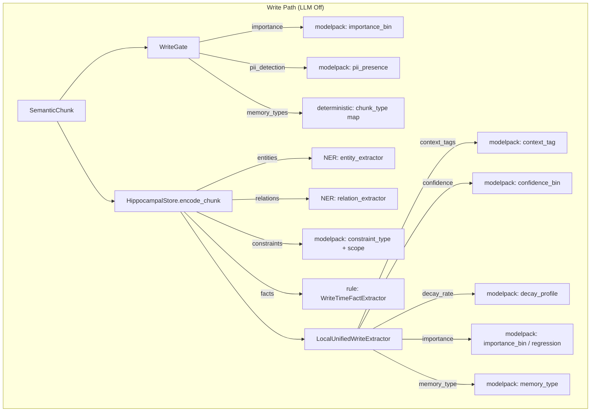

# SLM Replacement Report

Date: 2026-03-06 (updated)
Previous: 2026-02-27

## Goal

Replace LLM-dependent classification/extraction fallback logic with a small custom model pack + NER-based runtime path while preserving optional LLM mode.

## Implemented

1. Unified modelpack runtime loader
- File: `src/utils/modelpack.py`
- Loads:
  - `router_model.joblib`
  - `extractor_model.joblib`
  - `pair_model.joblib`

2. Runtime task wiring
- `query_domain`: classifier/planner/retriever
- `scope_match`: retriever/reranker
- `constraint_stability`: reranker recency weighting
- `supersession`: constraint supersession checks

3. NER runtime fallback replacement
- entity extraction: `src/extraction/entity_extractor.py`
- relation extraction: `src/extraction/relation_extractor.py`
- write-time facts fallback: `src/extraction/write_time_facts.py`
- PII span helper: `src/utils/ner.py`

4. Pipeline consolidation in `packages/models`
- prepare: `packages/models/scripts/prepare.py`
- train: `packages/models/scripts/train.py`
- config: `packages/models/model_pipeline.toml`
- model outputs: `packages/models/trained_models`

5. Modelpack write path wiring (new)
- `LocalUnifiedWriteExtractor` now predicts `context_tag`, `confidence_bin`, and `decay_profile` from the router model
- Orchestrator instantiates `LocalUnifiedWriteExtractor` and passes it to `HippocampalStore` when LLM is disabled
- `encode_chunk` and `encode_batch` consume `context_tags`, `confidence`, and `decay_rate` from local extractor when unified result is unavailable

## Current runtime decision matrix

| Mode | Write/read behavior |
|---|---|
| `FEATURES__USE_LLM_ENABLED=false` | modelpack + NER/non-LLM paths |
| `FEATURES__USE_LLM_ENABLED=true` | fine-grained `FEATURES__USE_LLM_*` controls LLM paths |

## Write path field coverage (LLM off)

The table below shows the source for each write-path field when `FEATURES__USE_LLM_ENABLED=false`:

```mermaid
flowchart TD
    subgraph writePath ["Write Path (LLM Off)"]
        Chunk[SemanticChunk] --> Gate[WriteGate]
        Gate --> |importance| MP_IMP["modelpack: importance_bin"]
        Gate --> |pii_detection| MP_PII["modelpack: pii_presence"]
        Gate --> |memory_types| DET["deterministic: chunk_type map"]

        Chunk --> Enc[HippocampalStore.encode_chunk]
        Enc --> |entities| NER_ENT["NER: entity_extractor"]
        Enc --> |relations| NER_REL["NER: relation_extractor"]
        Enc --> |constraints| MP_CONST["modelpack: constraint_type + scope"]
        Enc --> |facts| WTF["rule: WriteTimeFactExtractor"]

        Enc --> LE[LocalUnifiedWriteExtractor]
        LE --> |context_tags| MP_CT["modelpack: context_tag"]
        LE --> |confidence| MP_CB["modelpack: confidence_bin"]
        LE --> |decay_rate| MP_DP["modelpack: decay_profile"]
        LE --> |importance| MP_IMP2["modelpack: importance_bin / regression"]
        LE --> |memory_type| MP_MT["modelpack: memory_type"]
    end
```

| Field | Source (LLM off) | Quality |
|-------|------------------|---------|
| entities | NER (`entity_extractor`, `_ner_entities_for_text`) | Full |
| relations | NER (`relation_extractor`, `_ner_relations_for_text`) | Full |
| constraints | Modelpack `constraint_type` + `constraint_scope` + NER | Weak (single constraint, crude subject/scope) |
| facts | `WriteTimeFactExtractor` (spaCy + keyword rules) | Full |
| importance | Modelpack `importance_bin` or `write_importance_regression` | Full |
| memory_type | Modelpack `memory_type` or gate chunk_type map | Full |
| context_tags | Modelpack `context_tag` (single label → list) | Moderate (single tag vs LLM multi-tag) |
| confidence | Modelpack `confidence_bin` → mapped float | Moderate (3-bin vs continuous) |
| decay_rate | Modelpack `decay_profile` → mapped float | Moderate (5-profile vs continuous) |
| PII detection | Modelpack `pii_presence` + regex redaction | Moderate (binary + redactor, no typed spans) |
| contains_secrets | Regex patterns in write gate | Full (deterministic) |

## Remaining scope not replaced by custom classifiers

1. Unified generative write extraction quality (`unified_write_extractor`)
   - The single LLM call producing the full schema (entities, relations, constraints, facts, salience, importance, PII spans, memory_type, confidence, context_tags, decay_rate) has no single-model replacement
   - Individual sub-tasks now have modelpack coverage (see table above) but quality is weaker for constraints (single per chunk, crude scope) and PII (binary, no typed spans)
2. Consolidation gist generation
3. Forgetting compression summaries
4. LLM-forced paths when corresponding flags explicitly require LLM

## References

- Canonical usage/runtime docs: [../UsageDocumentation.md](../UsageDocumentation.md)
- Model pipeline details: [../../packages/models/README.md](../../packages/models/README.md)
- Base CML status: [../BaseCML/BaseCMLStatus.md](../BaseCML/BaseCMLStatus.md)
