# Locomo Evaluation Plan for Cognitive Memory Layer

## 1. Overview
[Locomo](https://github.com/snap-research/locomo) (Long Context Memory) is a benchmark designed to evaluate long-term conversational memory in LLM agents. It focuses on:
- **Very Long-Term Data**: Conversations spanning weeks/months.
- **Complex Reasoning**: Temporal, causal, and multi-hop questions.
- **Tasks**: Question Answering (QA), Event Summarization, and Multimodal updates.

Event summarization evaluation is **"Coming soon"** in the Locomo repo; this plan focuses on the QA task. The benchmark also provides **RAG baselines** (dialog, observation, or session summary as retrieval "databases"); we evaluate CML as an alternative **memory-backed RAG**—i.e., CML as the retriever instead of Locomo's built-in embedding + pickle retrieval.

This report details how to evaluate the **Cognitive Memory Layer (CML)** using the Locomo benchmark to validate its "human-like" memory capabilities, specifically testing the **Hippocampal (Episodic)** and **Neocortical (Semantic)** stores.

## 2. Evaluation Strategy

The evaluation treats CML as the **memory backend** for an LLM agent: we do **not** use Locomo's built-in RAG (dragon/contriever + pickle). Instead, CML is the retriever.

### 2.1. The Loop (RAG-style)
1.  **Ingestion**: For each Locomo sample, replay the `conversation` (sessions in order, turns in order) into CML using one tenant per `sample_id`. CML handles encoding, consolidation (episodic → semantic), and forgetting (if enabled).
2.  **QA phase**: For each question in `qa`, call CML `POST /memory/read` with `query` = question and `format` = `llm_context`; then call an LLM (e.g. GPT) with that context + question to produce an answer; collect (question_id, generated_answer, ground_truth, evidence).
3.  **Scoring**: Reuse Locomo's `eval_question_answering()` and `analyze_aggr_acc()` on the collected results so metrics (F1 by category, recall) match the paper.

### 2.2. Locomo repository and data
- **Clone**: `https://github.com/snap-research/locomo`. Configuration is in `scripts/env.sh` (e.g. `DATA_FILE_PATH=./data/locomo10.json`, `OUT_DIR`, `OPENAI_API_KEY`).
- **Dataset**: `data/locomo10.json` — a JSON list of samples. Each sample has:
  - `sample_id`: identifier for the sample.
  - `conversation`: keys `session_1`, `session_2`, … `session_N` (lists of dialogs) and `session_1_date_time`, `session_2_date_time`, … (one string per session). Each dialog has `speaker`, `dia_id`, `text`; optionally `blip_caption`, `img_url`.
  - `qa`: list of `{ "question", "answer", "category", "evidence" }` (evidence = dialog ids containing the answer).
  - Optional: `observation`, `session_summary` (generated, for RAG baselines), `event_summary` (annotated).
- **Exact conversation schema**: `conversation` keys are `session_1`, `session_2`, … and `session_1_date_time`, `session_2_date_time`, … (not `session__date_time`). Each `session_K` is a list of dialogs; each dialog has `speaker`, `dia_id`, `text`, and optionally `blip_caption`, `img_url`.
- To regenerate observations or session summaries for comparison, see the Locomo README (`scripts/generate_observations.sh`, `scripts/generate_session_summaries.sh`).

### 2.3. CML as RAG backend (flow)

```mermaid
flowchart LR
    LocomoData[Locomo data]
    IngestScript[Ingestion script]
    CMLWrite[CML write or turn]
    CMLRead[CML read]
    LLM[LLM e.g. GPT]
    Predictions[Predictions]
    EvalScripts[Locomo eval scripts]
    Metrics[Metrics]

    LocomoData --> IngestScript
    IngestScript --> CMLWrite
    CMLWrite --> CMLRead
    CMLRead --> LLM
    LLM --> Predictions
    Predictions --> EvalScripts
    EvalScripts --> Metrics
```



## 3. Implementation Steps

### 3.1. Prerequisites
- **Locomo**: Clone the repo; install dependencies (e.g. from `requirements.txt`); set `scripts/env.sh` (at least `DATA_FILE_PATH`, `OUT_DIR`, `OPENAI_API_KEY`).
- **CML**: Running instance (e.g. Docker at `http://localhost:8000`); API key if required.
- **Python**: The evaluation script must be able to call the CML HTTP API and, for scoring, either run from within the Locomo tree or have Locomo's `task_eval` on `PYTHONPATH`.

### 3.2. Data Mapping
Map Locomo fields to CML's API using the **actual** Locomo schema.

| Locomo Field | CML Field | Notes |
| :--- | :--- | :--- |
| `sample_id` | `tenant_id` | One CML tenant per conversation; isolate each evaluation sample. |
| `session_K` + `session_K_date_time` | `session_id` = e.g. `session_<K>`; store `session_K_date_time` in `metadata["locomo_session_date_time"]` | Stable session id; session date/time in metadata for ordering and temporal display. |
| `speaker` | `metadata["speaker"]` or `agent_id` | Identify who is speaking (use `agent_id` if one side is "the agent"). |
| `dia_id` | `metadata["dia_id"]` and/or `turn_id` | Dialog id for evidence/recall alignment. |
| `text` (and optional `blip_caption`) | `content` | e.g. `speaker + ': ' + text` or include `blip_caption` in content/metadata. |
| Images | `metadata["images"]` or `metadata["blip_caption"]` | CML is text-first; store URLs/captions in metadata. |

**Important**: CML's `WriteMemoryRequest` and `/memory/turn` do **not** currently accept an explicit event timestamp; records get "now". For temporal fidelity, the plan includes an action item to add an optional `timestamp` and thread it through to record creation.

### 3.3. Integration Script: `scripts/eval_locomo.py`

A Python script (e.g. `scripts/eval_locomo.py`) drives the evaluation.

#### Phase A: Ingestion
Iterate over `conversation` by session key order (`session_1`, `session_2`, …). For each session, use a stable `session_id` (e.g. `session_<K>`). For each dialog/turn, either:

- **Option (a)** `POST /memory/turn` with `user_message` = combined turn text (e.g. `speaker + ': ' + text`), `assistant_response` = None or next turn if pairing, `session_id` = session id; or
- **Option (b)** `POST /memory/write` with `content`, `session_id`, and `metadata` containing `locomo_session_date_time`, `speaker`, `dia_id`, and optionally `turn_id` = `dia_id`.

Example (using write for explicit metadata; base URL may include API prefix e.g. `/api/v1`):

```python
session_nums = sorted([int(k.split("_")[-1]) for k in sample["conversation"] if k.startswith("session_") and not k.endswith("_date_time")])
for k in session_nums:
    session_id = f"session_{k}"
    date_time = sample["conversation"].get(f"session_{k}_date_time", "")
    for dialog in sample["conversation"].get(f"session_{k}", []):
        content = dialog["speaker"] + ": " + dialog["text"]
        if dialog.get("blip_caption"):
            content += " [shared: " + dialog["blip_caption"] + "]"
        requests.post(
            f"{CML_URL}/memory/write",
            json={
                "content": content,
                "session_id": session_id,
                "metadata": {
                    "locomo_session_date_time": date_time,
                    "speaker": dialog["speaker"],
                    "dia_id": dialog["dia_id"],
                },
                "turn_id": dialog.get("dia_id"),
            },
            headers={"X-Tenant-ID": sample["sample_id"]},  # tenant_id = sample_id
        )
```

**Critical**: Today CML does not accept a per-turn event timestamp. When optional `timestamp` is added to the API, the script should pass the session's `session_K_date_time` (or a derived datetime) so stored memories have the correct event time.

#### Phase B: Question Answering (QA)
For each item in `qa`:

1. `POST /memory/read` with `query` = question, `format` = `llm_context`, `max_results` as needed (e.g. 10–25).
2. Use the returned `llm_context` like Locomo's RAG path (prepend to a QA prompt, then call OpenAI).
3. Append to the result list: `question`, `answer` (ground truth), prediction key (e.g. `cml_top_10_prediction`), and optionally `evidence` for recall.

Output format must match what Locomo's `eval_question_answering` expects: per-QA dict with a prediction key and optionally `_context` for recall (e.g. `cml_top_10_prediction_context`).

```python
for qa_item in sample["qa"]:
    read_resp = requests.post(
        f"{CML_URL}/memory/read",
        json={"query": qa_item["question"], "format": "llm_context", "max_results": 25},
        headers={"X-Tenant-ID": sample["sample_id"]},
    )
    llm_context = read_resp.json().get("llm_context", "")
    answer = generate_answer(llm_context, qa_item["question"])  # e.g. GPT with same QA prompt as Locomo
    qa_item["cml_top_10_prediction"] = answer.strip()
    # optionally set qa_item["cml_top_10_prediction_context"] for recall
```

#### Phase C: Scoring
Either import and call `eval_question_answering` and `analyze_aggr_acc` from Locomo's `task_eval` (add the Locomo repo to the path or install), or replicate their logic. The script must produce an output file compatible with Locomo's stats script (same JSON shape as their QA output). Use a consistent prediction key (e.g. `gpt-3.5-turbo_cml_top_10_prediction`) so `analyze_aggr_acc` can compute per-category and overall accuracy and recall.

### 3.4. Evaluation Metrics
Align with Locomo's pipeline (`task_eval/evaluation.py`, `task_eval/evaluation_stats.py`):

- **Primary**: **F1 by category** (1 = multi-hop, 2 = temporal, 3/4 = open-domain, 5 = adversarial) and **overall accuracy** from `eval_question_answering`; **recall** when `evidence` is present (retrieved context contains evidence dialogs).
- **Aggregate stats**: Use `analyze_aggr_acc()` to produce per-category counts, accuracy, and optional recall by category; output a stats JSON compatible with Locomo.
- **Optional**: Exact Match; LLM judge (GPT-4 grading vs. ground truth). **Consolidation rate** (episodic → semantic promotion) as an internal CML metric.

## 4. Key Performance Indicators (KPIs) for CML
Running this benchmark will assess:

1.  **Temporal Consistency**: Can CML retrieve the *correct* version of a fact if it changed over time? (e.g., "Where does user live?" -> Paris in 2022, London in 2023).
2.  **Long-Term Recall**: Does the `HippocampalStore` (Vector DB) effectively recall events from "weeks" ago (in simulation time)?
3.  **Cross-Session Inference**: Does the `NeocorticalStore` (Graph) help connect dots between sessions?
4.  **Noise Reduction**: Does the `WriteGate` effectively filter out chit-chat, improving retrieval quality?

Locomo's **category 2** (temporal) and **category 1** (multi-hop) are the most relevant for long-term and cross-session behavior.

## 5. Action Items
1.  **[API]**: Add optional `timestamp` to `WriteMemoryRequest` (and, if used for eval, to `ProcessTurnRequest` or equivalent) and thread it through the orchestrator and into chunk/record creation (e.g. `src/api/schemas.py`, `src/memory/orchestrator.py`, short-term/working chunk creation or hippocampal store) so that Locomo's session dates can be stored as event time. **Mandatory** for historical benchmarks.
2.  **[Script]**: Implement `scripts/eval_locomo.py` (ingestion → QA → output in Locomo-compatible format; then run or call Locomo's evaluation and stats).
3.  **[Dataset]**: Use `data/locomo10.json` from the cloned Locomo repo (no separate download).
4.  **[Run]**: Execute ingestion (per sample), then QA, then score; optionally start with a subset (e.g. one sample) for cost and speed.

## 6. Risks & Mitigations
- **Time injection**: CML currently uses "now" for new memories; add and use optional `timestamp` for benchmark fidelity.
- **Cost**: Embedding thousands of turns and running GPT for evaluation can be expensive; start with one or two samples.
- **Compatibility**: Script output (per-QA keys, prediction key name) must match what `eval_question_answering` and `analyze_aggr_acc` expect; document the exact key names (e.g. `gpt-3.5-turbo_cml_top_10_prediction`) so the stats scripts work.
