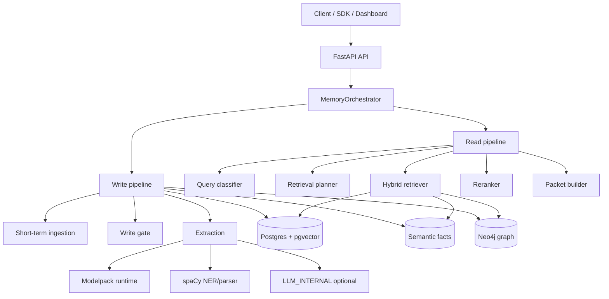
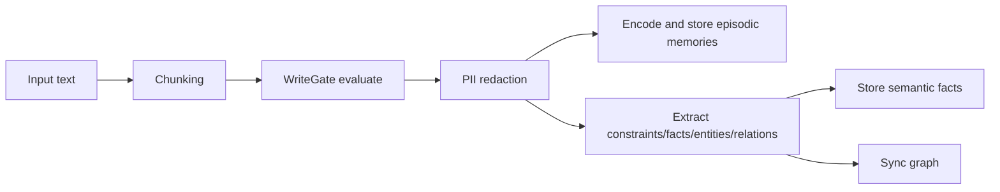
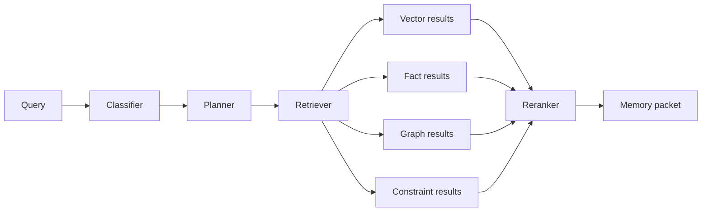

# CML Usage Documentation

This document is the canonical server-side guide for running and operating CML.

## Overview

CML exposes a tenant-scoped memory API over FastAPI and uses:

- PostgreSQL + pgvector for episodic/vector memory
- PostgreSQL semantic facts for consolidated knowledge
- Neo4j for graph memory
- Redis for cache/rate-limit/session/background coordination
- optional Celery workers for consolidation/forgetting jobs

Primary runtime orchestrator: `src/memory/orchestrator.py`.

## Runtime modes

### Default mode (non-LLM)

`FEATURES__USE_LLM_ENABLED=false` (default)

- write/read runtime uses modelpack tasks when trained artifacts exist
- NER/parser-based extraction paths are used for entity/relation/fact fallback
- no internal LLM calls are made in write/read paths

### LLM-enabled mode

`FEATURES__USE_LLM_ENABLED=true`

Fine-grained flags (`FEATURES__USE_LLM_*`) choose LLM vs non-LLM path for:

- constraint extraction
- write-time fact extraction
- query classifier
- salience / write-gate importance
- pii spans
- memory_type / confidence / context_tags / decay
- conflict detection
- constraint reranking

LLM provider settings come from `LLM_INTERNAL__*`.

## High-level architecture



## Write path



Core behavior:

- chunks are generated by short-term memory components
- write gate decides `store`, `skip`, or `redact_and_store`
- constraints can deactivate superseded earlier constraints
- write-time facts can be materialized into semantic store
- entity/relation extraction is LLM-first when enabled, NER fallback otherwise

## Read path



Core behavior:

- classifier uses modelpack by default and can be forced to LLM
- planner sets source groups and timeout budget
- retriever runs steps in parallel groups with per-step/total timeouts
- reranker applies relevance/recency/confidence/diversity and constraint boosts
- response includes `retrieval_meta` diagnostics

## API authentication and headers

Required header:

- `X-API-Key: <AUTH__API_KEY>`

Optional headers:

- `X-Tenant-ID: <tenant>`
- `X-Eval-Mode: true` (write/session write only)

Admin endpoints require `AUTH__ADMIN_API_KEY`.

## Endpoint reference

Base path: `/api/v1`

### Memory

1. `POST /memory/write`
- Store memory content.
- Body: content + optional tags/session/memory type/metadata.
- Returns `memory_id`, `chunks_created`, optional eval outcome fields.

2. `POST /memory/read`
- Retrieve relevant memories.
- Supports filters: tags, memory types, since/until, timezone.
- Formats: packet/list/llm_context.
- Returns categorized memories + `retrieval_meta`.

3. `POST /memory/turn`
- Read + optionally store user/assistant turn with memory context generation.

4. `POST /memory/update`
- Update a memory’s text/confidence/importance/metadata.

5. `POST /memory/forget`
- Bulk/specific forget actions (`delete`, `archive`, `silence`, etc.).

6. `GET /memory/stats`
- Memory counts and storage statistics.

7. `POST /memory/read/stream`
- SSE streaming variant of read.

8. `DELETE /memory/all`
- Admin-only tenant wipe.

9. `GET /health`
- Liveness/readiness.

### Session convenience

1. `POST /session/create`
2. `POST /session/{session_id}/write`
3. `POST /session/{session_id}/read` (deprecated)
4. `GET /session/{session_id}/context`

## Request/response examples

### Write

```bash
curl -X POST "http://localhost:8000/api/v1/memory/write" \
  -H "Content-Type: application/json" \
  -H "X-API-Key: ${AUTH__API_KEY}" \
  -d '{
    "content": "I am allergic to shellfish and prefer vegetarian meals.",
    "context_tags": ["profile", "diet"],
    "session_id": "s-001"
  }'
```

### Read

```bash
curl -X POST "http://localhost:8000/api/v1/memory/read" \
  -H "Content-Type: application/json" \
  -H "X-API-Key: ${AUTH__API_KEY}" \
  -d '{
    "query": "suggest dinner options",
    "max_results": 10,
    "format": "packet",
    "user_timezone": "America/New_York"
  }'
```

## Configuration reference

Source of truth: `src/core/config.py` and `.env.example`.

### Core sections

- `DATABASE__*`: postgres/neo4j/redis
- `AUTH__*`: API/admin keys, default tenant, rate limiting
- `EMBEDDING_INTERNAL__*`: embedding provider/model/base URL
- `LLM_INTERNAL__*`: internal LLM provider/model/base URL
- `LLM_EVAL__*`: evaluation LLM overrides
- `CHUNKER__*`: tokenizer/chunk size/overlap
- `FEATURES__*`: feature flags
- `RETRIEVAL__*`: read timeouts and reranker tuning

### Important feature flags

- `FEATURES__USE_LLM_ENABLED`
- `FEATURES__CONSTRAINT_EXTRACTION_ENABLED`
- `FEATURES__WRITE_TIME_FACTS_ENABLED`
- `FEATURES__USE_LLM_CONSTRAINT_EXTRACTOR`
- `FEATURES__USE_LLM_WRITE_TIME_FACTS`
- `FEATURES__USE_LLM_QUERY_CLASSIFIER_ONLY`
- `FEATURES__USE_LLM_SALIENCE_REFINEMENT`
- `FEATURES__USE_LLM_PII_REDACTION`
- `FEATURES__USE_LLM_WRITE_GATE_IMPORTANCE`
- `FEATURES__USE_LLM_MEMORY_TYPE`
- `FEATURES__USE_LLM_CONFIDENCE`
- `FEATURES__USE_LLM_CONTEXT_TAGS`
- `FEATURES__USE_LLM_DECAY_RATE`
- `FEATURES__USE_LLM_CONFLICT_DETECTION_ONLY`
- `FEATURES__USE_LLM_CONSTRAINT_RERANKER`

## Modelpack runtime

Runtime adapter: `src/utils/modelpack.py`.

Expected artifacts (if trained):

- `packages/models/trained_models/router_model.joblib`
- `packages/models/trained_models/extractor_model.joblib`
- `packages/models/trained_models/pair_model.joblib`

Tasks currently consumed in runtime include:

- single-text: `query_intent`, `query_domain`, `constraint_dimension`, `constraint_stability`, `pii_presence`, `importance_bin`
- pair-text: `constraint_rerank`, `scope_match`, `supersession`

Training pipeline docs: [packages/models/README.md](../packages/models/README.md).

## NER-based fallback paths

- entity extraction: `src/extraction/entity_extractor.py`
- relation extraction: `src/extraction/relation_extractor.py`
- write-time facts fallback: `src/extraction/write_time_facts.py`
- PII span helper: `src/utils/ner.py` + redactor regex/NER merge

## Operations

### Start local dependencies

```bash
docker compose -f docker/docker-compose.yml up -d postgres neo4j redis
```

### Apply migrations

```bash
alembic upgrade head
```

### Run API

```bash
uvicorn src.api.app:app --host 0.0.0.0 --port 8000
```

### Run API in Docker (with startup validation)

```bash
docker compose -f docker/docker-compose.yml up -d api
```

- The API container validates `LLM_INTERNAL__BASE_URL` reachability at startup when `FEATURES__USE_LLM_ENABLED=true`.
- Validation is skipped by default in CI/GitHub Actions to avoid pipeline failures.
- Control knobs:
  - `LLM_STARTUP_VALIDATION_ENABLED` (default: true)
  - `LLM_STARTUP_VALIDATE_IN_CI` (default: false)
  - `LLM_STARTUP_VALIDATION_TIMEOUT_SEC` (default: 3)

### Run tests

```bash
pytest tests/unit -v --tb=short
pytest tests/integration -v --tb=short
pytest tests/e2e -v
```

See [tests/README.md](../tests/README.md) for service-specific prerequisites.


## Internal LLM Call Counts (Default Settings)

Approximate per-request behavior when LLM mode is enabled:

- `write`: about 1 unified extraction call per chunk
- `read`: 0-1 classifier call + optional reranker call
- `turn`: read + write flow(s) and optional reconsolidation calls

When `FEATURES__USE_LLM_ENABLED=false`, these internal LLM calls are not used for write/read runtime paths.
## Related docs

- Root overview: [README.md](../README.md)
- Custom model pipeline: [packages/models/README.md](../packages/models/README.md)
- SDK docs: [packages/py-cml/README.md](../packages/py-cml/README.md)
- Pending gaps: [ProjectPlan/BaseCML/PENDING_ISSUES.md](BaseCML/PENDING_ISSUES.md)
- Changelog: [CHANGELOG.md](../CHANGELOG.md)


