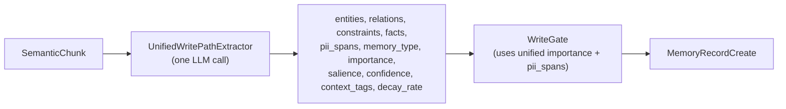

# CML Usage Documentation

Last verified: 2026-03-05

This document is the canonical server-side usage guide for Cognitive Memory Layer (CML). It is aligned to the current implementation in `src/`.

## Overview

CML exposes a tenant-scoped FastAPI API and coordinates:

- PostgreSQL + pgvector for episodic memory vectors (`memory_records`)
- PostgreSQL semantic facts for neocortical facts (`semantic_facts`)
- Neo4j for entity and relation graph storage
- Redis for rate limiting, embedding cache, labile state, and dashboard counters
- Optional Celery workers for scheduled forgetting fan-out

Primary coordinator: `src/memory/orchestrator.py`.

## Runtime Modes

`FEATURES__USE_LLM_ENABLED` picks between one intelligence path and one deterministic
fallback. There is no third model tier — the custom-model ("modelpack") runtime was
removed in commit 51afd15.

### LLM-enabled mode (recommended)

`FEATURES__USE_LLM_ENABLED=true`, provider settings from `LLM_INTERNAL__*`.

`MemoryOrchestrator.create()` wires `UnifiedWritePathExtractor`, which makes one LLM call
per chunk and returns entities, relations, constraints, write-time facts, PII spans,
memory type, importance, salience, confidence, context tags and decay rate. The read path
uses the same client for query classification, conflict detection, constraint
supersession, consolidation gists and forgetting compression.

#### Write path field sources (LLM on)


```mermaid
flowchart LR
    Chunk["SemanticChunk"] --> UWE["UnifiedWritePathExtractor<br/>(one LLM call)"]
    UWE --> Fields["entities, relations, constraints, facts,<br/>pii_spans, memory_type, importance,<br/>salience, confidence, context_tags, decay_rate"]
    Fields --> Gate["WriteGate<br/>(uses unified importance + pii_spans)"]
    Gate --> Record["MemoryRecordCreate"]
```

### Heuristic mode (LLM off)

`FEATURES__USE_LLM_ENABLED=false` (the default in `src/core/config.py`). No internal LLM
client is constructed. This is the mode the hermetic unit suite runs in.

| Field | Source | Notes |
|-------|--------|-------|
| entities / relations | — | Not extracted; the graph stays empty |
| constraints | `ConstraintExtractor` regex patterns + chunk-type map | Single constraint per chunk; scope from chunk entities |
| facts | `WriteTimeFactExtractor` regex families | preference / identity / location / occupation |
| importance | Upstream chunk salience | Clamped to [0,1] |
| memory_type | Write-gate chunk_type map | Full coverage |
| context_tags | Caller-provided only | No inference |
| confidence | Chunk confidence | No inference |
| decay_rate | Type default | No inference |
| PII detection | Regex pattern table (`src/utils/ner.py`) | Typed spans, no model |
| novelty | Jaccard word overlap | See `WriteGate._compute_novelty` |
| contains_secrets | Regex patterns in write gate | Deterministic |

Consolidation produces no gists in this mode (`GistExtractor.extract_gist` returns `[]`
without an LLM); forgetting compression falls back to deterministic truncation.

## API Base And Auth

Base path: `/api/v1`

Required header:

- `X-API-Key: <AUTH__API_KEY>`

Optional headers:

- `X-Tenant-ID: <tenant>` (applies only when using admin key)
- `X-User-ID: <user>`
- `X-Eval-Mode: true` (write and session-write only)

Important tenancy rule:

- `X-Tenant-ID` override is accepted only for admin-authenticated requests.

## Endpoint Reference

### Memory endpoints

- `POST /memory/write`
- `POST /memory/turn`
- `POST /memory/read`
- `POST /memory/read/stream` (SSE)
- `POST /memory/update`
- `POST /memory/forget`
- `GET /memory/stats`
- `DELETE /memory/all` (admin only)

### Session convenience endpoints

- `POST /session/create`
- `POST /session/{session_id}/write`
- `POST /session/{session_id}/read` (deprecated)
- `GET /session/{session_id}/context`

### Admin endpoints

- `POST /admin/consolidate/{user_id}`
- `POST /admin/forget/{user_id}`

### Service and observability endpoints

- `GET /health`
- `GET /metrics` (Prometheus)

## Dashboard Surface

Dashboard API is mounted under `/api/v1/dashboard/*` and static SPA under `/dashboard/*`.

Dashboard API modules include:

- overview, timeline, components, tenants, sessions, ratelimits, request-stats
- memories list/detail/bulk-action/export
- events list
- graph stats/overview/explore/search/neo4j-config (with relationship edge labels and improved physics)
- semantic facts list/invalidate (Facts Explorer page with category/tenant filters, current-only toggle, pagination)
- config get/update
- jobs/labile/retrieval test/consolidate/forget/reconsolidate/database reset

Security behavior:

- Dashboard API endpoints require admin auth.
- State-changing dashboard requests (`POST`, `PUT`, `DELETE`, `PATCH`) require `X-Requested-With: XMLHttpRequest` (CSRF middleware).

## Request/Response Notes

- `WriteMemoryRequest.content` max length is `100_000`.
- `WriteMemoryRequest.timestamp` and `ProcessTurnRequest.timestamp` are optional and propagate through the write path.
- `ReadMemoryRequest.max_results` max is `50`.
- `ReadMemoryRequest.format` supports `packet`, `list`, and `llm_context`.
- `ReadMemoryResponse` includes optional `retrieval_meta`.
- Streaming read (`/memory/read/stream`) emits item events and a final `done` event with summary metadata.
- `POST /session/create` stores session metadata in Redis when available; if Redis is unavailable it still returns a session id, but no Redis-backed session record is created.

## Write Pipeline (Current Execution Order)

For `POST /memory/write` and write steps in `/memory/turn`:

1. STM ingest and chunking (`short_term.ingest_turn`)
2. Optional unified extraction (LLM path)
3. Constraint supersession/deactivation by key
4. Batched encode/store in hippocampal store
   - write gate decision (`store`, `skip`, `redact_and_store`)
   - redaction
   - batch embed
   - batch entity/relation extraction
   - bounded upsert
5. Best-effort graph sync to Neo4j
6. Write-time facts to semantic store
7. Write-time constraints to semantic store

Key behavior:

- Memory type may come from API override, LLM extraction, or gate mapping.
- Constraints can supersede previous constraints and invalidate older semantic facts.
- Request metadata is merged with system metadata (request metadata wins on key conflicts).

## Read Pipeline (Current Execution Order)

1. Query classification (`QueryClassifier`)
   - LLM classification when `FEATURES__USE_LLM_ENABLED` and a client is configured
   - regex intent/constraint heuristics otherwise (and always applied on top)
2. Retrieval plan generation (`RetrievalPlanner`)
3. Hybrid retrieval (`HybridRetriever`)
   - facts, vector, graph, constraints, cache
   - per-step and total timeout enforcement (when enabled)
4. Reranking (`MemoryReranker`)
   - relevance, recency, confidence, diversity
   - constraint-specific scoring boosts
5. Packet build (`MemoryPacketBuilder`)
   - constraint-first formatting
   - conflict and supersession suppression

Temporal behavior:

- `today` and `yesterday` planning uses `ReadMemoryRequest.user_timezone` when provided.

## Configuration Reference

Source of truth: `src/core/config.py`.

### Config groups

- `DATABASE__*`
- `AUTH__*`
- `EMBEDDING_INTERNAL__*`
- `LLM_INTERNAL__*`
- `LLM_EVAL__*`
- `CHUNKER__*`
- `FEATURES__*`
- `RETRIEVAL__*`

### Important feature flags

- `FEATURES__USE_LLM_ENABLED` (master switch)
- `FEATURES__CONSTRAINT_EXTRACTION_ENABLED`
- `FEATURES__WRITE_TIME_FACTS_ENABLED`
- `FEATURES__BATCH_EMBEDDINGS_ENABLED`
- `FEATURES__CACHED_EMBEDDINGS_ENABLED`
- `FEATURES__RETRIEVAL_TIMEOUTS_ENABLED`
- `FEATURES__SKIP_IF_FOUND_CROSS_GROUP`
- `FEATURES__DB_DEPENDENCY_COUNTS`
- `FEATURES__HNSW_EF_SEARCH_TUNING`
- `FEATURES__STORE_ASYNC`
- All fine-grained `FEATURES__USE_LLM_*` flags

### Dashboard config editability

Dashboard config writes through `src/core/env_file.py` and persists to `.env`, but:

- DB URLs and key/password fields are write-protected.

## Semantic Lineage

When facts are superseded during reconsolidation or consolidation, CML tracks the lineage chain via `supersedes_id`. The following APIs expose this lineage:

- `SemanticFactStore.get_fact_lineage(tenant_id, key=..., fact_id=...)` — returns the full supersession chain (oldest to newest) for a given fact key or starting fact ID.
- `SemanticFactStore.get_superseded_chain(tenant_id, fact_id)` — returns all facts that were superseded by a given fact (forward chain).

Lineage metadata is captured during consolidation and reconsolidation operations. The `supersedes_id` field is surfaced in:

- `ReadMemoryResponse` memory items (when a memory supersedes a previous version)
- Dashboard retrieval test results (`RetrievalResultItem.supersedes_id`)
- Dashboard memory detail page (visual lineage chain in the Provenance section)
- py-cml SDK `RetrievalResultItem.supersedes_id`

## Shadow Mode Logging

`src/utils/shadow_logger.py` provides `ShadowModeLogger` for running heuristic and model paths in parallel:

- `compare()` runs both paths concurrently and returns the heuristic result
- Logs latency deltas and decision disagreements
- Configurable `sample_rate` for production use (e.g. 0.1 = 10% of requests)

Used by the conflict evaluation framework and during model rollout validation.

## Operations

### Start local dependencies

```bash
docker compose -f docker/docker-compose.yml up -d postgres neo4j redis
```

### Apply migrations

```bash
alembic upgrade head
```

### Run API locally

```bash
uvicorn src.api.app:app --host 0.0.0.0 --port 8000
```

### Run API in Docker

```bash
docker compose -f docker/docker-compose.yml up -d api
```

The Docker API startup command runs:

1. `python scripts/validate_llm_endpoints.py`
2. `alembic upgrade head`
3. `uvicorn src.api.app:app ...`

Startup LLM validation controls:

- `LLM_STARTUP_VALIDATION_ENABLED` (default true)
- `LLM_STARTUP_VALIDATE_IN_CI` (default false)
- `LLM_STARTUP_VALIDATION_TIMEOUT_SEC` (default 3)

### Run tests

```bash
pytest tests/unit -v --tb=short
pytest tests/integration -v --tb=short
pytest tests/e2e -v
```

Operational note from current test setup:

- `tests/unit/test_api_ingestion.py` and `tests/unit/test_workflow.py` require a running API despite location under `unit/`.

## Examples

### Write

```bash
curl -X POST "http://localhost:8000/api/v1/memory/write" \
  -H "Content-Type: application/json" \
  -H "X-API-Key: ${AUTH__API_KEY}" \
  -d '{
    "content": "I am allergic to shellfish and prefer vegetarian meals.",
    "context_tags": ["profile", "diet"],
    "session_id": "s-001"
  }'
```

### Read

```bash
curl -X POST "http://localhost:8000/api/v1/memory/read" \
  -H "Content-Type: application/json" \
  -H "X-API-Key: ${AUTH__API_KEY}" \
  -d '{
    "query": "suggest dinner options",
    "max_results": 10,
    "format": "packet",
    "user_timezone": "America/New_York"
  }'
```

## Current Caveats

- `FEATURES__STORE_ASYNC` exists, and `SeamlessMemoryProvider` supports `AsyncStoragePipeline`, but `/memory/turn` does not currently inject the async pipeline and runs synchronous writes.
- `src/core/tenant_flags.py` exists for per-tenant Redis overrides, but it is not wired into the active API/orchestrator runtime path.
- `event_log` table and repository exist, but the core write/read/update/forget flow does not currently append event-log records automatically.
- `POST /memory/forget` accepts `delete|archive|silence`, but non-`delete` actions currently execute the same soft-delete path in storage.

## Related Docs

- Root overview: [README.md](../README.md)
- SDK docs: [packages/py-cml/README.md](../packages/py-cml/README.md)
- SDK eval module: [packages/py-cml/docs/evaluation.md](../packages/py-cml/docs/evaluation.md) (`cml-eval` CLI and Python API)
- Changelog: [CHANGELOG.md](../CHANGELOG.md)
