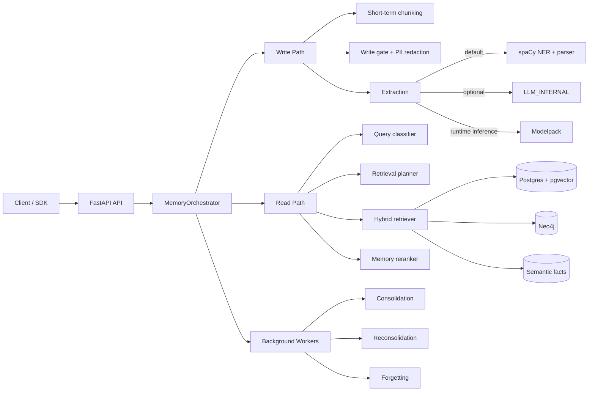
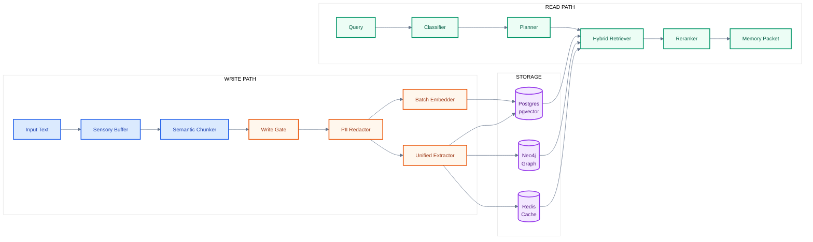

<div align="center">

# Cognitive Memory Layer

### A Neuro-Inspired Memory System for AI

*Store. Retrieve. Consolidate. Forget.*
*Just like the human brain.*

<br/>

[](#-quick-start)
[](./ProjectPlan/UsageDocumentation.md)
[](./tests/README.md)
[](#)

<br/>


</div>

---

<div align="center">

**[The Problem](#-the-problem)** &#8226;
**[How Your Brain Solves It](#-how-your-brain-solves-it)** &#8226;
**[How CML Implements It](#-how-cml-implements-it)** &#8226;
**[Architecture](#-architecture)** &#8226;
**[Quick Start](#-quick-start)** &#8226;
**[Evaluation](#-evaluation-highlights)** &#8226;
**[Docs](#-documentation)**

</div>

---

## The Problem

> *"The brain does not simply store memories; it actively reconstructs them."*
> &mdash; **Bartlett, 1932** <sup>[7]</sup>

Current Large Language Models have a fundamental cognitive deficit. They operate with **fixed context windows** and **static weights** &mdash; the computational equivalent of a brilliant mind with amnesia:

| What LLMs Lack | What Happens | What Humans Do |
| :--- | :--- | :--- |
| Dynamic knowledge updates | Stale information persists | Continuously revise beliefs |
| Graceful forgetting | Context bloat, noise accumulation | Actively prune irrelevant traces |
| Episodic &rarr; semantic consolidation | All memories treated equally | Distill experiences into knowledge |
| Latent constraint tracking | Safety-critical context is lost | "I can't eat that &mdash; I'm allergic" |

The **Cognitive Memory Layer** bridges this gap by implementing how human memory *actually* works &mdash; not as a simple database, but as a living, reconstructive system grounded in decades of neuroscience research.

---

## How Your Brain Solves It

CML's architecture is a direct computational translation of three foundational theories from cognitive neuroscience. Each maps to a specific subsystem in the codebase.

### Theory 1: The Multi-Store Model <sup>[Atkinson & Shiffrin, 1968]</sup>

Human memory is not a single store &mdash; it is a **pipeline**. Information flows through distinct stages, each with different capacity, encoding, and duration:

```
                        Attention                    Rehearsal
  Sensory Register  ──────────────►  Short-Term  ──────────────►  Long-Term
  (250ms, huge)                      (20s, ~7 items)              (lifetime, unlimited)
       │                                  │                            │
       └─── Decay                         └─── Displacement            └─── Interference
```

**In CML:** Raw input enters the `SensoryBuffer` (token-level encoding via tiktoken). A `WorkingMemoryManager` enforces the ~7-item capacity limit. `SemchunkChunker` handles semantic segmentation before long-term encoding.

> **Reference**: Miller, G.A. (1956). ["The magical number seven, plus or minus two."](https://doi.org/10.1037/h0043158) *Psychological Review*, 63(2), 81-97.

### Theory 2: Complementary Learning Systems <sup>[McClelland et al., 1995]</sup>

The brain uses **two complementary systems** that learn at fundamentally different speeds &mdash; and this tension is not a bug, it's the architecture:

| System | Brain Region | Speed | What It Stores | Decay |
| :--- | :--- | :--- | :--- | :--- |
| **Hippocampal** | Medial Temporal Lobe | Fast (one-shot) | Rich episodic traces | Rapid |
| **Neocortical** | Distributed Cortex | Slow (gradual) | Distilled semantic knowledge | Stable |

The hippocampus captures today's lunch conversation in full context. Over time &mdash; during sleep &mdash; **sharp-wave ripples** replay these episodes, training the neocortex to extract the durable semantic pattern: *"this person is vegetarian."*

**In CML:** `HippocampalStore` performs one-shot episodic encoding with dense vector embeddings. `NeocorticalStore` maintains structured semantic facts with schema alignment. The `ConsolidationEngine` performs the equivalent of sleep-replay: sampling, clustering, gist extraction, and migration from hippocampal to neocortical stores.

> **Reference**: McClelland, J.L., McNaughton, B.L., & O'Reilly, R.C. (1995). ["Why there are complementary learning systems in the hippocampus and neocortex."](https://doi.org/10.1037/0033-295X.102.3.419) *Psychological Review*, 102(3), 419-457.

### Theory 3: Reconsolidation <sup>[Nader et al., 2000]</sup>

A discovery that upended memory science: retrieved memories become **temporarily unstable** ("labile") and can be modified before restabilizing. Memory is not read-only &mdash; every retrieval is a potential rewrite.

**In CML:** The `LabileStateTracker` marks retrieved memories as labile for 5 minutes. The `ConflictDetector` identifies contradictions, refinements, and supersessions. The `BeliefRevisionEngine` applies one of 6 strategies (reinforce, correct, time-slice, merge, demote, supersede) before restabilizing.

> **Reference**: Nader, K., Schafe, G.E., & Le Doux, J.E. (2000). ["Fear memories require protein synthesis in the amygdala for reconsolidation after retrieval."](https://doi.org/10.1038/35021052) *Nature*, 406(6797), 722-726.

### Theory 4: Active Forgetting <sup>[Shuai et al., 2010]</sup>

Forgetting is not failure &mdash; it is an **active, protein-mediated process**. The proteins Rac1 and Cofilin actively prune synaptic connections, removing traces that are no longer relevant. This keeps memory efficient and prevents catastrophic interference.

**In CML:** The `ForgettingWorker` runs a relevance scorer every 24h. Memories are triaged into five actions &mdash; Keep, Decay, Silence, Compress, or Delete &mdash; based on importance, recency, frequency, confidence, type, and dependency count.

> **Reference**: Shuai, Y., et al. (2010). ["Forgetting is regulated through Rac activity in Drosophila."](https://doi.org/10.1016/j.cell.2009.12.044) *Cell*, 140(4), 579-589.

---

## How CML Implements It

CML integrates five AI memory research frameworks, mapping each onto a specific capability:

| Framework | Paper | What CML Takes From It |
| :--- | :--- | :--- |
| **CLS Theory** | McClelland et al. (1995) | Dual-store: fast hippocampal + slow neocortical |
| **HippoRAG** | Gutierrez et al. (2024) <sup>[8]</sup> | Knowledge graph + Personalized PageRank for multi-hop retrieval |
| **HawkinsDB** | Based on Thousand Brains Theory | 15 cognitive memory types with biological decay profiles |
| **Mem0** | mem0.ai (2024) <sup>[9]</sup> | Add/Update/Delete/No-change ops + belief revision |
| **LoCoMo-Plus** | Li et al. (2024) <sup>[14]</sup> | Level-2 cognitive constraint evaluation (goal/value/state/causal/policy) |

### The Cognitive Constraint Layer

This is what makes CML different from a vector database with extra steps. Standard RAG retrieves text that *looks similar*. CML retrieves **latent constraints** &mdash; goals, values, policies, states, and causal rules &mdash; even when the query is semantically distant from the constraint:

```
User stored:    "I'm deathly allergic to shellfish"      (cue)
User asks:      "Recommend a restaurant for tonight"      (trigger)
                 ↑                                         ↑
           These are semantically distant &mdash; cosine similarity is low.
           But the constraint is CRITICAL to the response.
```

CML solves this through **multi-path retrieval**: vector search + knowledge graph traversal + structured constraint lookup + domain-aware rescoring. Constraints are extracted at write time, stored with type metadata (goal/value/policy/state/causal), and surfaced at retrieval time regardless of surface-level semantic similarity.

---

## Architecture

### System Overview



### Data Flow: Write &rarr; Store &rarr; Read



### Neuroscience &rarr; Code Mapping

Every module in CML corresponds to a specific biological mechanism. Click to explore each:

<details>
<summary><strong>Sensory & Working Memory</strong> &mdash; Miller's 7&plusmn;2 capacity limit</summary>

| Biology | Code | Location |
| :--- | :--- | :--- |
| Sensory register | `SensoryBuffer` (tiktoken token-ID storage) | `src/memory/sensory/buffer.py` |
| Working memory (7&plusmn;2) | `WorkingMemoryManager` (max=10) + `BoundedStateMap` | `src/memory/working/manager.py` |
| Semantic chunking | `SemchunkChunker` (Hugging Face tokenizer) | `src/memory/working/chunker.py` |

</details>

<details>
<summary><strong>Encoding Gate</strong> &mdash; CREB/Npas4 neuronal selection</summary>

Not all experiences become memories. CML's `WriteGate` mirrors the CREB protein's role in selecting which neurons participate in engram formation (Han et al., 2007 <sup>[5]</sup>).

| Biology | Code | Location |
| :--- | :--- | :--- |
| CREB allocation | `WriteGate.evaluate()` &mdash; salience, novelty, risk | `src/memory/hippocampal/write_gate.py` |
| PII redaction | `PIIRedactor` strips sensitive data before storage | `src/memory/hippocampal/redactor.py` |
| Constraint boost | Constraint chunks get `importance += 0.2` | `WriteGateConfig` |

</details>

<details>
<summary><strong>Hippocampal Store</strong> &mdash; One-shot episodic encoding with pattern separation</summary>

| Biology | Code | Location |
| :--- | :--- | :--- |
| One-shot encoding | `HippocampalStore.encode_batch()` | `src/memory/hippocampal/store.py` |
| Pattern separation | SHA256 stable keys + unique embeddings | `PostgresMemoryStore` |
| Unified extraction | Entities, relations, constraints, facts in one call | `src/extraction/unified_write_extractor.py` |

</details>

<details>
<summary><strong>Neocortical Store</strong> &mdash; Slow semantic learning with schema alignment</summary>

| Biology | Code | Location |
| :--- | :--- | :--- |
| Schema-based storage | `FactSchema` + `FactCategory` | `src/memory/neocortical/schemas.py` |
| Cognitive categories | GOAL, STATE, VALUE, CAUSAL, POLICY | `src/memory/neocortical/schemas.py` |
| Graph traversal | Personalized PageRank on Neo4j | `src/storage/neo4j.py` |

</details>

<details>
<summary><strong>Retrieval</strong> &mdash; Tulving's ecphory (cue-engram interaction)</summary>

Memory retrieval is not lookup &mdash; it is **ecphory**: the interaction between a retrieval cue and a stored engram that *reconstructs* the memory (Tulving, 1983 <sup>[2]</sup>).

| Biology | Code | Location |
| :--- | :--- | :--- |
| Query classification | `QueryClassifier` (10 intents) | `src/retrieval/classifier.py` |
| Retrieval planning | `RetrievalPlanner` (parallel step groups) | `src/retrieval/planner.py` |
| Hybrid search | Vector + Graph + Constraints + Facts | `src/retrieval/retriever.py` |
| Constraint-aware reranking | Type-stability weighting, domain rescoring | `src/retrieval/reranker.py` |

</details>

<details>
<summary><strong>Consolidation</strong> &mdash; Sleep-cycle replay (sharp-wave ripples)</summary>

| Biology | Code | Location |
| :--- | :--- | :--- |
| Episode sampling | `EpisodeSampler` (7d episodes, 90d constraints) | `src/consolidation/sampler.py` |
| Semantic clustering | `SemanticClusterer` | `src/consolidation/clusterer.py` |
| Gist extraction | `GistSummarizer` (preserves constraint types) | `src/consolidation/summarizer.py` |
| Migration | `ConsolidationMigrator` (hippo &rarr; neocortex) | `src/consolidation/migrator.py` |

</details>

<details>
<summary><strong>Active Forgetting</strong> &mdash; Rac1/Cofilin synaptic pruning</summary>

| Biology | Code | Location |
| :--- | :--- | :--- |
| Relevance scoring | `ForgettingScorer` (6-factor composite) | `src/forgetting/scorer.py` |
| Interference | `InterferenceDetector` | `src/forgetting/interference.py` |
| Five actions | Keep / Decay / Silence / Compress / Delete | `src/forgetting/actions.py` |

</details>

### Memory Types

CML supports 15 memory types, each with a biological analog and distinct decay profile:

| Type | Description | Decay | Type | Description | Decay |
| :--- | :--- | :--- | :--- | :--- | :--- |
| `episodic_event` | What happened | Fast | `conversation` | Chat turn | Session |
| `semantic_fact` | Distilled facts | Slow | `message` | Single message | Session |
| `preference` | Likes/dislikes | Medium | `tool_result` | Function output | Task |
| `constraint` | Rules/policies/goals | Stable | `reasoning_step` | CoT step | Session |
| `procedure` | How-to | Stable | `scratch` | Working notes | Fast |
| `hypothesis` | Uncertain belief | Confirm | `knowledge` | World knowledge | Stable |
| `task_state` | Progress | Very Fast | `observation` | Environment | Session |
| `plan` | Goals/plans | Task | | | |

---

## Quick Start

```bash
# 1. Install
pip install -e .

# 2. Configure
cp .env.example .env   # Set DATABASE__POSTGRES_URL and AUTH__API_KEY

# 3. Start infrastructure
docker compose -f docker/docker-compose.yml up -d postgres neo4j redis

# 4. Migrate and run
alembic upgrade head
uvicorn src.api.app:app --host 0.0.0.0 --port 8000
```

<details>
<summary><strong>Docker one-liner</strong></summary>

```bash
docker compose -f docker/docker-compose.yml up -d api
```

</details>

<details>
<summary><strong>Python SDK</strong></summary>

```bash
pip install cognitive-memory-layer
```

```python
from cml import CognitiveMemoryLayer

memory = CognitiveMemoryLayer(base_url="<your-cml-url>", api_key="your-key")
memory.write(content="I never eat shellfish - severe allergy.", tenant_id="demo")
response = memory.read(query="Recommend a restaurant", tenant_id="demo")
# Constraints section will include the shellfish allergy ^
```

Sync, async, and embedded (SQLite) modes. See [SDK docs](packages/py-cml/docs/).

</details>

---

## Evaluation Highlights

Evaluated on **LoCoMo-Plus** &mdash; the first benchmark that tests *cognitive* memory (constraints, beliefs, causal reasoning), not just factual recall:

| Metric | CML | Mem0 | SeCom | RAG Baselines |
| :--- | :--- | :--- | :--- | :--- |
| **Cognitive score** | **21.45%** | 15.80% | 14.90% | 12-15% |
| **Factual-Cognitive gap** | **10.04%** | ~30% | ~27% | ~18-45% |

> CML's gap between factual and cognitive performance is the **smallest** of any system tested &mdash; meaning it retains constraint-consistency better than alternatives.

Full results: [evaluation/README.md](evaluation/README.md) &#8226; Run: `python evaluation/scripts/run_full_eval.py`

---

## Testing

```bash
pytest tests/unit -v --tb=short        # 580+ unit tests
pytest tests/integration -v --tb=short  # 87 integration tests
pytest tests/e2e -v                     # End-to-end API tests
```

Full-stack quality test with LLM-as-judge: `python scripts/test_memory_quality.py`

Details: [tests/README.md](tests/README.md)

---

## Documentation

| | Document | Description |
|---|----------|-------------|
| **API** | [Usage & API Reference](ProjectPlan/UsageDocumentation.md) | Full API, config, dashboard, runtime modes |
| **SDK** | [Python SDK](packages/py-cml/docs/README.md) | Getting started, API reference, examples |
| **Eval** | [Evaluation](evaluation/README.md) | LoCoMo-Plus harness, scripts, comparison |
| **Models** | [Custom Models](packages/models/README.md) | Training, data prep, model pipeline |
| **Dev** | [Contributing](CONTRIBUTING.md) | Setup, code standards, PR process |
| **Changelog** | [Release History](CHANGELOG.md) | Version history |
| **Roadmap** | [Future Plans](ProjectPlan/ActiveCML/) | Intrinsic memory integration phases |

---

## Future Roadmap

The next frontier: **intrinsic memory** &mdash; injecting memories directly into the LLM's computational graph (steering vectors, KV-cache manipulation, logit biases) instead of context-window stuffing.

See [ProjectPlan/ActiveCML/](ProjectPlan/ActiveCML/) for the 10-phase specification.

---

## References

<details open>
<summary><strong>Neuroscience Foundations</strong></summary>

1. McClelland, J.L., McNaughton, B.L., & O'Reilly, R.C. (1995). ["Why there are complementary learning systems in the hippocampus and neocortex."](https://doi.org/10.1037/0033-295X.102.3.419) *Psychological Review*, 102(3), 419-457.
2. Tulving, E. (1983). ["Elements of Episodic Memory."](https://books.google.com/books/about/Elements_of_episodic_memory.html?id=3nQ6AAAAMAAJ) Oxford University Press.
3. Nader, K., Schafe, G.E., & Le Doux, J.E. (2000). ["Fear memories require protein synthesis in the amygdala for reconsolidation."](https://doi.org/10.1038/35021052) *Nature*, 406(6797), 722-726.
4. Shuai, Y., et al. (2010). ["Forgetting is regulated through Rac activity in Drosophila."](https://doi.org/10.1016/j.cell.2009.12.044) *Cell*, 140(4), 579-589.
5. Han, J.H., et al. (2007). ["Neuronal competition and selection during memory formation."](https://doi.org/10.1126/science.1139438) *Science*, 316(5823), 457-460.
6. Miller, G.A. (1956). ["The magical number seven, plus or minus two."](https://doi.org/10.1037/h0043158) *Psychological Review*, 63(2), 81-97.
7. Bartlett, F.C. (1932). ["Remembering: A Study in Experimental and Social Psychology."](https://archive.org/details/rememberingstudy00bart) Cambridge University Press.
12. Rasch, B., & Born, J. (2013). ["About sleep's role in memory."](https://doi.org/10.1152/physrev.00032.2012) *Physiological Reviews*, 93(2), 681-766.
13. Atkinson, R.C. & Shiffrin, R.M. (1968). "Human memory: A proposed system and its control processes." *Psychology of Learning and Motivation*, 2, 89-195.

</details>

<details open>
<summary><strong>AI Memory Frameworks</strong></summary>

8. HippoRAG (2024). ["Neurobiologically Inspired Long-Term Memory for Large Language Models."](https://arxiv.org/abs/2405.14831) *arXiv:2405.14831*.
9. Mem0 (2024). ["Mem0: The Memory Layer for AI Applications."](https://github.com/mem0ai/mem0) GitHub.
10. HawkinsDB (2024). ["HawkinsDB: A Thousand Brains Theory inspired Database."](https://github.com/harishsg993010/HawkinsDB) GitHub.
11. Wu, T., et al. (2024). ["From Human Memory to AI Memory: A Survey."](https://arxiv.org/abs/2404.15965) *arXiv:2404.15965*.
14. Li, Y., et al. (2024). ["Locomo-Plus: Beyond-Factual Cognitive Memory Evaluation."](https://arxiv.org/abs/2602.10715) *arXiv:2602.10715*.

</details>

---

<div align="center">

*"Memory is the diary that we all carry about with us."* &mdash; Oscar Wilde

**CML transforms that diary into a computational system that learns, consolidates, and gracefully forgets &mdash; just like we do.**

<br/>


</div>
