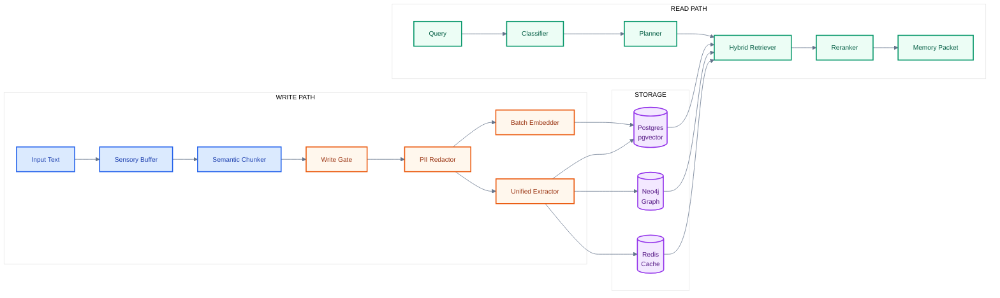
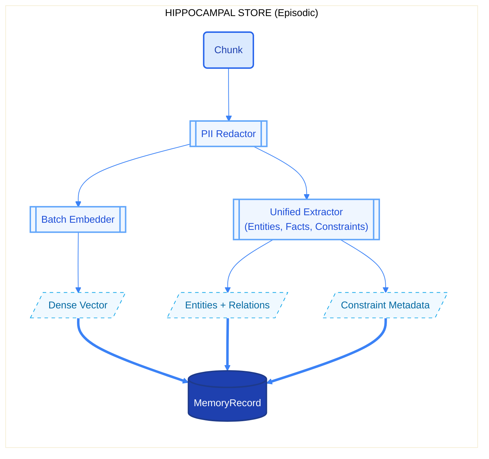
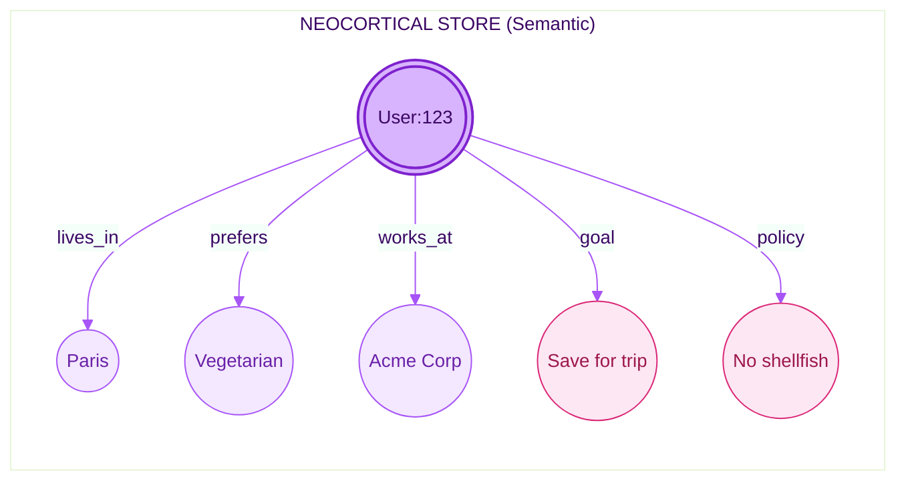
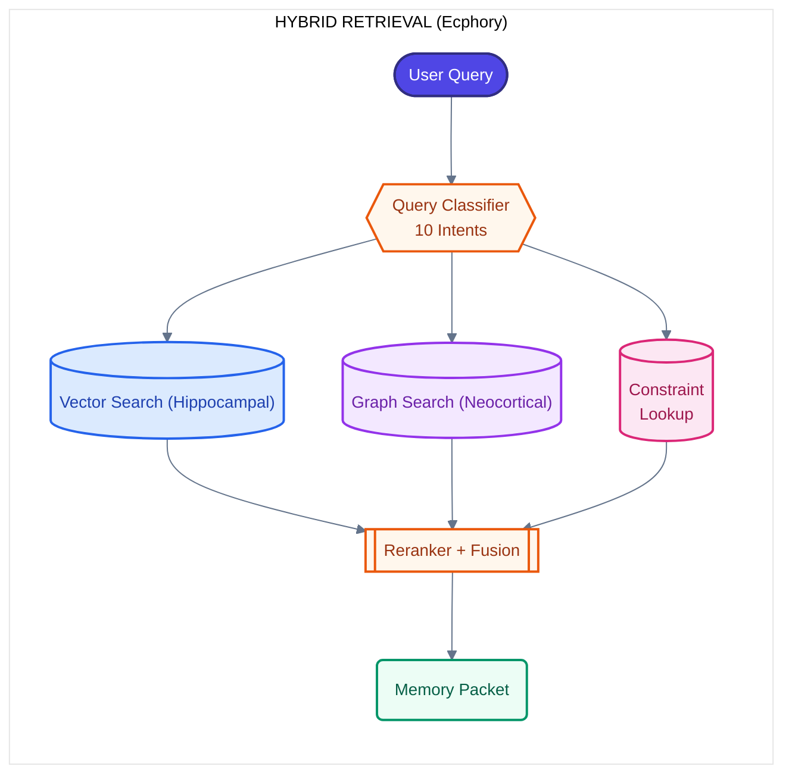
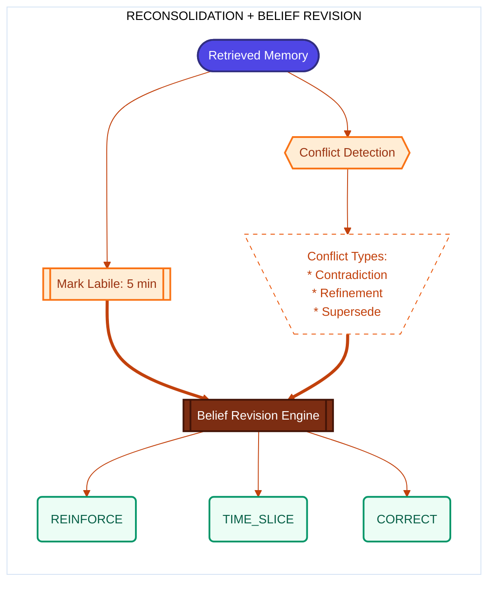
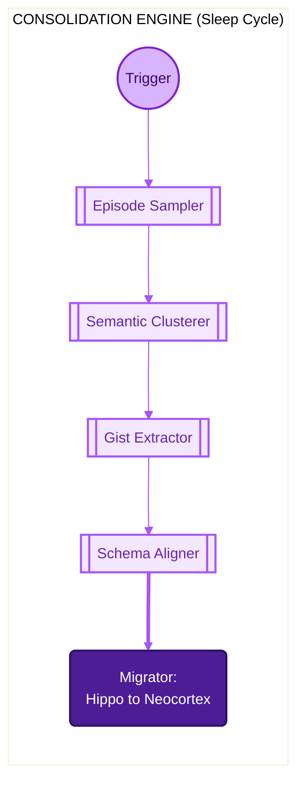
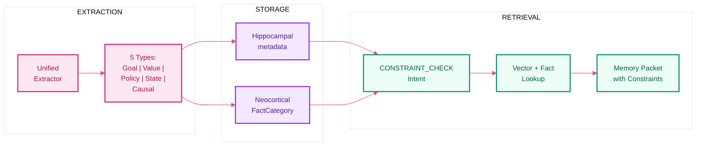

<h1 align="center">Cognitive Memory Layer</h1>

<p align="center">
  <strong>A neuro-inspired memory system that brings human-like memory to AI</strong>
</p>

<p align="center">
  <em>Store. Retrieve. Consolidate. Forget. &mdash; Just like the human brain.</em>
</p>

<p align="center">
  <a href="#basic-usage"></a>
  <a href="./ProjectPlan/UsageDocumentation.md"></a>
  <a href="./tests/README.md"></a>
  
</p>

<p align="center">
  
  
  
  
  
  
  
</p>

---

## Table of Contents

<details open>
<summary><strong>Click to expand</strong></summary>

- [What is CML?](#what-is-cml)
- [Key Features](#key-features)
- [Research Foundation](#research-foundation)
- [Architecture Overview](#architecture-overview)
- [Neuroscience-to-Implementation Mapping](#neuroscience-to-implementation-mapping)
- [Memory Types](#memory-types)
- [Basic Usage](#basic-usage)
- [Evaluation Highlights](#evaluation-highlights)
- [Documentation](#documentation)
- [Technology Stack](#technology-stack)
- [Python SDK](#python-sdk)
- [Testing](#testing)
- [References](#references)
- [Future Roadmap](#future-roadmap)

</details>

---

## What is CML?

Current Large Language Models operate with **fixed context windows** and **static weights**. They lack the dynamic, reconstructive nature of human memory:

| Limitation | Impact |
| :--- | :--- |
| Cannot dynamically update knowledge | Stale information persists |
| No integration without catastrophic forgetting | Retraining required |
| No relevance-based forgetting | Context bloat and inefficiency |
| No episodic-to-semantic consolidation | All memories treated equally |
| No latent constraint tracking | Decision-relevant context is lost |

The **Cognitive Memory Layer (CML)** solves this by implementing the Multi-Store Memory Model from cognitive neuroscience: a dual-store architecture with hippocampal (fast, episodic) and neocortical (slow, semantic) systems connected by biologically-inspired consolidation, reconsolidation, and active forgetting.

---

## Key Features

Dual-store (hippocampal + neocortical), hybrid retrieval, cognitive constraints, consolidation, reconsolidation, active forgetting, Python SDK, LoCoMo-Plus evaluation. See [Usage & API](ProjectPlan/UsageDocumentation.md#overview) for details.

---

## Research Foundation

> *"Memory is the process of maintaining information over time."*
> &mdash; **Matlin, 2005**

> *"The brain does not simply store memories; it actively reconstructs them."*
> &mdash; **Bartlett, 1932**

### Key Research Frameworks Integrated

| Framework | Key Contribution | Implementation |
| :--- | :--- | :--- |
| **HippoRAG** (2024) | Hippocampal index with KG + PPR | Neo4j graph store with Personalized PageRank |
| **HawkinsDB** (2025) | Thousand Brains: unified memory types | 15 multi-type memory records |
| **Mem0** (2025) | A.U.D.N. ops + graph memory | `ReconsolidationService` with belief revision |
| **CLS Theory** (1995) | Dual-system: fast hippo + slow neo | `HippocampalStore` + `NeocorticalStore` |
| **LoCoMo-Plus** (2024) | Level-2 cognitive memory benchmark | Constraint extraction and constraint-aware retrieval |

---

<a name="architecture-overview"></a>

## Architecture Overview

The system implements the **Complementary Learning Systems (CLS) theory** with a fast hippocampal store for episodic encoding and a slow neocortical store for semantic knowledge.

| System | Learning Speed | Representation | Memory Type |
| :--- | :--- | :--- | :--- |
| **Hippocampal** | Fast (one-shot) | Sparse | Episodic |
| **Neocortical** | Slow (gradual) | Distributed | Semantic |


### End-to-End Data Flow



---

## Neuroscience-to-Implementation Mapping

<details>
<summary><strong>1. Sensory and Working Memory (Prefrontal Cortex)</strong></summary>

**Biological Basis**: Sensory memory holds high-fidelity input for seconds. Working memory acts as a temporary workspace with limited capacity (~7+/-2 items).


| Concept | Implementation | Location |
| :--- | :--- | :--- |
| Sensory buffer | `SensoryBuffer` (token-ID storage via tiktoken, batch decode) | `src/memory/sensory/buffer.py` |
| Working memory limit | `WorkingMemoryManager` (max=10) + `BoundedStateMap` (LRU/TTL) | `src/memory/working/manager.py` |
| Semantic chunking | `SemchunkChunker` (semchunk + Hugging Face tokenizer) | `src/memory/working/chunker.py` |

**Reference**: Miller, G.A. (1956). "The Magical Number Seven, Plus or Minus Two"

</details>

<details>
<summary><strong>2. Encoding: Write Gate and Salience (CREB/Npas4)</strong></summary>

**Biological Basis**: Not all experiences become memories. The proteins **CREB** and **Npas4** regulate which neurons are recruited into memory engrams based on excitability.


| Concept | Implementation | Location |
| :--- | :--- | :--- |
| CREB allocation | `WriteGate.evaluate()` with salience, novelty, and risk scoring | `src/memory/hippocampal/write_gate.py` |
| Npas4 gating | Write gate threshold (0.3); constraint chunks get importance boost | `WriteGateConfig` |
| PII redaction | `PIIRedactor` strips sensitive information before storage | `src/memory/hippocampal/redactor.py` |
| Type override | `ChunkType.CONSTRAINT` maps to `MemoryType.CONSTRAINT` | `write_gate.py` |

**Reference**: Han et al. (2007). "Neuronal Competition and Selection During Memory Formation"

</details>

<details>
<summary><strong>3. Hippocampal Store (Episodic Memory)</strong></summary>

**Biological Basis**: The hippocampus rapidly encodes detailed, context-rich episodes with a single exposure using **pattern separation**.



| Concept | Implementation | Location |
| :--- | :--- | :--- |
| One-shot encoding | `HippocampalStore.encode_batch()` &mdash; gate+redact, batch embed, unified extract, upsert | `src/memory/hippocampal/store.py` |
| Pattern separation | Content-based stable keys (SHA256) + unique embeddings | `PostgresMemoryStore` |
| Write-time facts | `UnifiedWritePathExtractor` populates semantic store at write time | `src/extraction/unified_write_extractor.py` |
| Constraint extraction | `UnifiedWritePathExtractor` detects goals/values/policies/states/causal at encode time | `src/extraction/unified_write_extractor.py` |
| Batch entity/relation extraction | `UnifiedWritePathExtractor` returns typed entities and relations; when unified path enabled, graph sync uses them for Neo4j (schema-first, few-shot prompts; excludes system prompts) | `src/extraction/unified_write_extractor.py` |
| Contextual binding | Metadata: time, agent, turn, speaker, constraints | `MemoryRecord` schema |

**Reference**: HippoRAG (2024) &mdash; "Neurobiologically Inspired Long-Term Memory for LLMs"

</details>

<details>
<summary><strong>4. Neocortical Store (Semantic Memory)</strong></summary>

**Biological Basis**: The neocortex gradually encodes generalized, semantic knowledge through slow learning, supporting **pattern completion** via associative networks.



| Concept | Implementation | Location |
| :--- | :--- | :--- |
| Schema-based storage | `FactSchema` + `FactCategory` with `DEFAULT_FACT_SCHEMAS` | `src/memory/neocortical/schemas.py` |
| Cognitive fact categories | `GOAL`, `STATE`, `VALUE`, `CAUSAL`, `POLICY` in `FactCategory` | `src/memory/neocortical/schemas.py` |
| Personalized PageRank | `Neo4jGraphStore.personalized_pagerank()` for multi-hop traversal | `src/storage/neo4j.py` |
| Schema management | `SchemaManager` resolves and registers fact schemas dynamically | `src/memory/neocortical/schema_manager.py` |

**Reference**: HippoRAG uses PPR for "pattern completion across a whole graph structure"

</details>

<details>
<summary><strong>5. Retrieval: Ecphory and Constructive Memory</strong></summary>

**Biological Basis**: Memory retrieval is **ecphory**&mdash;the interaction between a retrieval cue and a stored engram that reconstructs the memory.



| Concept | Implementation | Location |
| :--- | :--- | :--- |
| Query classification | `QueryClassifier` with 10 intents incl. `CONSTRAINT_CHECK` | `src/retrieval/classifier.py` |
| Retrieval planning | `RetrievalPlanner` generates multi-step plans with priorities | `src/retrieval/planner.py` |
| Hybrid search | `HybridRetriever` with per-step timeouts, cross-group skip-if-found | `src/retrieval/retriever.py` |
| Constraint retrieval | Vector search (MemoryType.CONSTRAINT) + fact lookup across cognitive categories | `src/retrieval/retriever.py` |
| Reranking | Configurable weights (`recency_weight=0.1`, `relevance_weight=0.5`, `confidence_weight=0.2`) | `src/retrieval/reranker.py` |
| Packet building | Facts, preferences, episodes, constraints with provenance and formatting | `src/retrieval/packet_builder.py` |
| Temporal queries | Timezone-aware "today"/"yesterday" via `user_timezone` | `src/retrieval/planner.py` |

**Reference**: Tulving, E. (1983). "Elements of Episodic Memory" &mdash; Encoding Specificity Principle

</details>

<details>
<summary><strong>6. Reconsolidation and Belief Revision</strong></summary>

**Biological Basis**: When a memory is retrieved, it enters a **labile state** and can be modified before being restabilized (reconsolidation).



| Concept | Implementation | Location |
| :--- | :--- | :--- |
| Labile state tracking | `LabileStateTracker` (5-min labile window) | `src/reconsolidation/labile_tracker.py` |
| Conflict detection | `ConflictDetector` identifies contradictions, refinements, supersessions | `src/reconsolidation/conflict_detector.py` |
| Belief revision | `BeliefRevisionEngine` (6 strategies) | `src/reconsolidation/belief_revision.py` |
| Constraint supersession | `ConstraintExtractor.detect_supersession()` for same-type+scope | `src/extraction/constraint_extractor.py` |

**Reference**: Nader et al. (2000). "Fear memories require protein synthesis in the amygdala for reconsolidation"

</details>

<details>
<summary><strong>7. Consolidation: The "Sleep Cycle"</strong></summary>

**Biological Basis**: During NREM sleep, the hippocampus "replays" recent experiences via **sharp-wave ripples**, training the neocortex to extract semantic structures.



| Concept | Implementation | Location |
| :--- | :--- | :--- |
| Episode sampling | `EpisodeSampler` with type-specific time windows (7d episodes, 90d constraints) | `src/consolidation/sampler.py` |
| Semantic clustering | `SemanticClusterer` groups related memories | `src/consolidation/clusterer.py` |
| Gist extraction | `GistSummarizer` produces cognitive gist types | `src/consolidation/summarizer.py` |
| Schema alignment | `SchemaAligner` maps gists to `FactCategory` (incl. cognitive types) | `src/consolidation/schema_aligner.py` |
| Migration | `ConsolidationMigrator` moves facts hippo &rarr; neocortex | `src/consolidation/migrator.py` |

**Reference**: McClelland et al. (1995). "Why there are complementary learning systems"

</details>

<details>
<summary><strong>8. Active Forgetting (Rac1/Cofilin)</strong></summary>

**Biological Basis**: Forgetting is an **active process**. The proteins **Rac1** and **Cofilin** actively degrade memory traces by pruning synaptic connections.


| Concept | Implementation | Location |
| :--- | :--- | :--- |
| Relevance scoring | `ForgettingScorer` computes composite relevance | `src/forgetting/scorer.py` |
| Interference | `InterferenceDetector` finds conflicting memories | `src/forgetting/interference.py` |
| Actions | Keep, Decay, Silence, Compress, Delete | `src/forgetting/actions.py` |
| LLM compression | LLM-based summarization for `COMPRESS` action | `src/forgetting/compression.py` |
| DB-side aggregation | `bulk_dependency_counts()` (one SQL vs O(n^2) Python loop) | `src/storage/postgres.py` |

**Reference**: Shuai et al. (2010). "Forgetting is regulated through Rac activity in Drosophila"

</details>

---

## Memory Types

CML supports 15 memory types reflecting different cognitive functions. When `FEATURES__USE_LLM_MEMORY_TYPE` is true (default), the LLM classifies each chunk into one of these types in the unified extraction call; you can override via the `memory_type` parameter on write.

| Type | Description | Biological Analog | Decay |
| :--- | :--- | :--- | :--- |
| `episodic_event` | What happened (full context) | Hippocampal trace | Fast |
| `semantic_fact` | Durable distilled facts | Neocortical schema | Slow |
| `preference` | User preferences and tastes | Orbitofrontal cortex | Medium |
| `constraint` | Goals, values, policies, states, causal rules | Prefrontal inhibition | Stable |
| `procedure` | How to do something | Procedural memory | Stable |
| `hypothesis` | Uncertain beliefs | Predictive coding | Needs confirm |
| `task_state` | Current task progress | Working memory | Very Fast |
| `conversation` | Chat message / turn | Dialogue memory | Session |
| `message` | Single message | Message storage | Session |
| `tool_result` | Tool execution output | Function results | Task |
| `reasoning_step` | Chain-of-thought step | Agent reasoning | Session |
| `scratch` | Temporary working memory | Working notes | Fast |
| `knowledge` | General world knowledge | Domain facts | Stable |
| `observation` | Agent observations | Environment context | Session |
| `plan` | Agent plans and goals | Task planning | Task |

---

## Cognitive Constraint Layer (Level-2 Memory)

Goals, values, policies, states, and causal rules extracted at write time and surfaced at retrieval. Enables LoCoMo-Plus Level-2 performance. See [UsageDocumentation](ProjectPlan/UsageDocumentation.md) for constraint extraction and retrieval details.



---

---

## Basic Usage

**Prerequisites:** Docker, Docker Compose; optionally API keys for OpenAI or Ollama.

```bash
cp .env.minimal .env && docker compose -f docker/docker-compose.yml up -d postgres neo4j redis
docker compose -f docker/docker-compose.yml up api
# Verify: curl http://localhost:8000/api/v1/health
```

```bash
# Write (content max 100,000 characters)
curl -X POST http://localhost:8000/api/v1/memory/write -H "Content-Type: application/json" -H "X-API-Key: $AUTH__API_KEY" -H "X-Tenant-ID: demo" \
  -d '{"content": "User prefers vegetarian food and lives in Paris."}'

# Read
curl -X POST http://localhost:8000/api/v1/memory/read -H "Content-Type: application/json" -H "X-API-Key: $AUTH__API_KEY" -H "X-Tenant-ID: demo" \
  -d '{"query": "dietary preferences", "format": "packet"}'

# Seamless turn (retrieve + store in one call)
curl -X POST http://localhost:8000/api/v1/memory/turn -H "Content-Type: application/json" -H "X-API-Key: $AUTH__API_KEY" -H "X-Tenant-ID: demo" \
  -d '{"user_message": "What do I like to eat?", "session_id": "session-001"}'
```

For full API usage, SDK, sessions, and response formats, see [UsageDocumentation](ProjectPlan/UsageDocumentation.md).

---

## Evaluation Highlights

LoCoMo-Plus harness benchmarks Level-2 cognitive memory: `python evaluation/scripts/run_full_eval.py`. CML achieves **21.45%** on Cognitive (above Mem0, SeCom, RAG baselines) with a **10.04%** gap (factual − cognitive), smaller than most baselines. Full comparison: [evaluation/COMPARISON.md](evaluation/COMPARISON.md).

| Aspect | CML (gpt-oss:20b + CML) |
| :--- | :--- |
| **Cognitive (LoCoMo-Plus)** | 21.45% (above Mem0 15.80%, SeCom 14.90%) |
| **Gap** (factual − cognitive) | 10.04% (smaller than paper ~18–45%) |

See [evaluation/README.md](evaluation/README.md) and [ProjectPlan/LocomoEval/RunEvaluation.md](ProjectPlan/LocomoEval/RunEvaluation.md).

---

## Documentation

| Document | Description |
|----------|-------------|
| [Usage & API](ProjectPlan/UsageDocumentation.md) | Full API reference, SDK usage, config, dashboard |
| [API Versioning](docs/api-versioning.md) | Version strategy, deprecation policy, backward compatibility |
| [Python SDK](packages/py-cml/docs/) | Getting started, API reference, configuration, examples |
| [Tests](tests/README.md) | Test layout, how to run, coverage |
| [Evaluation](evaluation/README.md) | LoCoMo-Plus harness, scripts, comparison |
| [Examples](examples/README.md) | Example scripts and integrations |
| [Contributing](CONTRIBUTING.md) | Dev setup, code standards, PR process |
| [Future Roadmap](ProjectPlan/ActiveCML/) | Intrinsic memory phase plans |

---

## Technology Stack

FastAPI, PostgreSQL+pgvector, Neo4j, Redis, Celery. Feature flags and config: [.env.example](.env.example), [UsageDocumentation — Configuration](ProjectPlan/UsageDocumentation.md#configuration-reference).

---

## Python SDK

```bash
pip install cognitive-memory-layer
```

```python
from cml import CognitiveMemoryLayer
memory = CognitiveMemoryLayer(base_url="http://localhost:8000", api_key="your-key")
memory.write(content="I never eat shellfish because I'm allergic.", tenant_id="demo")
response = memory.read(query="What should I avoid ordering?", tenant_id="demo")
turn = memory.turn(user_message="Recommend a restaurant", tenant_id="demo")

# Progressive streaming retrieval (SSE)
for memory_item in memory.read_stream(query="Tell me everything about the user"):
    print(memory_item.text)
```

Sync, async, and embedded (SQLite) modes. See [packages/py-cml/docs](packages/py-cml/docs/).

**API & Dashboard:** [UsageDocumentation](ProjectPlan/UsageDocumentation.md) | Interactive: `http://localhost:8000/docs` | Dashboard: `http://localhost:8000/dashboard` (requires `AUTH__ADMIN_API_KEY`)

**Project structure:** `src/` (engine), `packages/py-cml/` (SDK), `tests/`, `evaluation/`, `examples/`. See [CONTRIBUTING](CONTRIBUTING.md).

---

## Testing

```bash
pytest tests/unit tests/integration tests/e2e -v --tb=short
```

See [tests/README.md](tests/README.md) for layout, coverage, and SDK tests.

---

## References

<details>
<summary><strong>Neuroscience Foundations</strong></summary>

1. **McClelland, J.L., McNaughton, B.L., & O'Reilly, R.C.** (1995). ["Why there are complementary learning systems in the hippocampus and neocortex."](https://doi.org/10.1037/0033-295X.102.3.419) *Psychological Review*, 102(3), 419-457.
2. **Tulving, E.** (1983). ["Elements of Episodic Memory."](https://books.google.com/books/about/Elements_of_episodic_memory.html?id=3nQ6AAAAMAAJ) Oxford University Press.
3. **Nader, K., Schafe, G.E., & Le Doux, J.E.** (2000). ["Fear memories require protein synthesis in the amygdala for reconsolidation after retrieval."](https://doi.org/10.1038/35021052) *Nature*, 406(6797), 722-726.
4. **Shuai, Y., et al.** (2010). ["Forgetting is regulated through Rac activity in Drosophila."](https://doi.org/10.1016/j.cell.2009.12.044) *Cell*, 140(4), 579-589.
5. **Han, J.H., et al.** (2007). ["Neuronal competition and selection during memory formation."](https://doi.org/10.1126/science.1139438) *Science*, 316(5823), 457-460.
6. **Miller, G.A.** (1956). ["The magical number seven, plus or minus two."](https://doi.org/10.1037/h0043158) *Psychological Review*, 63(2), 81-97.
7. **Bartlett, F.C.** (1932). ["Remembering: A Study in Experimental and Social Psychology."](https://archive.org/details/rememberingstudy00bart) Cambridge University Press.

</details>

<details>
<summary><strong>AI Memory Frameworks</strong></summary>

8. **HippoRAG** (2024). ["Neurobiologically Inspired Long-Term Memory for Large Language Models."](https://arxiv.org/abs/2405.14831) *arXiv:2405.14831*.
9. **Mem0** (2024). ["Mem0: The Memory Layer for AI Applications."](https://github.com/mem0ai/mem0) *GitHub Repository*.
10. **HawkinsDB** (2024). ["HawkinsDB: A Thousand Brains Theory inspired Database."](https://github.com/harishsg993010/HawkinsDB) *GitHub Repository*.
11. **Wu, T., et al.** (2024). ["From Human Memory to AI Memory: A Survey on Memory Mechanisms in the Era of LLMs."](https://arxiv.org/abs/2404.15965) *arXiv:2404.15965*.

</details>

<details>
<summary><strong>Implementation Guides</strong></summary>

12. **Matlin, M.W.** (2012). ["Cognition"](https://books.google.com/books?id=i9i3EAAAQBAJ) (8th ed.). John Wiley & Sons.
13. **Rasch, B., & Born, J.** (2013). ["About sleep's role in memory."](https://doi.org/10.1152/physrev.00032.2012) *Physiological Reviews*, 93(2), 681-766.

</details>

---

## Future Roadmap

Planned evolution: **intrinsic memory integration** &mdash; injecting memories into the LLM computational graph (steering vectors, KV-cache, logit biases) instead of context-stuffing. See [ProjectPlan/ActiveCML/](ProjectPlan/ActiveCML/) for phase specifications.

---

## License

<p align="center">
  
</p>

This project is licensed under the **GNU General Public License v3.0**. See [LICENSE](./LICENSE) for details.

---

<p align="center">
  <em>"Memory is the diary that we all carry about with us."</em> &mdash; Oscar Wilde
</p>

<p align="center">
  <strong>This project transforms that diary into a computational system that learns, consolidates, and gracefully forgets &mdash; just like we do.</strong>
</p>
