<h1 align="center">Cognitive Memory Layer</h1>

<p align="center">
  <strong>A neuro-inspired memory system that brings human-like memory to AI</strong>
</p>

<p align="center">
  <em>Store. Retrieve. Consolidate. Forget. &mdash; Just like the human brain.</em>
</p>

<p align="center">
  <a href="#quick-start"></a>
  <a href="./ProjectPlan/UsageDocumentation.md"></a>
  <a href="./tests/README.md"></a>
  
</p>

<p align="center">
  
  
  
  
  
  
  
</p>

---

## Table of Contents

<details open>
<summary><strong>Click to expand</strong></summary>

- [What is CML?](#what-is-cml)
- [Key Features](#key-features)
- [Research Foundation](#research-foundation)
- [Architecture Overview](#architecture-overview)
- [Neuroscience-to-Implementation Mapping](#neuroscience-to-implementation-mapping)
- [Memory Types](#memory-types)
- [Technology Stack](#technology-stack)
- [Cognitive Constraint Layer](#cognitive-constraint-layer-level-2-memory)
- [Feature Flags](#feature-flags)
- [Quick Start](#quick-start)
- [Python SDK](#python-sdk)
- [Monitoring Dashboard](#monitoring-dashboard)
- [API Reference](#api-reference)
- [Evaluation](#evaluation)
- [Project Structure](#project-structure)
- [Testing](#testing)
- [References](#references)
- [Future Roadmap](#future-roadmap-llm-intrinsic-memory-integration)

</details>

---

## What is CML?

Current Large Language Models operate with **fixed context windows** and **static weights**. They lack the dynamic, reconstructive nature of human memory:

| Limitation | Impact |
| :--- | :--- |
| Cannot dynamically update knowledge | Stale information persists |
| No integration without catastrophic forgetting | Retraining required |
| No relevance-based forgetting | Context bloat and inefficiency |
| No episodic-to-semantic consolidation | All memories treated equally |
| No latent constraint tracking | Decision-relevant context is lost |

The **Cognitive Memory Layer (CML)** solves this by implementing the Multi-Store Memory Model from cognitive neuroscience: a dual-store architecture with hippocampal (fast, episodic) and neocortical (slow, semantic) systems connected by biologically-inspired consolidation, reconsolidation, and active forgetting.

---

## Key Features

| Category | Capabilities |
| :--- | :--- |
| **Dual-Store Architecture** | Hippocampal (episodic, pgvector) + Neocortical (semantic, Neo4j) stores following CLS theory |
| **Semantic Chunking** | LLM-based and rule-based chunking with 8 chunk types including constraints |
| **Write Gate (CREB/Npas4)** | Salience scoring, novelty check, PII redaction, risk assessment |
| **Extraction Pipeline** | Entity, fact, relation, and cognitive constraint extraction at write time; batch entity/relation extraction in `encode_batch()` |
| **Hybrid Retrieval** | Query classification (10 intents) &rarr; parallel vector + graph search &rarr; reranking &rarr; memory packets |
| **Cognitive Constraints** | Goal/value/policy/state/causal extraction, constraint-aware retrieval, supersession |
| **Reconsolidation** | Labile state tracking, conflict detection, 6 belief revision strategies |
| **Consolidation** | Episodic-to-semantic migration via clustering, gist extraction, schema alignment |
| **Active Forgetting** | Rac1/Cofilin-inspired decay, silence, compression, and deletion |
| **Monitoring Dashboard** | 11-page admin dashboard: memories, graph explorer, sessions, retrieval tester, management |
| **Python SDK** | `pip install cognitive-memory-layer` with sync, async, and embedded (SQLite) modes |
| **Evaluation** | LoCoMo-Plus benchmark harness with LLM-as-judge scoring |

---

## Research Foundation

> *"Memory is the process of maintaining information over time."*
> &mdash; **Matlin, 2005**

> *"The brain does not simply store memories; it actively reconstructs them."*
> &mdash; **Bartlett, 1932**

### Key Research Frameworks Integrated

| Framework | Key Contribution | Implementation |
| :--- | :--- | :--- |
| **HippoRAG** (2024) | Hippocampal index with KG + PPR | Neo4j graph store with Personalized PageRank |
| **HawkinsDB** (2025) | Thousand Brains: unified memory types | 15 multi-type memory records |
| **Mem0** (2025) | A.U.D.N. ops + graph memory | `ReconsolidationService` with belief revision |
| **CLS Theory** (1995) | Dual-system: fast hippo + slow neo | `HippocampalStore` + `NeocorticalStore` |
| **LoCoMo-Plus** (2024) | Level-2 cognitive memory benchmark | Constraint extraction and constraint-aware retrieval |

---

<a name="architecture-overview"></a>

## Architecture Overview

The system implements the **Complementary Learning Systems (CLS) theory** with a fast hippocampal store for episodic encoding and a slow neocortical store for semantic knowledge.

| System | Learning Speed | Representation | Memory Type |
| :--- | :--- | :--- | :--- |
| **Hippocampal** | Fast (one-shot) | Sparse | Episodic |
| **Neocortical** | Slow (gradual) | Distributed | Semantic |

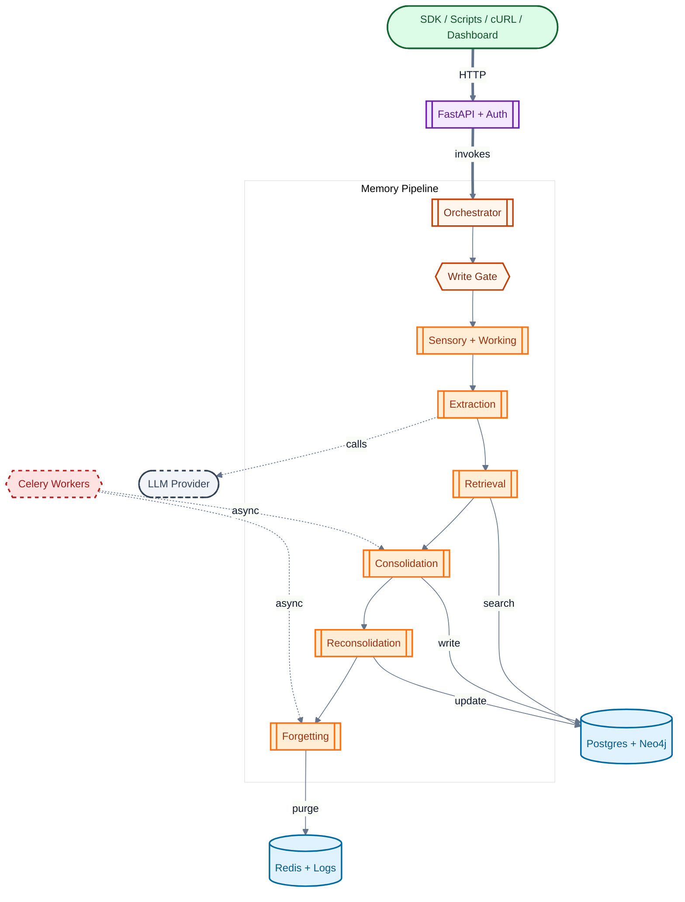

### End-to-End Data Flow

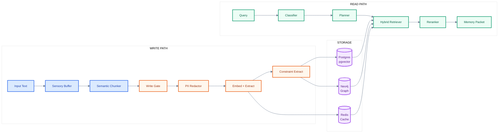

---

## Neuroscience-to-Implementation Mapping

<details>
<summary><h3>1. Sensory and Working Memory (Prefrontal Cortex)</h3></summary>

**Biological Basis**: Sensory memory holds high-fidelity input for seconds. Working memory acts as a temporary workspace with limited capacity (~7+/-2 items).

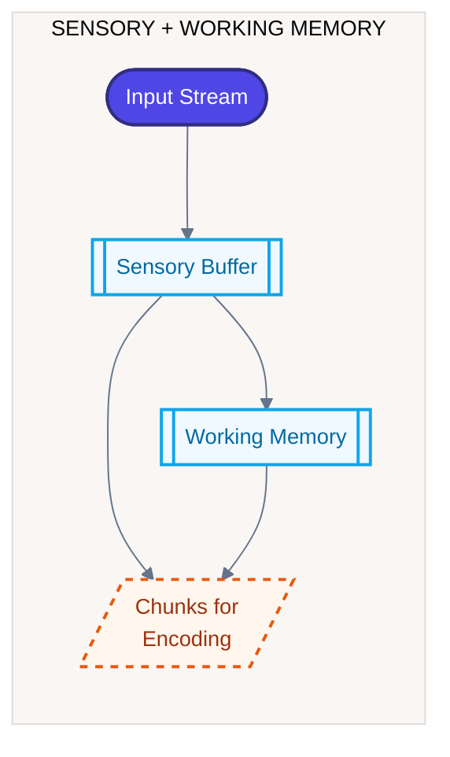

| Concept | Implementation | Location |
| :--- | :--- | :--- |
| Sensory buffer | `SensoryBuffer` (token-ID storage via tiktoken, batch decode) | `src/memory/sensory/buffer.py` |
| Working memory limit | `WorkingMemoryManager` (max=10) + `BoundedStateMap` (LRU/TTL) | `src/memory/working/manager.py` |
| Semantic chunking | `SemanticChunker` (LLM) + `RuleBasedChunker` (8 chunk types incl. CONSTRAINT) | `src/memory/working/chunker.py` |

**Reference**: Miller, G.A. (1956). "The Magical Number Seven, Plus or Minus Two"

</details>

<details>
<summary><h3>2. Encoding: Write Gate and Salience (CREB/Npas4)</h3></summary>

**Biological Basis**: Not all experiences become memories. The proteins **CREB** and **Npas4** regulate which neurons are recruited into memory engrams based on excitability.

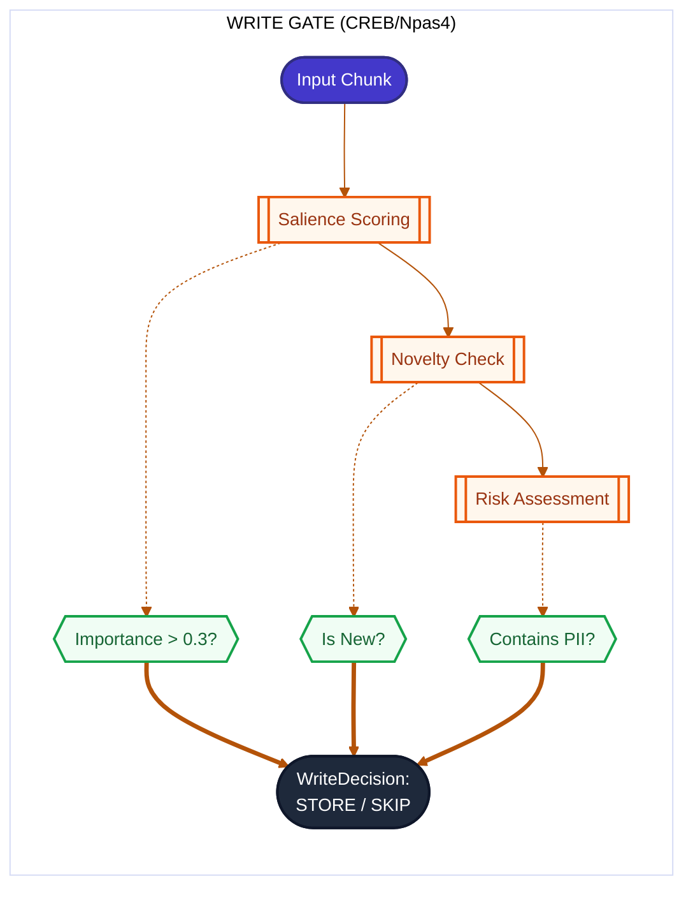

| Concept | Implementation | Location |
| :--- | :--- | :--- |
| CREB allocation | `WriteGate.evaluate()` with salience, novelty, and risk scoring | `src/memory/hippocampal/write_gate.py` |
| Npas4 gating | Write gate threshold (0.3); constraint chunks get importance boost | `WriteGateConfig` |
| PII redaction | `PIIRedactor` strips sensitive information before storage | `src/memory/hippocampal/redactor.py` |
| Type override | `ChunkType.CONSTRAINT` maps to `MemoryType.CONSTRAINT` | `write_gate.py` |

**Reference**: Han et al. (2007). "Neuronal Competition and Selection During Memory Formation"

</details>

<details>
<summary><h3>3. Hippocampal Store (Episodic Memory)</h3></summary>

**Biological Basis**: The hippocampus rapidly encodes detailed, context-rich episodes with a single exposure using **pattern separation**.

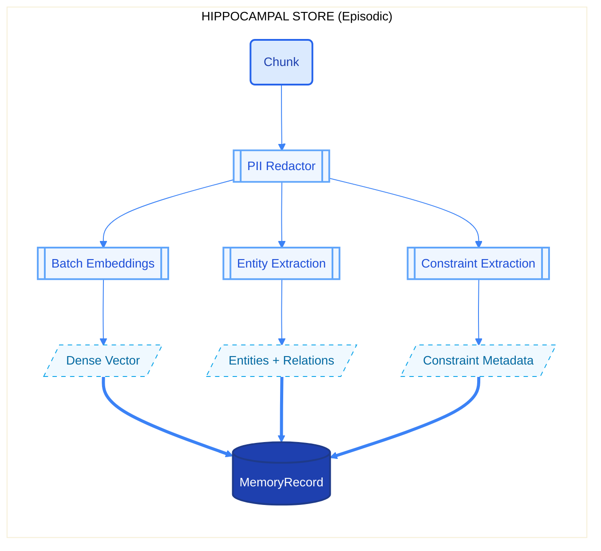

| Concept | Implementation | Location |
| :--- | :--- | :--- |
| One-shot encoding | `HippocampalStore.encode_batch()` &mdash; gate+redact, batch embed, upsert | `src/memory/hippocampal/store.py` |
| Pattern separation | Content-based stable keys (SHA256) + unique embeddings | `PostgresMemoryStore` |
| Write-time facts | `WriteTimeFactExtractor` populates semantic store at write time | `src/extraction/write_time_facts.py` |
| Constraint extraction | `ConstraintExtractor` detects goals/values/policies/states/causal at encode time | `src/extraction/constraint_extractor.py` |
| Batch entity/relation extraction | `RelationExtractor.extract_batch()` in `encode_batch()` reduces per-chunk LLM calls | `src/extraction/relation_extractor.py` |
| Contextual binding | Metadata: time, agent, turn, speaker, constraints | `MemoryRecord` schema |

**Reference**: HippoRAG (2024) &mdash; "Neurobiologically Inspired Long-Term Memory for LLMs"

</details>

<details>
<summary><h3>4. Neocortical Store (Semantic Memory)</h3></summary>

**Biological Basis**: The neocortex gradually encodes generalized, semantic knowledge through slow learning, supporting **pattern completion** via associative networks.

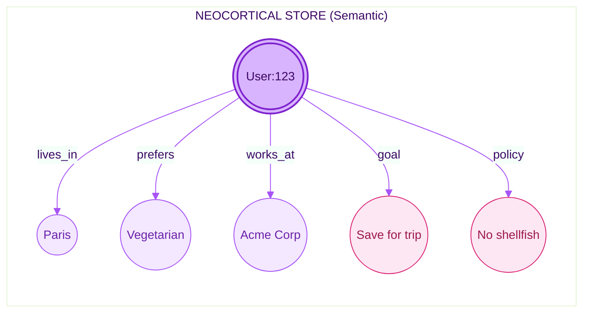

| Concept | Implementation | Location |
| :--- | :--- | :--- |
| Schema-based storage | `FactSchema` + `FactCategory` with `DEFAULT_FACT_SCHEMAS` | `src/memory/neocortical/schemas.py` |
| Cognitive fact categories | `GOAL`, `STATE`, `VALUE`, `CAUSAL`, `POLICY` in `FactCategory` | `src/memory/neocortical/schemas.py` |
| Personalized PageRank | `Neo4jGraphStore.personalized_pagerank()` for multi-hop traversal | `src/storage/neo4j.py` |
| Schema management | `SchemaManager` resolves and registers fact schemas dynamically | `src/memory/neocortical/schema_manager.py` |

**Reference**: HippoRAG uses PPR for "pattern completion across a whole graph structure"

</details>

<details>
<summary><h3>5. Retrieval: Ecphory and Constructive Memory</h3></summary>

**Biological Basis**: Memory retrieval is **ecphory**&mdash;the interaction between a retrieval cue and a stored engram that reconstructs the memory.

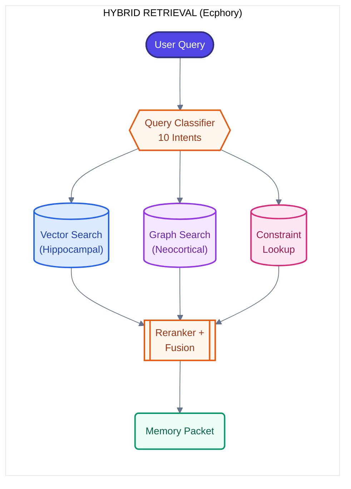

| Concept | Implementation | Location |
| :--- | :--- | :--- |
| Query classification | `QueryClassifier` with 10 intents incl. `CONSTRAINT_CHECK` | `src/retrieval/classifier.py` |
| Retrieval planning | `RetrievalPlanner` generates multi-step plans with priorities | `src/retrieval/planner.py` |
| Hybrid search | `HybridRetriever` with per-step timeouts, cross-group skip-if-found | `src/retrieval/retriever.py` |
| Constraint retrieval | Vector search (MemoryType.CONSTRAINT) + fact lookup across cognitive categories | `src/retrieval/retriever.py` |
| Reranking | Type-dependent recency weights (stable=0.05, semi-stable=0.15, volatile=0.2) | `src/retrieval/reranker.py` |
| Packet building | Facts, preferences, episodes, constraints with provenance and formatting | `src/retrieval/packet_builder.py` |
| Temporal queries | Timezone-aware "today"/"yesterday" via `user_timezone` | `src/retrieval/planner.py` |

**Reference**: Tulving, E. (1983). "Elements of Episodic Memory" &mdash; Encoding Specificity Principle

</details>

<details>
<summary><h3>6. Reconsolidation and Belief Revision</h3></summary>

**Biological Basis**: When a memory is retrieved, it enters a **labile state** and can be modified before being restabilized (reconsolidation).

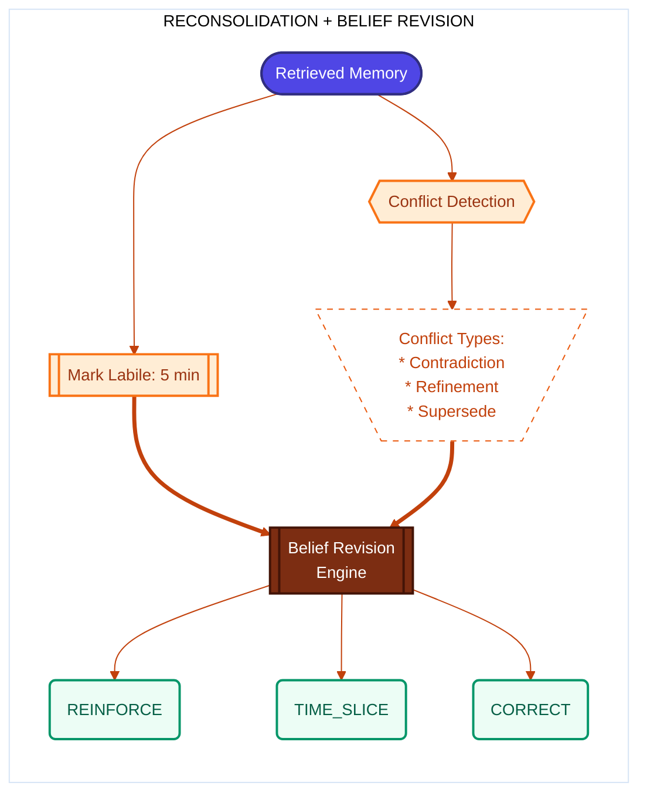

| Concept | Implementation | Location |
| :--- | :--- | :--- |
| Labile state tracking | `LabileStateTracker` (5-min labile window) | `src/reconsolidation/labile_tracker.py` |
| Conflict detection | `ConflictDetector` identifies contradictions, refinements, supersessions | `src/reconsolidation/conflict_detector.py` |
| Belief revision | `BeliefRevisionEngine` (6 strategies) | `src/reconsolidation/belief_revision.py` |
| Constraint supersession | `ConstraintExtractor.detect_supersession()` for same-type+scope | `src/extraction/constraint_extractor.py` |

**Reference**: Nader et al. (2000). "Fear memories require protein synthesis in the amygdala for reconsolidation"

</details>

<details>
<summary><h3>7. Consolidation: The "Sleep Cycle"</h3></summary>

**Biological Basis**: During NREM sleep, the hippocampus "replays" recent experiences via **sharp-wave ripples**, training the neocortex to extract semantic structures.

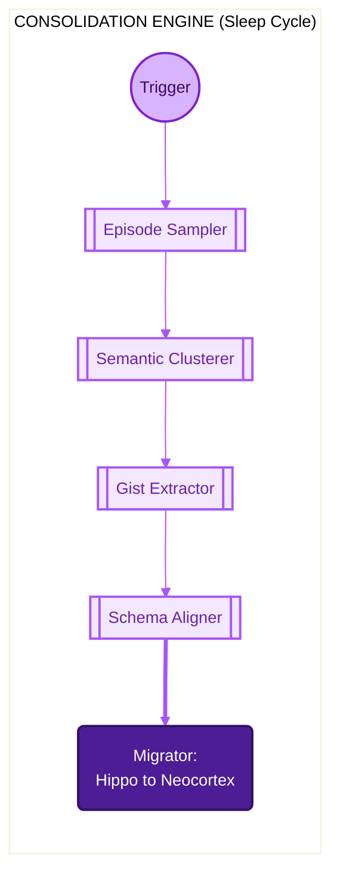

| Concept | Implementation | Location |
| :--- | :--- | :--- |
| Episode sampling | `EpisodeSampler` with type-specific time windows (7d episodes, 90d constraints) | `src/consolidation/sampler.py` |
| Semantic clustering | `SemanticClusterer` groups related memories | `src/consolidation/clusterer.py` |
| Gist extraction | `GistSummarizer` produces cognitive gist types | `src/consolidation/summarizer.py` |
| Schema alignment | `SchemaAligner` maps gists to `FactCategory` (incl. cognitive types) | `src/consolidation/schema_aligner.py` |
| Migration | `ConsolidationMigrator` moves facts hippo &rarr; neocortex | `src/consolidation/migrator.py` |

**Reference**: McClelland et al. (1995). "Why there are complementary learning systems"

</details>

<details>
<summary><h3>8. Active Forgetting (Rac1/Cofilin)</h3></summary>

**Biological Basis**: Forgetting is an **active process**. The proteins **Rac1** and **Cofilin** actively degrade memory traces by pruning synaptic connections.

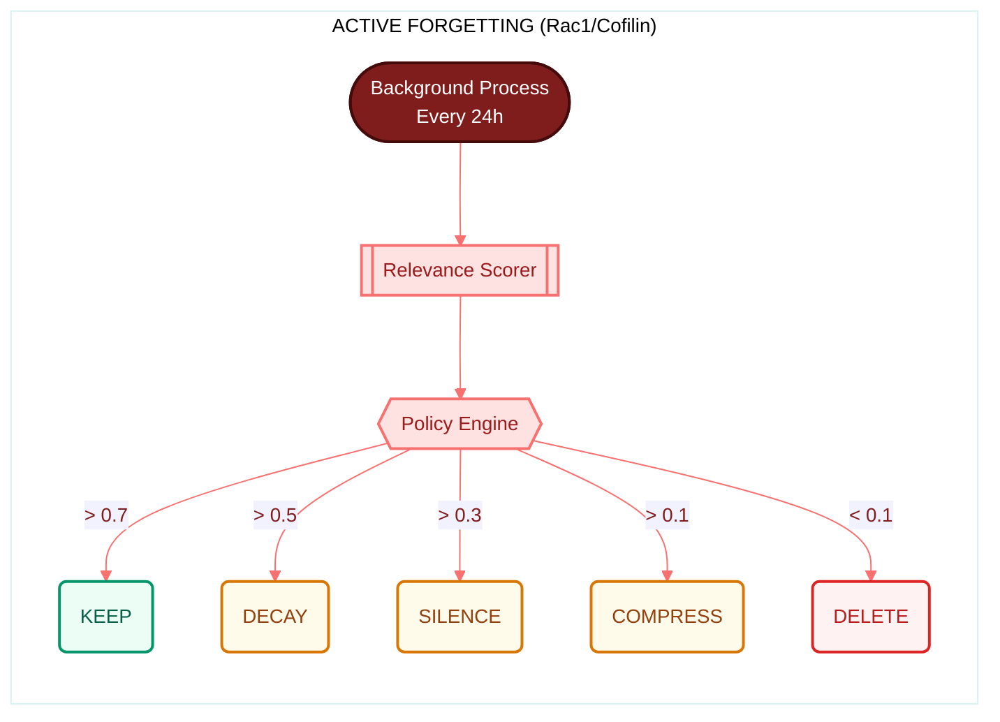

| Concept | Implementation | Location |
| :--- | :--- | :--- |
| Relevance scoring | `ForgettingScorer` computes composite relevance | `src/forgetting/scorer.py` |
| Interference | `InterferenceDetector` finds conflicting memories | `src/forgetting/interference.py` |
| Actions | Keep, Decay, Silence, Compress, Delete | `src/forgetting/actions.py` |
| LLM compression | LLM-based summarization for `COMPRESS` action | `src/forgetting/compression.py` |
| DB-side aggregation | `bulk_dependency_counts()` (one SQL vs O(n^2) Python loop) | `src/storage/postgres.py` |

**Reference**: Shuai et al. (2010). "Forgetting is regulated through Rac activity in Drosophila"

</details>

---

## Memory Types

CML supports 15 memory types reflecting different cognitive functions:

| Type | Description | Biological Analog | Decay |
| :--- | :--- | :--- | :--- |
| `episodic_event` | What happened (full context) | Hippocampal trace | Fast |
| `semantic_fact` | Durable distilled facts | Neocortical schema | Slow |
| `preference` | User preferences and tastes | Orbitofrontal cortex | Medium |
| `constraint` | Goals, values, policies, states, causal rules | Prefrontal inhibition | Stable |
| `procedure` | How to do something | Procedural memory | Stable |
| `hypothesis` | Uncertain beliefs | Predictive coding | Needs confirm |
| `task_state` | Current task progress | Working memory | Very Fast |
| `conversation` | Chat message / turn | Dialogue memory | Session |
| `message` | Single message | Message storage | Session |
| `tool_result` | Tool execution output | Function results | Task |
| `reasoning_step` | Chain-of-thought step | Agent reasoning | Session |
| `scratch` | Temporary working memory | Working notes | Fast |
| `knowledge` | General world knowledge | Domain facts | Stable |
| `observation` | Agent observations | Environment context | Session |
| `plan` | Agent plans and goals | Task planning | Task |

---

## Technology Stack

| Component | Technology | Rationale |
| :--- | :--- | :--- |
| API | **FastAPI** | Async, auto-generated OpenAPI docs |
| Episodic Store | **PostgreSQL + pgvector** | ACID, HNSW vector search with tunable `ef_search` |
| Semantic Store | **Neo4j** | Graph algorithms (PPR), batched entity lookups, multi-hop queries |
| Cache / Queue | **Redis** | Embedding cache (MGET/pipeline), Celery broker, rate limiting, session store |
| Workers | **Redis + Celery** | Background consolidation and forgetting, optional async storage pipeline |
| Embeddings | **OpenAI / sentence-transformers** | Configurable; batched + cached with Redis |
| LLM | **OpenAI / Ollama / compatible** | Extraction, summarization, chunking; optional `LLM_INTERNAL__*` for chunking/extraction/consolidation (bulk ingestion) |
| Observability | **Prometheus + structlog** | Per-step retrieval metrics, structured logging |

---

## Cognitive Constraint Layer (Level-2 Memory)

The system extracts, stores, and retrieves **cognitive constraints** &mdash; goals, values, policies, states, and causal rules &mdash; as first-class memory objects. This enables **LoCoMo-Plus Level-2** performance where latent constraints (e.g. "I'm vegetarian", "We should save money for the trip") are surfaced at decision time even when the query has no lexical overlap with the original statement.

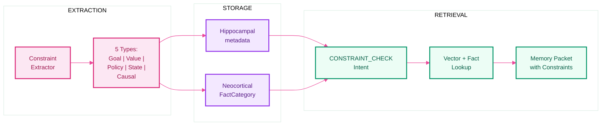

| Component | What it does |
| :--- | :--- |
| **Constraint Extraction** | Rule-based `ConstraintExtractor` detects goal/value/state/causal/policy patterns; `ConstraintObject` schema with subject, scope, activation, confidence |
| **Chunker awareness** | `SemanticChunker` and `RuleBasedChunker` classify constraint cue phrases as `ChunkType.CONSTRAINT` with salience boost (0.85+) |
| **Write gate** | `ChunkType.CONSTRAINT` &rarr; `MemoryType.CONSTRAINT` with importance boost; hippocampal store attaches structured constraints to metadata |
| **Semantic storage** | Constraints stored as `FactCategory.GOAL / VALUE / STATE / CAUSAL / POLICY` in the neocortical fact store |
| **Constraint-aware retrieval** | `CONSTRAINT_CHECK` intent detection; highest-priority retrieval step combining vector search + fact lookup |
| **Packet builder** | "Active Constraints (Must Follow)" section with provenance; up to 6 constraints displayed |
| **Consolidation** | 90-day window for constraint memories (vs 7 days for episodes); cognitive gist types in schema aligner |
| **Supersession** | `ConstraintExtractor.detect_supersession()` for belief revision of same-type constraints |
| **API** | `ReadMemoryResponse.constraints` field; SDK `ReadResponse.constraints` |

Toggle: `FEATURES__CONSTRAINT_EXTRACTION_ENABLED` (default: true). See [evaluation/deep-research-report.md](evaluation/deep-research-report.md) for analysis.

---

## Feature Flags

All features can be toggled via environment variables. See [.env.example](.env.example) and [UsageDocumentation.md](ProjectPlan/UsageDocumentation.md#configuration-reference).

| Flag | Description | Default |
| :--- | :--- | :---: |
| `FEATURES__CONSTRAINT_EXTRACTION_ENABLED` | Extract and store cognitive constraints at write time | On |
| `FEATURES__USE_LLM_*` (8 flags) | LLM-based extractors (constraint, facts, salience, importance, PII, classifier, conflict) | On |
| `FEATURES__STABLE_KEYS_ENABLED` | SHA256-based fact/memory keys (no process-random `hash()`) | On |
| `FEATURES__WRITE_TIME_FACTS_ENABLED` | Populate semantic store at write time (preference/identity) | On |
| `FEATURES__BATCH_EMBEDDINGS_ENABLED` | Single `embed_batch()` call per turn instead of N per-chunk calls | On |
| `FEATURES__STORE_ASYNC` | Enqueue turn writes to Redis; process in background | Off |
| `FEATURES__CACHED_EMBEDDINGS_ENABLED` | Redis cache for embeddings | On |
| `FEATURES__RETRIEVAL_TIMEOUTS_ENABLED` | Per-step and total timeouts for retrieval | On |
| `FEATURES__SKIP_IF_FOUND_CROSS_GROUP` | Cross-group skip on fact hit during retrieval | On |
| `FEATURES__DB_DEPENDENCY_COUNTS` | DB-side aggregation for forgetting | On |
| `FEATURES__BOUNDED_STATE_ENABLED` | LRU+TTL state maps for working/sensory memory | On |
| `FEATURES__HNSW_EF_SEARCH_TUNING` | Query-time HNSW ef_search for pgvector recall/latency trade-off | On |

Prometheus metrics: `cml_retrieval_step_duration_seconds`, `cml_retrieval_step_result_count`, `cml_retrieval_timeout_total`, `cml_fact_hit_rate`.

---

## Quick Start

### Prerequisites

- Docker and Docker Compose
- (Optional) API keys for OpenAI or an Ollama instance for LLM/embeddings

### 1. Start Services

```bash
cd CognitiveMemoryLayer
cp .env.example .env    # Edit .env with your API keys

# Start infrastructure
docker compose -f docker/docker-compose.yml up -d postgres neo4j redis

# Start API server
docker compose -f docker/docker-compose.yml up api

# Verify
curl http://localhost:8000/api/v1/health
```

### 2. Store a Memory

```bash
export AUTH__API_KEY=your-secret-key

curl -X POST http://localhost:8000/api/v1/memory/write \
  -H "Content-Type: application/json" \
  -H "X-API-Key: $AUTH__API_KEY" \
  -H "X-Tenant-ID: demo" \
  -d '{
    "content": "User prefers vegetarian food and lives in Paris.",
    "context_tags": ["preference", "personal"]
  }'
```

For evaluation scripts, add `-H "X-Eval-Mode: true"` to receive `eval_outcome` and `eval_reason` in the response.

### 3. Retrieve Memories

```bash
curl -X POST http://localhost:8000/api/v1/memory/read \
  -H "Content-Type: application/json" \
  -H "X-API-Key: $AUTH__API_KEY" \
  -H "X-Tenant-ID: demo" \
  -d '{"query": "dietary preferences", "format": "packet"}'
```

Response formats: `packet` (categorized into facts, preferences, episodes, constraints), `llm_context` (formatted text), or `list` (flat list).

Optional: include `"user_timezone": "America/New_York"` for timezone-aware "today"/"yesterday" retrieval.

### 4. Seamless Turn (Chat Integration)

```bash
curl -X POST http://localhost:8000/api/v1/memory/turn \
  -H "Content-Type: application/json" \
  -H "X-API-Key: $AUTH__API_KEY" \
  -H "X-Tenant-ID: demo" \
  -d '{"user_message": "What do I like to eat?", "session_id": "session-001"}'
```

The turn endpoint automatically retrieves relevant memories and stores the interaction in a single call.

---

## Python SDK

Install the SDK for Python integration:

```bash
pip install cognitive-memory-layer
```

```python
from cml import CMLClient

client = CMLClient(base_url="http://localhost:8000", api_key="your-key")

# Write
client.write(content="I never eat shellfish because I'm allergic.", tenant_id="demo")

# Read (returns facts, preferences, episodes, and constraints)
response = client.read(query="What should I avoid ordering?", tenant_id="demo")
for constraint in response.constraints:
    print(f"Constraint: {constraint.text}")

# Seamless turn
turn = client.turn(user_message="Recommend a restaurant", tenant_id="demo")
```

The SDK supports **sync**, **async**, and **embedded (SQLite) modes**. Embedded mode runs the memory engine in-process without a server (`storage_mode="lite"`).

See [packages/py-cml](packages/py-cml/) and [packages/py-cml/docs](packages/py-cml/docs/) for full documentation.

---

## Monitoring Dashboard

Access the dashboard at `http://localhost:8000/dashboard` (requires `AUTH__ADMIN_API_KEY`).

| Page | Description |
| :--- | :--- |
| **Overview** | KPIs, memory type/status charts, activity timeline, system health, reconsolidation queue, request sparkline |
| **Tenants** | All tenants with memory/fact/event counts, last activity, quick-link filters |
| **Memory Explorer** | Filterable, sortable, paginated table with bulk actions (archive/silence/delete) and JSON export |
| **Sessions** | Active sessions from Redis with TTL badges and per-session memory counts |
| **Memory Detail** | Full record: content, metrics, provenance, entities/relations, related events |
| **Knowledge Graph** | Interactive vis-network visualization of Neo4j entities/relations; search, depth control, detail panel |
| **API Usage** | Rate-limit buckets with utilization bars, hourly request volume chart |
| **Components** | Health status and metrics for each storage backend |
| **Configuration** | Read-only config snapshot (secrets masked); inline editing for safe runtime settings |
| **Retrieval Test** | Interactive query tool: tenant + query &rarr; scored memories with relevance bars |
| **Events** | Paginated event log with expandable payloads; auto-refresh option |
| **Management** | Trigger consolidation/forgetting per tenant (with dry-run); job history; labile status |

See [UsageDocumentation.md &mdash; Dashboard](./ProjectPlan/UsageDocumentation.md#dashboard-monitoring--management) for full details.

---

## API Reference

Full documentation: [UsageDocumentation.md](./ProjectPlan/UsageDocumentation.md) | Interactive docs: `http://localhost:8000/docs`

### Memory Endpoints

| Endpoint | Method | Description |
| :--- | :---: | :--- |
| `/api/v1/memory/write` | POST | Store new information (with optional `X-Eval-Mode` header) |
| `/api/v1/memory/read` | POST | Retrieve relevant memories (supports `user_timezone`) |
| `/api/v1/memory/turn` | POST | Seamless: auto-retrieve + store in one call |
| `/api/v1/memory/update` | POST | Update memory or provide feedback |
| `/api/v1/memory/forget` | POST | Forget specific memories |
| `/api/v1/memory/stats` | GET | Get memory statistics by type and status |
| `/api/v1/memory/all` | DELETE | Delete all memories for a tenant (admin only) |

### Session Endpoints

| Endpoint | Method | Description |
| :--- | :---: | :--- |
| `/api/v1/session/create` | POST | Create a new session |
| `/api/v1/session/{id}/write` | POST | Write memory within a session |
| `/api/v1/session/{id}/read` | POST | Read memories within session scope |
| `/api/v1/session/{id}/context` | GET | Get session context |

### Admin and System

| Endpoint | Method | Description |
| :--- | :---: | :--- |
| `/api/v1/admin/consolidate/{user_id}` | POST | Trigger consolidation for a user |
| `/api/v1/admin/forget/{user_id}` | POST | Trigger active forgetting for a user |
| `/api/v1/health` | GET | Health check |
| `/dashboard` | GET | Admin dashboard (requires admin API key) |

> **Authentication**: Set `AUTH__API_KEY` and pass via `X-API-Key` header. The dashboard and admin endpoints require `AUTH__ADMIN_API_KEY`.

---

## Evaluation

CML includes a LoCoMo-Plus evaluation harness for benchmarking Level-2 cognitive memory performance.

```bash
# Run full evaluation
cd evaluation
python scripts/eval_locomo_plus.py --verbose
python scripts/run_full_eval.py
```

The evaluation pipeline:
1. Parses LoCoMo conversation data with `DATE:` lines into UTC timestamps
2. Writes each utterance to CML with temporal fidelity and speaker metadata
3. Runs consolidation and reconsolidation (release labile) for each eval tenant via the dashboard API, unless `--skip-consolidation` is set
4. Queries CML with benchmark questions using neutral prompting
5. Scores responses using LLM-as-judge

Use `--ingestion-workers N` (default 10) for concurrent Phase A ingestion; optional `LLM_INTERNAL__*` in `.env` for faster extraction.

See [evaluation/README.md](evaluation/README.md) and [ProjectPlan/LocomoEval/RunEvaluation.md](ProjectPlan/LocomoEval/RunEvaluation.md).

---

## Project Structure

```
CognitiveMemoryLayer/
├── src/                          # Server engine (85 Python modules)
│   ├── api/                      # REST API: routes, auth, middleware, dashboard routes
│   ├── core/                     # Schemas, enums (15 memory types), config (11 feature flags)
│   ├── dashboard/                # Web dashboard (monitoring + management SPA)
│   │   └── static/               # HTML, CSS, JS
│   ├── memory/
│   │   ├── sensory/              # Sensory buffer (token-ID storage via tiktoken)
│   │   ├── working/              # Working memory + chunker (8 chunk types, BoundedStateMap)
│   │   ├── hippocampal/          # Episodic store (pgvector, batch embed, write gate, PII redactor)
│   │   ├── neocortical/          # Semantic store (Neo4j, fact schemas, schema manager)
│   │   └── orchestrator.py       # Main coordinator
│   ├── retrieval/                # Query classifier, planner, hybrid retriever, reranker, packet builder
│   ├── consolidation/            # Sampler, clusterer, summarizer, schema aligner, migrator
│   ├── reconsolidation/          # Labile tracker, conflict detector, belief revision
│   ├── forgetting/               # Scorer, interference, actions, compression, executor
│   ├── extraction/               # Entity, fact, relation, constraint, write-time fact extractors
│   ├── storage/                  # Postgres, Neo4j, Redis, event log, async pipeline
│   └── utils/                    # LLM, embeddings, metrics, timing, bounded state
├── packages/
│   └── py-cml/                   # Python SDK (pip install cognitive-memory-layer)
│       ├── src/cml/              # Client, models, transport, converters
│       ├── tests/                # 175 tests (unit, integration, embedded, e2e)
│       └── docs/                 # SDK documentation
├── tests/                        # 492 tests (unit, integration, e2e)
├── evaluation/                   # LoCoMo-Plus evaluation harness + scripts
├── examples/                     # 14 example scripts (quickstart, chatbot, embedded, integrations)
├── migrations/                   # Alembic database migrations
├── docker/                       # Docker Compose + Dockerfile
├── scripts/                      # Dev scripts (badge updater, init structure)
└── ProjectPlan/                  # Documentation, phase plans, status docs
```

---

## Testing

Tests read configuration from the project root `.env`; copy `.env.example` to `.env` and set values. See [tests/README.md](tests/README.md) for full layout and [packages/py-cml/README.md#testing](packages/py-cml/README.md#testing) for SDK tests.

```bash
# Run all server tests (unit + integration + e2e)
pytest tests/unit tests/integration tests/e2e -v --tb=short

# Run in Docker (with DB)
docker compose -f docker/docker-compose.yml build app
docker compose -f docker/docker-compose.yml run --rm app sh -c "alembic upgrade head && pytest tests -v --tb=short"

# Run unit tests only (no DB required for most)
pytest tests/unit -v

# Run SDK tests (unit, integration, embedded, e2e)
pytest packages/py-cml/tests -v
```

<details>
<summary><strong>Test suite summary</strong></summary>

| Suite | Count | Description |
| :--- | ---: | :--- |
| Server unit | 413 | Core models, write gate, chunker, extraction, constraint layer, retrieval, forgetting, API |
| Server integration | 76 | Hippocampal encode, neocortical store, retrieval flow, consolidation, forgetting, dashboard |
| Server e2e | 3 | Full API flows |
| **Server total** | **492** | `pytest tests/unit tests/integration tests/e2e` |
| SDK unit | 149 | Client, models, transport, serialization, config, enums, retry, logging |
| SDK integration | 18 | Write/read, sessions, admin, batch, stats, namespaces |
| SDK embedded | 6 | Lite mode, lifecycle |
| SDK e2e | 2 | Chat flow, migration |
| **SDK total** | **175** | `pytest packages/py-cml/tests` |
| **Combined** | **667** | Server + SDK |

To refresh version and test-count badges: `python scripts/update_readme_badges.py`

</details>

---

## References

<details>
<summary><strong>Neuroscience Foundations</strong></summary>

1. **McClelland, J.L., McNaughton, B.L., & O'Reilly, R.C.** (1995). ["Why there are complementary learning systems in the hippocampus and neocortex."](https://doi.org/10.1037/0033-295X.102.3.419) *Psychological Review*, 102(3), 419-457.
2. **Tulving, E.** (1983). ["Elements of Episodic Memory."](https://books.google.com/books/about/Elements_of_episodic_memory.html?id=3nQ6AAAAMAAJ) Oxford University Press.
3. **Nader, K., Schafe, G.E., & Le Doux, J.E.** (2000). ["Fear memories require protein synthesis in the amygdala for reconsolidation after retrieval."](https://doi.org/10.1038/35021052) *Nature*, 406(6797), 722-726.
4. **Shuai, Y., et al.** (2010). ["Forgetting is regulated through Rac activity in Drosophila."](https://doi.org/10.1016/j.cell.2009.12.044) *Cell*, 140(4), 579-589.
5. **Han, J.H., et al.** (2007). ["Neuronal competition and selection during memory formation."](https://doi.org/10.1126/science.1139438) *Science*, 316(5823), 457-460.
6. **Miller, G.A.** (1956). ["The magical number seven, plus or minus two."](https://doi.org/10.1037/h0043158) *Psychological Review*, 63(2), 81-97.
7. **Bartlett, F.C.** (1932). ["Remembering: A Study in Experimental and Social Psychology."](https://archive.org/details/rememberingstudy00bart) Cambridge University Press.

</details>

<details>
<summary><strong>AI Memory Frameworks</strong></summary>

8. **HippoRAG** (2024). ["Neurobiologically Inspired Long-Term Memory for Large Language Models."](https://arxiv.org/abs/2405.14831) *arXiv:2405.14831*.
9. **Mem0** (2024). ["Mem0: The Memory Layer for AI Applications."](https://github.com/mem0ai/mem0) *GitHub Repository*.
10. **HawkinsDB** (2024). ["HawkinsDB: A Thousand Brains Theory inspired Database."](https://github.com/harishsg993010/HawkinsDB) *GitHub Repository*.
11. **Wu, T., et al.** (2024). ["From Human Memory to AI Memory: A Survey on Memory Mechanisms in the Era of LLMs."](https://arxiv.org/abs/2404.15965) *arXiv:2404.15965*.

</details>

<details>
<summary><strong>Implementation Guides</strong></summary>

12. **Matlin, M.W.** (2012). ["Cognition"](https://books.google.com/books?id=i9i3EAAAQBAJ) (8th ed.). John Wiley & Sons.
13. **Rasch, B., & Born, J.** (2013). ["About sleep's role in memory."](https://doi.org/10.1152/physrev.00032.2012) *Physiological Reviews*, 93(2), 681-766.

</details>

<details>
<summary><strong>Additional Readings and Resources</strong></summary>

### Academic Journals

* [Cellular and molecular mechanisms of memory: the LTP connection](https://pubmed.ncbi.nlm.nih.gov/10377283/)
* [Cognitive neuroscience perspective on memory: overview and summary](https://pmc.ncbi.nlm.nih.gov/articles/PMC10410470/)
* [Comprehensive exploration of visual working memory mechanisms](https://pmc.ncbi.nlm.nih.gov/articles/PMC11799313/)
* [Destabilization of fear memory by Rac1-driven engram-microglia communication](https://pubmed.ncbi.nlm.nih.gov/38670239/)
* [From Structure to Behavior in Basolateral Amygdala-Hippocampus Circuits](https://pmc.ncbi.nlm.nih.gov/articles/PMC5671506/)
* [Function and mechanisms of memory destabilization and reconsolidation](https://pmc.ncbi.nlm.nih.gov/articles/PMC7167366/)
* [Learning and memory (PMC)](https://pmc.ncbi.nlm.nih.gov/articles/PMC4248571/)
* [Memory Consolidation](https://pmc.ncbi.nlm.nih.gov/articles/PMC4526749/)
* [Memory Part 1: Overview](https://pmc.ncbi.nlm.nih.gov/articles/PMC7965175/)
* [Memory processes during sleep: beyond standard consolidation](https://pmc.ncbi.nlm.nih.gov/articles/PMC11115869/)
* [Memory Reconsolidation or Updating Consolidation?](https://www.ncbi.nlm.nih.gov/books/NBK3905/)
* [Memory Retrieval and the Passage of Time](https://pmc.ncbi.nlm.nih.gov/articles/PMC3069643/)
* [Memory: Neurobiological mechanisms and assessment](https://pmc.ncbi.nlm.nih.gov/articles/PMC8611531/)
* [Molecular Mechanisms of Synaptic Plasticity](https://www.ncbi.nlm.nih.gov/books/NBK3913/)
* [Molecular Mechanisms of the Memory Trace](https://pmc.ncbi.nlm.nih.gov/articles/PMC6312491/)
* [Neurobiology of systems memory consolidation](https://pubmed.ncbi.nlm.nih.gov/32027423/)
* [Perspectives on: Information coding in mammalian sensory physiology](https://pmc.ncbi.nlm.nih.gov/articles/PMC3171078/)
* [Reconstructing a new hippocampal engram for systems reconsolidation](https://pubmed.ncbi.nlm.nih.gov/39689709/)
* [Roles of Rac1-Dependent Intrinsic Forgetting in Memory-Related Disorders](https://pmc.ncbi.nlm.nih.gov/articles/PMC10341513/)
* [Shift from Hippocampal to Neocortical Centered Retrieval Network](https://www.jneurosci.org/content/29/32/10087)
* [Simultaneous encoding of sensory features](https://pmc.ncbi.nlm.nih.gov/articles/PMC12783435/)
* [Systems consolidation reorganizes hippocampal engram circuitry](https://pubmed.ncbi.nlm.nih.gov/40369077/)
* [The Biology of Forgetting -- A Perspective](https://pmc.ncbi.nlm.nih.gov/articles/PMC5657245/)
* [The neurobiological foundation of memory retrieval](https://pmc.ncbi.nlm.nih.gov/articles/PMC6903648/)

### Frontiers Journals

* [Advancements in Neural Coding](https://www.frontiersin.org/research-topics/61027/advancements-in-neural-coding-sensory-perception-and-multiplexed-encoding-strategies)
* [Memory consolidation from a reinforcement learning perspective](https://www.frontiersin.org/journals/computational-neuroscience/articles/10.3389/fncom.2024.1538741/full)
* [Molecular Mechanisms of Memory Consolidation Including Sleep](https://www.frontiersin.org/journals/molecular-neuroscience/articles/10.3389/fnmol.2021.767384/full)
* [Neural, Cellular and Molecular Mechanisms of Active Forgetting](https://www.frontiersin.org/journals/systems-neuroscience/articles/10.3389/fnsys.2018.00003/full)

### University and Educational Resources

* [Synaptic Mechanisms of Long-Term Memory (OpenStax)](https://openstax.org/books/introduction-behavioral-neuroscience/pages/18-4-synaptic-mechanisms-of-long-term-memory)
* [Memories as Types and Stages (OpenTextBC)](https://opentextbc.ca/introductiontopsychology/chapter/8-1-memories-as-types-and-stages/)
* [Engrams: Memory Consolidation and Retrieval (PDF)](https://sowmyamanojna.github.io/reports/engrams-termpaper.pdf)
* [Learning and Memory (Neuroscience Online)](https://nba.uth.tmc.edu/neuroscience/m/s4/chapter07.html)
* [Memory in Psychology: Definition, Types and Stages](https://study.com/academy/lesson/three-stages-of-memory-in-psychology-explanation-lesson-quiz.html)
* [Memory Retrieval: Mechanisms and Disorders](https://www.studysmarter.co.uk/explanations/medicine/neuroscience/memory-retrieval/)
* [Molecular and systems mechanisms of memory consolidation](https://augusta.elsevierpure.com/en/publications/molecular-and-systems-mechanisms-of-memory-consolidation-and-stor/)
* [Parts of the Brain Involved with Memory](https://courses.lumenlearning.com/waymaker-psychology/chapter/parts-of-the-brain-involved-with-memory/)

### News and General Information

* [Brain Anatomy (Mayfield Clinic)](https://mayfieldclinic.com/pe-anatbrain.htm)
* [Dynamic memory engrams reveal how the brain forms memories](https://www.eurekalert.org/news-releases/1084413)
* [How we recall the past (MIT News)](https://news.mit.edu/2017/neuroscientists-discover-brain-circuit-retrieving-memories-0817)
* [Introduction to Brain Anatomy](https://www.buildingbrains.ca/blog/kfsmzpicacg0e47rv0574k8jzk4adc)
* [Types of memory](https://www.medicalnewstoday.com/articles/types-of-memory)
* [Memory: What It Is, How It Works and Types](https://my.clevelandclinic.org/health/articles/memory)
* [Molecular mechanisms of memory formation revealed](https://www.sciencedaily.com/releases/2018/02/180208120925.htm)
* [Research into the nature of memory (UB News)](https://www.buffalo.edu/news/releases/2024/01/How-memory-cells-engrams-stabilize.html)
* [Sensory transduction](https://taylorandfrancis.com/knowledge/Medicine_and_healthcare/Physiology/Sensory_transduction/)

### Preprints

* [Autophagy in DG engrams mediates Rac1-dependent forgetting](https://www.biorxiv.org/content/10.1101/2021.08.26.457763.full)

</details>

---

## Future Roadmap: LLM Intrinsic Memory Integration

> The following describes a **planned** evolution; the current release provides the external (RAG) memory system.

The current CML operates as an advanced external memory system via REST APIs. The next evolution is **intrinsic memory integration** &mdash; injecting memories directly into the LLM's computational graph rather than context-stuffing prompts.

| Approach | How Memory Works | Privacy |
| :--- | :--- | :--- |
| **RAG** (Current) | Text concatenated to prompt | Raw text in prompt |
| **CML Intrinsic** (Target) | Steering vectors / KV-cache / logit biases | Latent vector obfuscation |

<details>
<summary><h3>The Three Injection Interfaces</h3></summary>

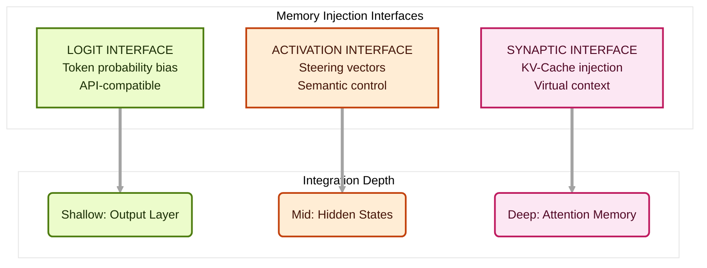

**1. Logit Interface** (Universal Compatibility)
- kNN-LM interpolation: Blend model predictions with memory-based token distributions
- Logit bias: Boost probability of memory-relevant tokens
- Works with any provider supporting `logit_bias`

**2. Activation Interface** (Semantic Steering)
- Steering Vectors: Inject concepts as directions in activation space
- Contrastive Direction Discovery from positive/negative prompt pairs
- Layer targeting: Early (syntactic) &rarr; Middle (semantic) &rarr; Late (formatting)

**3. Synaptic Interface** (Virtual Context)
- KV-Cache Injection: Pre-compute Key-Value pairs for memories
- Temporal Decay: Memories fade like biological synapses (SynapticRAG-inspired)
- Privacy via latent obfuscation &mdash; vectors, not plaintext

</details>

<details>
<summary><h3>Technical Architecture (Planned)</h3></summary>

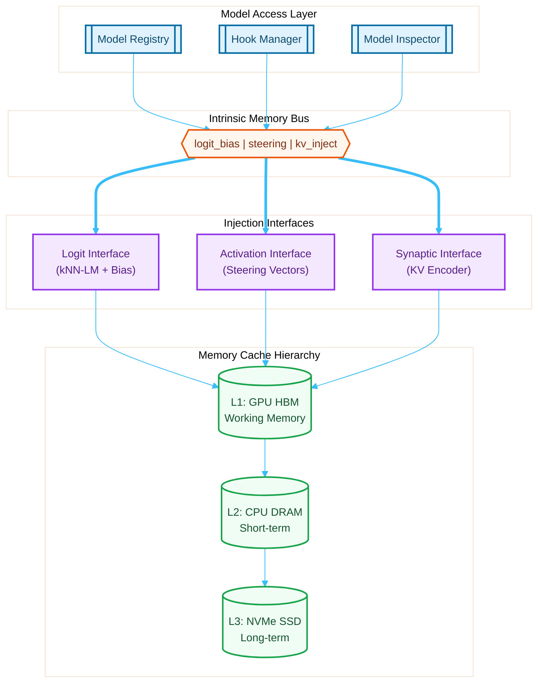

| Component | Function | Implementation |
| :--- | :--- | :--- |
| **Model Backend** | Abstract LLM internals | PyTorch hooks, OpenAI |
| **Hook Manager** | Hook lifecycle + safety | Norm/NaN detection |
| **Memory Encoder** | Text to vectors/KV pairs | Contrastive learning, PCA |
| **Injection Scaler** | Numerical stability | Norm preservation, adaptive alpha |

</details>

<details>
<summary><h3>Research Foundations</h3></summary>

#### Core Architectures

| Paper | Contribution | Link |
| :--- | :--- | :--- |
| **Prometheus Mind** | Identity V: memory via unembedding matrix | [ResearchGate][pm] |
| **SynapticRAG** | Temporal memory decay (synaptic plasticity) | [ACL Findings][sr] |
| **Titans** (Google) | Learning to memorize at test time | [arXiv][titans] |
| **Cognitive Workspace** | Active memory for infinite context | [arXiv][cw] |
| **LongMem** | Decoupled long-term memory networks | [arXiv][lm] |

[pm]: https://www.researchgate.net/publication/400002993_Prometheus_Mind_Retrofitting_Memory_to_Frozen_Language_Models
[sr]: https://aclanthology.org/2025.findings-acl.1048.pdf
[titans]: https://arxiv.org/abs/2501.00663
[cw]: https://arxiv.org/abs/2508.13171
[lm]: https://arxiv.org/abs/2306.07174

#### Techniques

| Paper | Contribution | Link |
| :--- | :--- | :--- |
| **kNN-LM** | Nearest-neighbor memory interpolation | [arXiv][knn] |
| **Shadow in the Cache** | KV-cache privacy via latent obfuscation | [arXiv][sitc] |
| **Steering Vector Fields** | Context-aware LLM control | [arXiv][svf] |
| **Activation Addition** | Steering via bias terms in activations | [OpenReview][aa] |
| **LMCache** | Efficient KV-cache storage and retrieval | [GitHub][lmc] |

[knn]: https://arxiv.org/abs/1911.00172
[sitc]: https://arxiv.org/abs/2508.09442
[svf]: https://arxiv.org/html/2602.01654v1
[aa]: https://openreview.net/forum?id=2XBPdPIcFK
[lmc]: https://github.com/LMCache/LMCache

</details>

<details>
<summary><h3>Development Phases</h3></summary>

| Phase | Focus | Status |
| :--- | :--- | :--- |
| **Phase 1** | Model Access Layer and Hook System | Planned |
| **Phase 2** | Logit Interface (kNN-LM, Bias Engine) | Planned |
| **Phase 3** | Activation Interface (Steering Vectors) | Planned |
| **Phase 4** | Synaptic Interface (KV-Cache Injection) | Planned |
| **Phase 5** | Controller and Gating Unit | Planned |
| **Phase 6** | Memory Encoding Pipeline | Planned |
| **Phase 7** | Cache Hierarchy (L1/L2/L3) | Planned |
| **Phase 8** | Weight Adaptation (Dynamic LoRA) | Planned |
| **Phase 9** | Integration and Migration | Planned |
| **Phase 10** | Observability and Benchmarking | Planned |

See [ProjectPlan/ActiveCML/](./ProjectPlan/ActiveCML/) for detailed specifications.

</details>

---

## License

<p align="center">
  
</p>

This project is licensed under the **GNU General Public License v3.0**. See [LICENSE](./LICENSE) for details.

---

<p align="center">
  <em>"Memory is the diary that we all carry about with us."</em> &mdash; Oscar Wilde
</p>

<p align="center">
  <strong>This project transforms that diary into a computational system that learns, consolidates, and gracefully forgets &mdash; just like we do.</strong>
</p>
