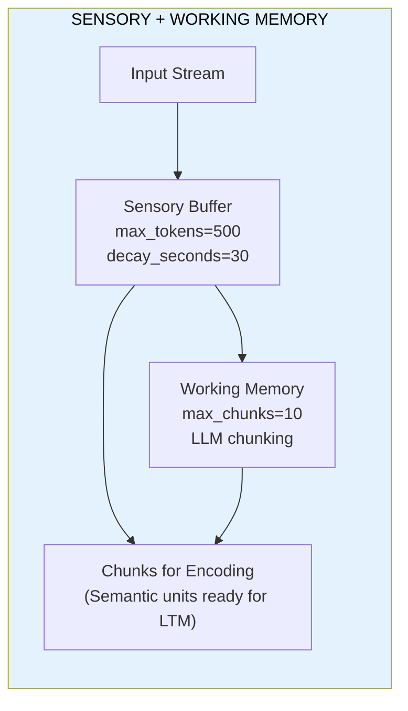
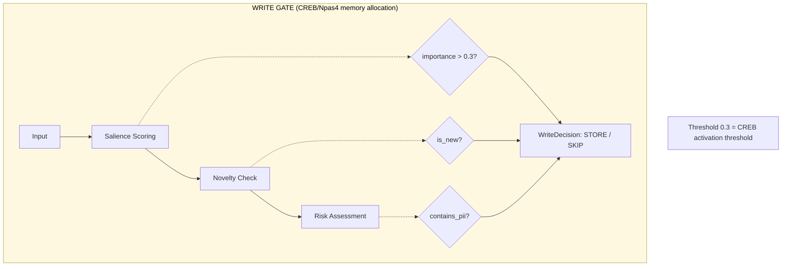
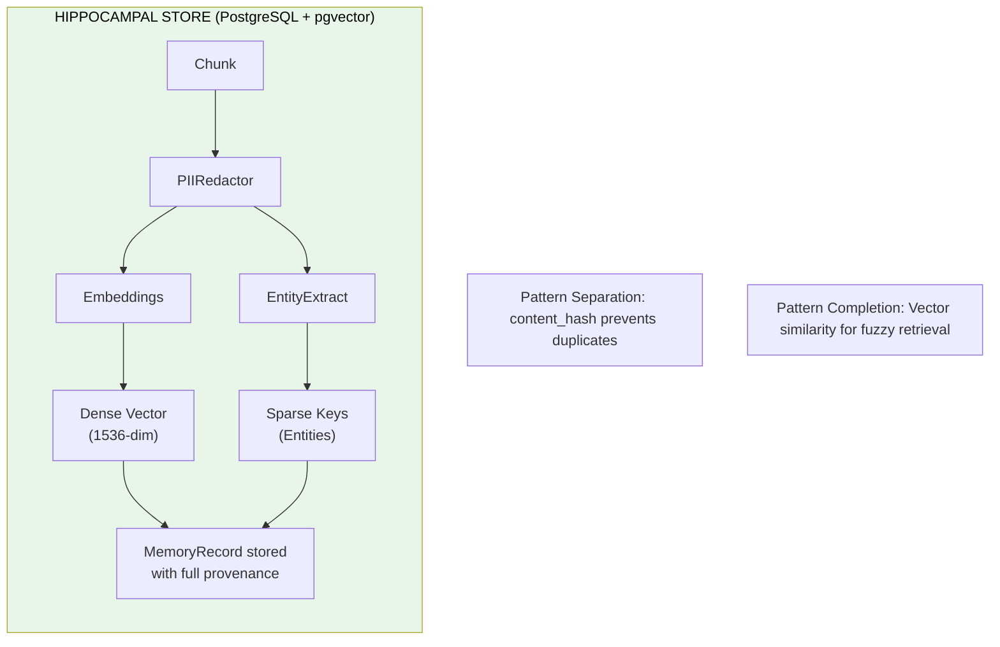
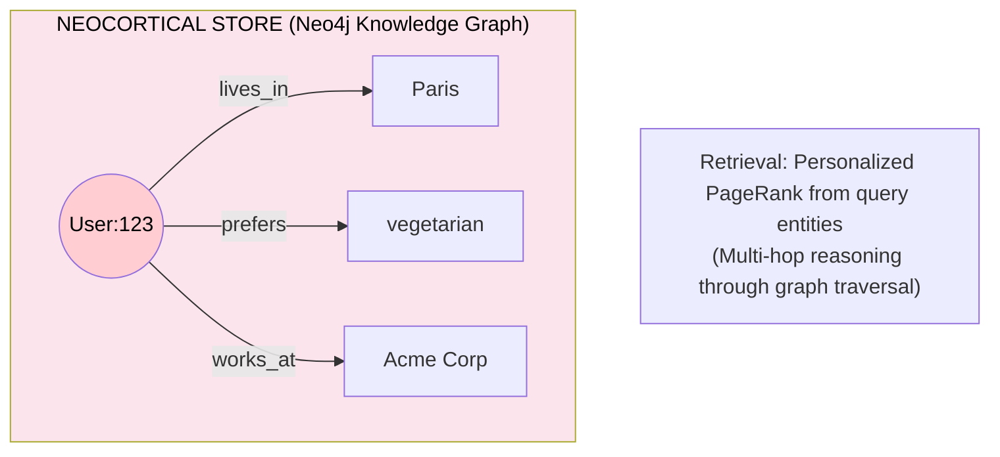

```mermaid
flowchart TB
    subgraph Retrieval["HYBRID RETRIEVAL (Ecphory)"]
        query["Query: 'What food does the user prefer?'"] --> classifier["Query Classifier<br/>(Intent Detection)"]
        classifier --> vector["Vector Search<br/>(Hippocampal)<br/>─────────<br/>Semantic sim.<br/>to embeddings"]
        classifier --> graphSearch["Graph Search<br/>(Neocortical)<br/>─────────<br/>PPR traversal<br/>from entities"]
        vector & graphSearch --> reranker["Reranker<br/>(Relevance+Recency+<br/>Confidence+Diverse)"]
        reranker --> packet["Memory Packet<br/>(Categorized result)"]
    end
    enc["Encoding Specificity: Retrieval cue must overlap with engram"]
    style Retrieval fill:#e8eaf6,color:#000
```

```mermaid
flowchart TB
    subgraph Recon["RECONSOLIDATION (Memory updating during retrieval)"]
        retrieved["Retrieved Memory"] --> mark["Mark Labile<br/>(5 min window)"]
        retrieved --> detect["Conflict Detection"]
        detect --> types["ConflictType:<br/>• CONTRADICTION<br/>• REFINEMENT<br/>• TEMPORAL_SUPERSEDE"]
        mark & types --> belief["Belief Revision Engine"]
        belief --> reinforce["REINFORCE<br/>(+0.2 conf)"]
        belief --> timeslice["TIME_SLICE<br/>(valid_to)"]
        belief --> correct["CORRECT<br/>(invalidate)"]
        reinforce & timeslice & correct --> restab["Restabilize<br/>(Update in store)"]
    end
    style Recon fill:#fff3e0,color:#000
```

```mermaid
flowchart TB
    subgraph Consol["CONSOLIDATION ENGINE ('Sleep Cycle' - Offline Processing)"]
        trigger["Trigger: scheduled | quota_reached | manual"] --> sampler["Episode Sampler<br/>(Priority scoring)"]
        sampler --> cluster["Semantic Clusterer<br/>(Group by similarity)"]
        ripple["⚡ Sharp-wave ripple analog:<br/>replay similar episodes"] -.-> cluster
        cluster --> gist["Gist Extractor<br/>(LLM summarization)"]
        extract["Extract semantic 'gist'<br/>from episodes"] -.-> gist
        gist --> schema["Schema Aligner<br/>(Rapid integration)"]
        match["Match to existing<br/>neocortical schemas"] -.-> schema
        schema --> migrator["Migrator<br/>(Hippo → Neocortex)"]
        migrator --> mark2["Mark episodes as consolidated<br/>(Allows forgetting of source detail)"]
    end
    style Consol fill:#f3e5f5,color:#000
```

```mermaid
flowchart TB
    subgraph Forget["ACTIVE FORGETTING (Rac1/Cofilin Pruning Algorithm)"]
        bg["Background Process<br/>(Celery beat: every 24h)"] --> scorer["Relevance Scorer<br/>─────────────<br/>Score = weighted(<br/>importance, recency,<br/>access_freq, confidence,<br/>type_bonus)"]
        scorer --> policy["Policy Engine<br/>─────────────<br/>score > 0.7 → KEEP<br/>score > 0.5 → DECAY<br/>score > 0.3 → SILENT<br/>score > 0.1 → COMPRESS<br/>score ≤ 0.1 → DELETE"]
        policy --> executor["Executor<br/>─────────────<br/>• Decay: reduce confidence<br/>• Silence: mark inaccessible<br/>• Compress: LLM summarization<br/>• Delete: with dependency check"]
    end
    interference["Interference Management: Detect & resolve duplicate/overlap"]
    style Forget fill:#ffebee,color:#000
```

# Cognitive Memory Layer

A production-ready, neuro-inspired memory system for Large Language Models (LLMs) that replicates human memory architecture. This system enables AI agents to store, retrieve, consolidate, and forget information dynamically—moving beyond static context windows to true long-term memory.

[](./tests)
[](https://python.org)
[](./LICENSE)

## Table of Contents

- [Research Foundation](#research-foundation)
- [Architecture Overview](#architecture-overview)
- [Neuroscience-to-Implementation Mapping](#neuroscience-to-implementation-mapping)
- [System Components](#system-components)
- [Quick Start](#quick-start)
- [API Documentation](#api-documentation)
- [References](#references)

---

## Research Foundation

This project implements a neuro-computational architecture for replicating human memory in LLMs, drawing from cognitive neuroscience research and recent AI memory frameworks.

### The Problem with Current LLMs

Current Large Language Models operate with **fixed context windows** and **static weights**, lacking the dynamic, reconstructive nature of human memory. They cannot:

- Dynamically update or recall knowledge over time
- Integrate new experiences without erasing old ones
- Forget irrelevant information to maintain efficiency
- Consolidate episodic experiences into semantic knowledge

### Our Approach: The Multi-Store Memory Model

Human memory is not a unitary faculty but an **orchestra of distinct functional systems**. Our architecture replicates this through specialized database tiers and biologically-inspired algorithms.

> *"Memory is the process of maintaining information over time."*
> — **Matlin, 2005**

> *"The brain does not simply store memories; it actively reconstructs them."*
> — **Bartlett, 1932**

### Key Research Frameworks Integrated

| Framework | Year | Key Contribution | Our Implementation |
|-----------|------|------------------|-------------------|
| **HippoRAG** | 2024 | Hippocampal index using knowledge graphs with Personalized PageRank for multi-hop retrieval | Neo4j graph store with PPR algorithm in `NeocorticalStore` |
| **HawkinsDB** | 2025 | Thousand Brains Theory - unified semantic/episodic/procedural memory with Reference Frames | Multi-type memory records with structured schemas |
| **Mem0/Mem0g** | 2025 | A.U.D.N. operations (Add, Update, Delete, No-op) with graph-based memory | `ReconsolidationService` with belief revision strategies |
| **Complementary Learning Systems** | McClelland et al., 1995 | Dual-system theory: fast hippocampal learning + slow neocortical integration | `HippocampalStore` (pgvector) + `NeocorticalStore` (Neo4j) |

---

## Architecture Overview

### The Dual-Store Memory System

Our architecture implements the **Complementary Learning Systems (CLS) theory**, which proposes that intelligent systems require two learning systems:

1. **Hippocampal System**: Fast learning, sparse representations, episodic memory
2. **Neocortical System**: Slow learning, distributed representations, semantic memory

```mermaid
flowchart TB
    subgraph API["REST API Layer (FastAPI)"]
        write["/memory/write"]
        read["/memory/read"]
        update["/memory/update"]
        forget["/memory/forget"]
        turn["/memory/turn"]
    end

    subgraph Orchestrator["Memory Orchestrator"]
        gate["Write Gate<br/>(Salience)"]
        encoder["Encoder<br/>(Sparse + Dense)"]
        retriever["Retriever<br/>(Ecphory)"]
        recon["Reconsolidate<br/>(Labile State)"]
        gate --> encoder --> retriever --> recon
    end

    subgraph Stores["Dual-Store Memory System"]
        subgraph Hippo["HIPPOCAMPAL STORE<br/>Fast Episodic Memory"]
            pg["PostgreSQL + pgvector"]
            pg_feat["• Vector embeddings<br/>• High contextual detail<br/>• Rapid write (one-shot)<br/>• Time-indexed episodes<br/>• Pattern separation"]
            bio1["🧠 CA3/CA1 hippocampal circuits"]
        end
        subgraph Neo["NEOCORTICAL STORE<br/>Slow Semantic Memory"]
            neo4j["Neo4j Knowledge Graph"]
            neo_feat["• Entity nodes<br/>• Relation edges<br/>• Personalized PageRank<br/>• Schema-aligned facts<br/>• Pattern completion"]
            bio2["🧠 Prefrontal & temporal cortex"]
        end
    end

    subgraph Workers["BACKGROUND WORKERS (Celery)"]
        consol["CONSOLIDATION<br/>('Sleep Cycle')<br/>─────────────<br/>• Episode replay<br/>• Gist extraction<br/>• Schema update<br/>• Migration"]
        forg["FORGETTING<br/>(Rac1/Cofilin)<br/>─────────────<br/>• Relevance scoring<br/>• Decay/Silence<br/>• Compression"]
        maint["MAINTENANCE<br/>─────────────<br/>• Index optimization<br/>• Schema alignment<br/>• Graph maintenance"]
    end

    subgraph EventLog["EVENT LOG (Append-Only)"]
        log["Immutable audit trail for all operations<br/>(Analogous to long-term potentiation trace)"]
    end

    API --> Orchestrator
    Orchestrator --> Stores
    Stores --> Workers
    Workers --> EventLog

    style API fill:#e1f5fe,color:#000
    style Orchestrator fill:#fff3e0,color:#000
    style Hippo fill:#e8f5e9,color:#000
    style Neo fill:#fce4ec,color:#000
    style Workers fill:#f3e5f5,color:#000
    style EventLog fill:#eceff1,color:#000
```



---

## Neuroscience-to-Implementation Mapping

### 1. Sensory & Working Memory (Prefrontal Cortex)

**Biological Basis**: Sensory memory holds high-fidelity input for seconds. Working memory (WM) acts as a temporary workspace with limited capacity (~7±2 items), maintained by the prefrontal cortex (PFC). Information is "chunked" into larger semantic units to optimize capacity.

**Implementation**:



| Biological Concept | Implementation | Location |
|-------------------|----------------|----------|
| Sensory buffer (iconic/echoic memory) | `SensoryBuffer` with token-level storage and decay | `src/memory/sensory/buffer.py` |
| Working memory capacity limit | `WorkingMemoryManager` with max_chunks=10 | `src/memory/working/manager.py` |
| Semantic chunking | `SemanticChunker` using LLM-based segmentation | `src/memory/working/chunker.py` |
| PFC coordination | `ShortTermMemory` facade | `src/memory/short_term.py` |

**Reference**: Miller, G.A. (1956). "The Magical Number Seven, Plus or Minus Two"

---

### 2. Encoding: Write Gate & Salience (CREB/Npas4 Regulation)

**Biological Basis**: Not all experiences become memories. The proteins **CREB** and **Npas4** regulate which neurons are recruited into memory engrams based on excitability. High-salience events are more likely to be encoded.

**Implementation**:



| Biological Concept | Implementation | Location |
|-------------------|----------------|----------|
| CREB-mediated memory allocation | `WriteGate.evaluate()` salience scoring | `src/memory/hippocampal/write_gate.py` |
| Npas4 contextual gating | Write gate threshold (default 0.3) | `WriteGateConfig` |
| PII redaction (protective forgetting) | `PIIRedactor` | `src/memory/hippocampal/redactor.py` |

**Reference**: Han et al. (2007). "Neuronal Competition and Selection During Memory Formation"

---

### 3. Hippocampal Store (Episodic Memory)

**Biological Basis**: The hippocampus rapidly encodes detailed, context-rich episodes with a single exposure. It uses **pattern separation** to keep distinct experiences from interfering and maintains an "index" to cortical memory traces.

**Implementation**:



| Biological Concept | Implementation | Location |
|-------------------|----------------|----------|
| Rapid one-shot encoding | `HippocampalStore.encode_chunk()` | `src/memory/hippocampal/store.py` |
| Pattern separation (orthogonal representations) | Content hashing + unique embeddings | `PostgresMemoryStore` |
| Sparse coding | Entity extraction + keyword indexing | `src/extraction/entity_extractor.py` |
| Contextual binding | Metadata: timestamp, agent_id, turn_id | `MemoryRecord` schema |

**Reference**: HippoRAG (2024) - "Neurobiologically Inspired Long-Term Memory for Large Language Models"

---

### 4. Neocortical Store (Semantic Memory)

**Biological Basis**: The neocortex gradually encodes generalized, semantic knowledge through slow learning. It stores schemas and facts stripped of specific episodic context, supporting **pattern completion** via associative networks.

**Implementation**:



| Biological Concept | Implementation | Location |
|-------------------|----------------|----------|
| Schema-based storage | `FactSchema` and `FactCategory` | `src/memory/neocortical/schemas.py` |
| Slow learning (interleaved) | Consolidation worker migrates data | `src/consolidation/migrator.py` |
| Personalized PageRank (pattern completion) | `Neo4jGraphStore.personalized_pagerank()` | `src/storage/neo4j.py` |
| Semantic fact management | `SemanticFactStore` | `src/memory/neocortical/fact_store.py` |

**Reference**: HippoRAG uses PPR for "pattern completion across a whole graph structure"

---

### 5. Retrieval: Ecphory & Constructive Memory

**Biological Basis**: Memory retrieval is not passive playback but **ecphory**—the interaction between a retrieval cue and a stored engram that reconstructs the memory. The brain uses different circuits for encoding (CA1→EC) and retrieval (CA1 via Subiculum).

**Implementation**:



| Biological Concept | Implementation | Location |
|-------------------|----------------|----------|
| Ecphory (cue-engram interaction) | `MemoryRetriever.retrieve()` | `src/retrieval/memory_retriever.py` |
| Query classification | `QueryClassifier` (fast patterns + LLM fallback) | `src/retrieval/classifier.py` |
| Hybrid search | `HybridRetriever` (vector + graph + cache) | `src/retrieval/retriever.py` |
| Constructive reconstruction | `MemoryPacketBuilder.to_llm_context()` | `src/retrieval/packet_builder.py` |

**Reference**: Tulving, E. (1983). "Elements of Episodic Memory" - Encoding Specificity Principle

---

### 6. Reconsolidation & Belief Revision

**Biological Basis**: When a memory is retrieved, it enters a **labile (unstable) state** and can be modified before being restabilized. This process—**reconsolidation**—allows memories to be updated with new information, supporting belief revision.

**Implementation**:



| Biological Concept | Implementation | Location |
|-------------------|----------------|----------|
| Labile state tracking | `LabileStateTracker` | `src/reconsolidation/labile_tracker.py` |
| Fact extraction | `LLMFactExtractor` (same LLM as summarization) | `src/extraction/fact_extractor.py` |
| Conflict detection | `ConflictDetector` (heuristics + LLM) | `src/reconsolidation/conflict_detector.py` |
| Belief revision strategies | `BeliefRevisionEngine` with 6 strategies | `src/reconsolidation/belief_revision.py` |
| A.U.D.N. operations | Mem0-inspired Add/Update/Delete/No-op | `ReconsolidationService` |

**Reference**: Nader et al. (2000). "Fear memories require protein synthesis in the amygdala for reconsolidation after retrieval"

---

### 7. Consolidation: The "Sleep Cycle"

**Biological Basis**: During NREM sleep, the hippocampus "replays" recent experiences via **sharp-wave ripples**, training the neocortex to extract statistical patterns and semantic structures. This transfers memories from hippocampal to neocortical storage.

**Implementation**:



| Biological Concept | Implementation | Location |
|-------------------|----------------|----------|
| Sleep replay (sharp-wave ripples) | `ConsolidationWorker` offline processing | `src/consolidation/worker.py` |
| Episode sampling | `EpisodeSampler` with priority scoring | `src/consolidation/sampler.py` |
| Semantic clustering | `SemanticClusterer` (cosine similarity) | `src/consolidation/clusterer.py` |
| Gist extraction | `GistExtractor` (LLM summarization) | `src/consolidation/summarizer.py` |
| Schema-consistent integration | `SchemaAligner` | `src/consolidation/schema_aligner.py` |

**Reference**: McClelland et al. (1995). "Why there are complementary learning systems in the hippocampus and neocortex"

---

### 8. Active Forgetting (Rac1/Cofilin Mechanism)

**Biological Basis**: Forgetting is not passive decay but an **active process**. The proteins **Rac1** and **Cofilin** actively degrade memory traces by pruning synaptic connections, preventing saturation and removing irrelevant information.

**Implementation**:



| Biological Concept | Implementation | Location |
|-------------------|----------------|----------|
| Rac1-mediated active forgetting | `ForgettingWorker` background process | `src/forgetting/worker.py` |
| Relevance scoring | `RelevanceScorer` with multi-factor weights | `src/forgetting/scorer.py` |
| Graceful decay (not abrupt deletion) | Decay → Silence → Compress → Delete | `ForgettingExecutor` |
| Interference management | `InterferenceDetector` (duplicate detection) | `src/forgetting/interference.py` |
| LLM-based compression | `summarize_for_compression()` with vLLM | `src/forgetting/compression.py` |
| Dependency check before delete | `count_references_to()` | `src/storage/postgres.py` |

**Reference**: Shuai et al. (2010). "Forgetting is regulated through Rac activity in Drosophila"

---

## System Components

### Seamless Memory

Memory retrieval is **automatic and unconscious**: use the `/memory/turn` endpoint to process each conversation turn. The system auto-retrieves relevant context for the user message, optionally stores salient information, and returns formatted memory context ready to inject into your LLM prompt. No explicit scope or partition: access is **holistic** per tenant, with optional `context_tags` for filtering.

### Memory Types

| Type | Description | Biological Analog | Decay Rate |
|------|-------------|-------------------|------------|
| `episodic_event` | What happened (full context) | Hippocampal trace | Fast |
| `semantic_fact` | Durable distilled facts | Neocortical schema | Slow |
| `preference` | User preferences | Orbitofrontal cortex | Medium |
| `task_state` | Current task progress | Working memory | Very Fast |
| `procedure` | How to do something | Procedural memory | Stable |
| `constraint` | Rules/policies | Prefrontal inhibition | Never |
| `hypothesis` | Uncertain beliefs | Predictive coding | Requires confirmation |

### Technology Stack

| Component | Technology | Rationale |
|-----------|------------|-----------|
| API Framework | FastAPI | Async, OpenAPI documentation |
| Episodic Store | PostgreSQL + pgvector | ACID, vector search, production-ready |
| Semantic Store | Neo4j | Graph algorithms (PPR), relationship queries |
| Cache | Redis | Working memory cache, rate limiting |
| Queue | Redis + Celery | Background workers (forgetting, consolidation) |
| Embeddings | OpenAI / sentence-transformers | Configurable dense vectors |
| LLM | OpenAI / vLLM | Extraction, summarization, compression |

---

## Quick Start

### Docker (Recommended)

```bash
# Clone and enter directory
cd CognitiveMemoryLayer

# Build and start all services
docker compose -f docker/docker-compose.yml up -d postgres neo4j redis
docker compose -f docker/docker-compose.yml up api

# Test the API
curl http://localhost:8000/api/v1/health

# Set API key (required for write/read). Use AUTH__API_KEY in .env or export it.
# export AUTH__API_KEY=your-secret-key

# Store a memory (holistic: tenant-only; optional context_tags and session_id)
curl -X POST http://localhost:8000/api/v1/memory/write \
  -H "Content-Type: application/json" \
  -H "X-API-Key: $AUTH__API_KEY" \
  -H "X-Tenant-ID: demo" \
  -d '{"content": "User prefers vegetarian food and lives in Paris.", "context_tags": ["preference", "personal"]}'

# Retrieve memories
curl -X POST http://localhost:8000/api/v1/memory/read \
  -H "Content-Type: application/json" \
  -H "X-API-Key: $AUTH__API_KEY" \
  -H "X-Tenant-ID: demo" \
  -d '{"query": "dietary preferences", "format": "llm_context"}'

# Seamless turn: auto-retrieve context + optional auto-store (for chat integrations)
curl -X POST http://localhost:8000/api/v1/memory/turn \
  -H "Content-Type: application/json" \
  -H "X-API-Key: $AUTH__API_KEY" \
  -H "X-Tenant-ID: demo" \
  -d '{"user_message": "What do I like to eat?", "session_id": "session-001"}'
```

### Run Tests

```bash
# Build and run all tests (138 total)
docker compose -f docker/docker-compose.yml build app
docker compose -f docker/docker-compose.yml run --rm app sh -c "alembic upgrade head && pytest tests -v --tb=short"
```

### Test Summary

| Phase | Component | Tests |
|-------|-----------|-------|
| 1 | Foundation & Core Data Models | 19 |
| 2 | Sensory Buffer & Working Memory | 14 |
| 3 | Hippocampal Store | 12 |
| 4 | Neocortical Store | 16 |
| 5 | Retrieval System | 11 |
| 6 | Reconsolidation & Belief Revision | 9 |
| 7 | Consolidation Engine | 10 |
| 8 | Active Forgetting | 28 |
| 9 | REST API & Integration | 11 |
| 10 | Testing & Deployment | 6 |
| **Total** | | **138** |

---

## API Documentation

See [ProjectPlan/UsageDocumentation.md](./ProjectPlan/UsageDocumentation.md) for complete API reference and LLM tool calling interface.

### Key Endpoints

| Endpoint | Method | Description |
|----------|--------|-------------|
| `/api/v1/memory/write` | POST | Store new information |
| `/api/v1/memory/read` | POST | Retrieve relevant memories |
| `/api/v1/memory/turn` | POST | **Seamless memory**: auto-retrieve + auto-store per turn |
| `/api/v1/memory/update` | POST | Update or provide feedback |
| `/api/v1/memory/forget` | POST | Forget memories |
| `/api/v1/memory/stats` | GET | Get memory statistics (tenant from auth) |
| `/api/v1/session/create` | POST | Create a new memory session |
| `/api/v1/session/{session_id}/write` | POST | Write to session memory |
| `/api/v1/session/{session_id}/read` | POST | Read from session memory |
| `/api/v1/health` | GET | Health check |

**Authentication:** Set `AUTH__API_KEY` (and optionally `AUTH__ADMIN_API_KEY`) in your environment; pass the key in the `X-API-Key` header. See [UsageDocumentation](./ProjectPlan/UsageDocumentation.md#authentication).

**Interactive Docs**: http://localhost:8000/docs

---

## References

### Neuroscience Foundations

1. **McClelland, J.L., McNaughton, B.L., & O'Reilly, R.C.** (1995). ["Why there are complementary learning systems in the hippocampus and neocortex: Insights from the successes and failures of connectionist models of learning and memory."](https://doi.org/10.1037/0033-295X.102.3.419) *Psychological Review*, 102(3), 419-457.

2. **Tulving, E.** (1983). *Elements of Episodic Memory*. Oxford University Press. — Encoding Specificity Principle.

3. **Nader, K., Schafe, G.E., & Le Doux, J.E.** (2000). ["Fear memories require protein synthesis in the amygdala for reconsolidation after retrieval."](https://doi.org/10.1038/35017083) *Nature*, 406(6797), 722-726.

4. **Shuai, Y., Lu, B., Hu, Y., Wang, L., Sun, K., & Zhong, Y.** (2010). ["Forgetting is regulated through Rac activity in Drosophila."](https://doi.org/10.1016/j.cell.2009.12.044) *Cell*, 140(4), 579-589.

5. **Han, J.H., et al.** (2007). ["Neuronal competition and selection during memory formation."](https://doi.org/10.1126/science.1128294) *Science*, 316(5823), 457-460. — CREB and memory allocation.

6. **Miller, G.A.** (1956). ["The magical number seven, plus or minus two: Some limits on our capacity for processing information."](https://doi.org/10.1037/h0043158) *Psychological Review*, 63(2), 81-97.

7. **Bartlett, F.C.** (1932). *Remembering: A Study in Experimental and Social Psychology*. Cambridge University Press. — Reconstructive memory.

### AI Memory Frameworks

8. **HippoRAG** (2024). ["Neurobiologically Inspired Long-Term Memory for Large Language Models."](https://arxiv.org/abs/2405.14831) *arXiv:2405.14831*. — Knowledge graph as hippocampal index with Personalized PageRank.

9. **Mem0** (2025). ["Building Production-Ready AI Agents with Scalable Long-Term Memory."](https://arxiv.org/abs/2504.19413) *arXiv:2504.19413*. — A.U.D.N. operations, 90%+ token reduction.

10. **HawkinsDB** (2025). GitHub repository. — Based on Jeff Hawkins' Thousand Brains Theory.

11. **Wu, T., et al.** (2025). ["From Human Memory to AI Memory: A Survey on Memory Mechanisms in the Era of LLMs."](https://arxiv.org/abs/2504.15965) *arXiv:2504.15965*.

### Implementation Guides

12. **Matlin, M.W.** (2005). *Cognition* (6th ed.). John Wiley & Sons.

13. **Rasch, B., & Born, J.** (2013). ["About sleep's role in memory."](https://doi.org/10.1152/physrev.00032.2012) *Physiological Reviews*, 93(2), 681-766.

---

## Project Structure

```
CognitiveMemoryLayer/
├── src/
│   ├── api/                    # REST API endpoints
│   ├── core/                   # Core schemas, enums, config
│   ├── memory/
│   │   ├── sensory/            # Sensory buffer
│   │   ├── working/            # Working memory + chunker
│   │   ├── hippocampal/        # Episodic store (pgvector)
│   │   ├── neocortical/        # Semantic store (Neo4j)
│   │   └── orchestrator.py     # Main coordinator
│   ├── retrieval/              # Hybrid retrieval system
│   ├── consolidation/          # Sleep cycle workers
│   ├── reconsolidation/        # Belief revision
│   ├── forgetting/             # Active forgetting
│   ├── extraction/             # Entity/fact extraction
│   ├── storage/                # Database adapters
│   └── utils/                  # LLM, embeddings, metrics
├── tests/                      # Unit, integration, E2E tests
├── config/                     # Configuration files
├── migrations/                 # Alembic database migrations
├── docker/                     # Docker configuration
└── ProjectPlan/                # Documentation and phase plans
```

---

## License

GNU General Public License v3.0 (GPL-3.0) - See [LICENSE](./LICENSE) for details.

---

*"Memory is the diary that we all carry about with us."* — Oscar Wilde

*This project transforms that diary into a computational system that learns, consolidates, and gracefully forgets—just like we do.*
