<h1 align="center">🧠 Cognitive Memory Layer</h1>

<p align="center">
  <strong>A neuro-inspired memory system that brings human-like memory to AI</strong>
</p>

<p align="center">
  <em>Store. Retrieve. Consolidate. Forget. — Just like the human brain.</em>
</p>

<p align="center">
  <a href="#-quick-start"></a>
  <a href="./ProjectPlan/UsageDocumentation.md"></a>
  <a href="./tests"></a>
</p>

<p align="center">
  
  
  
  
  
  
</p>

---

## ✨ Highlights

<table>
<tr>
<td width="50%">

### 🔬 Neuroscience-Grounded
Built on cognitive science research from McClelland, Tulving, and modern AI memory frameworks like HippoRAG and Mem0.

</td>
<td width="50%">

### ⚡ Production-Ready
Full REST API, Docker deployment, comprehensive test suite (138 tests), and battle-tested architecture.

</td>
</tr>
<tr>
<td width="50%">

### 🧬 Dual-Store Architecture
Complementary Learning Systems theory: fast hippocampal encoding + slow neocortical consolidation.

</td>
<td width="50%">

### 🎯 Seamless Integration
Drop-in `/memory/turn` endpoint auto-retrieves context—no complex orchestration needed.

</td>
</tr>
</table>

---

## 📚 Table of Contents

<details open>
<summary><strong>Click to expand</strong></summary>

- [Research Foundation](#-research-foundation)
- [Architecture Overview](#-architecture-overview)
- [Neuroscience-to-Implementation Mapping](#-neuroscience-to-implementation-mapping)
- [System Components](#-system-components)
- [Quick Start](#-quick-start)
- [Monitoring Dashboard](#-monitoring-dashboard)
- [API Documentation](#-api-documentation)
- [Project Structure](#-project-structure)
- [References](#-references)

</details>

---

## 🔬 Research Foundation

> *"Memory is the process of maintaining information over time."*
> — **Matlin, 2005**

> *"The brain does not simply store memories; it actively reconstructs them."*
> — **Bartlett, 1932**

### 🎯 The Problem with Current LLMs

Current Large Language Models operate with **fixed context windows** and **static weights**, lacking the dynamic, reconstructive nature of human memory:

| Limitation | Impact |
|:-----------|:-------|
| ❌ Cannot dynamically update knowledge | Stale information persists |
| ❌ No integration without catastrophic forgetting | Retraining required for new knowledge |
| ❌ No relevance-based forgetting | Context bloat and inefficiency |
| ❌ No episodic → semantic consolidation | All memories treated equally |

### 💡 Our Approach: The Multi-Store Memory Model

Human memory is not a unitary faculty but an **orchestra of distinct functional systems**. Our architecture replicates this through specialized database tiers and biologically-inspired algorithms.

#### Key Research Frameworks Integrated

| Framework | Year | Key Contribution | Our Implementation |
|:----------|:----:|:-----------------|:-------------------|
| 🧠 **HippoRAG** | 2024 | Hippocampal index using knowledge graphs with Personalized PageRank | Neo4j graph store with PPR algorithm |
| 🧠 **HawkinsDB** | 2025 | Thousand Brains Theory - unified semantic/episodic/procedural memory | Multi-type memory records with structured schemas |
| 🧠 **Mem0** | 2025 | A.U.D.N. operations (Add, Update, Delete, No-op) with graph memory | `ReconsolidationService` with belief revision |
| 🧠 **CLS Theory** | 1995 | Dual-system: fast hippocampal + slow neocortical learning | `HippocampalStore` + `NeocorticalStore` |

---

## 🏗️ Architecture Overview

### The Dual-Store Memory System

Our architecture implements the **Complementary Learning Systems (CLS) theory**:

| System | Learning Speed | Representation | Memory Type |
|:-------|:--------------|:---------------|:------------|
| 🔵 **Hippocampal** | Fast (one-shot) | Sparse | Episodic |
| 🟣 **Neocortical** | Slow (gradual) | Distributed | Semantic |


---

## 🧬 Neuroscience-to-Implementation Mapping

<details>
<summary><h3>1️⃣ Sensory & Working Memory (Prefrontal Cortex)</h3></summary>

**Biological Basis**: Sensory memory holds high-fidelity input for seconds. Working memory acts as a temporary workspace with limited capacity (~7±2 items).


| Biological Concept | Implementation | Location |
|:------------------|:---------------|:---------|
| Sensory buffer | `SensoryBuffer` with token-level storage | `src/memory/sensory/buffer.py` |
| Working memory limit | `WorkingMemoryManager` (max_chunks=10) | `src/memory/working/manager.py` |
| Semantic chunking | `SemanticChunker` with LLM segmentation | `src/memory/working/chunker.py` |

📖 **Reference**: Miller, G.A. (1956). "The Magical Number Seven, Plus or Minus Two"

</details>

<details>
<summary><h3>2️⃣ Encoding: Write Gate & Salience (CREB/Npas4)</h3></summary>

**Biological Basis**: Not all experiences become memories. The proteins **CREB** and **Npas4** regulate which neurons are recruited into memory engrams based on excitability.


| Biological Concept | Implementation | Location |
|:------------------|:---------------|:---------|
| CREB-mediated allocation | `WriteGate.evaluate()` | `src/memory/hippocampal/write_gate.py` |
| Npas4 contextual gating | Write gate threshold (0.3) | `WriteGateConfig` |
| PII redaction | `PIIRedactor` | `src/memory/hippocampal/redactor.py` |

📖 **Reference**: Han et al. (2007). "Neuronal Competition and Selection During Memory Formation"

</details>

<details>
<summary><h3>3️⃣ Hippocampal Store (Episodic Memory)</h3></summary>

**Biological Basis**: The hippocampus rapidly encodes detailed, context-rich episodes with a single exposure using **pattern separation**.


| Biological Concept | Implementation | Location |
|:------------------|:---------------|:---------|
| Rapid one-shot encoding | `HippocampalStore.encode_chunk()` | `src/memory/hippocampal/store.py` |
| Pattern separation | Content hashing + unique embeddings | `PostgresMemoryStore` |
| Contextual binding | Metadata: timestamp, agent_id, turn_id | `MemoryRecord` schema |

📖 **Reference**: HippoRAG (2024) - "Neurobiologically Inspired Long-Term Memory for LLMs"

</details>

<details>
<summary><h3>4️⃣ Neocortical Store (Semantic Memory)</h3></summary>

**Biological Basis**: The neocortex gradually encodes generalized, semantic knowledge through slow learning, supporting **pattern completion** via associative networks.


| Biological Concept | Implementation | Location |
|:------------------|:---------------|:---------|
| Schema-based storage | `FactSchema` and `FactCategory` | `src/memory/neocortical/schemas.py` |
| Personalized PageRank | `Neo4jGraphStore.personalized_pagerank()` | `src/storage/neo4j.py` |

📖 **Reference**: HippoRAG uses PPR for "pattern completion across a whole graph structure"

</details>

<details>
<summary><h3>5️⃣ Retrieval: Ecphory & Constructive Memory</h3></summary>

**Biological Basis**: Memory retrieval is **ecphory**—the interaction between a retrieval cue and a stored engram that reconstructs the memory.


| Biological Concept | Implementation | Location |
|:------------------|:---------------|:---------|
| Ecphory | `MemoryRetriever.retrieve()` | `src/retrieval/memory_retriever.py` |
| Hybrid search | `HybridRetriever` | `src/retrieval/retriever.py` |

📖 **Reference**: Tulving, E. (1983). "Elements of Episodic Memory" - Encoding Specificity Principle

</details>

<details>
<summary><h3>6️⃣ Reconsolidation & Belief Revision</h3></summary>

**Biological Basis**: When a memory is retrieved, it enters a **labile state** and can be modified before being restabilized (reconsolidation).


| Biological Concept | Implementation | Location |
|:------------------|:---------------|:---------|
| Labile state tracking | `LabileStateTracker` | `src/reconsolidation/labile_tracker.py` |
| Belief revision | `BeliefRevisionEngine` (6 strategies) | `src/reconsolidation/belief_revision.py` |

📖 **Reference**: Nader et al. (2000). "Fear memories require protein synthesis in the amygdala for reconsolidation"

</details>

<details>
<summary><h3>7️⃣ Consolidation: The "Sleep Cycle"</h3></summary>

**Biological Basis**: During NREM sleep, the hippocampus "replays" recent experiences via **sharp-wave ripples**, training the neocortex to extract semantic structures.

```mermaid
flowchart TB
    subgraph Consol["CONSOLIDATION ENGINE - Sleep Cycle"]
        trigger["Trigger"] --> sampler["Episode Sampler"]
        sampler --> cluster["Semantic Clusterer"]
        cluster --> gist["Gist Extractor"]
        gist --> schema["Schema Aligner"]
        schema --> migrator["Migrator<br/>(Hippo → Neocortex)"]
    end
    style Consol fill:#f3e5f5,color:#000
```



📖 **Reference**: McClelland et al. (1995). "Why there are complementary learning systems"

</details>

<details>
<summary><h3>8️⃣ Active Forgetting (Rac1/Cofilin)</h3></summary>

**Biological Basis**: Forgetting is an **active process**. The proteins **Rac1** and **Cofilin** actively degrade memory traces by pruning synaptic connections.


📖 **Reference**: Shuai et al. (2010). "Forgetting is regulated through Rac activity in Drosophila"

</details>

---

## 📦 System Components

### Memory Types

| Type | Description | Biological Analog | Decay Rate |
|:-----|:------------|:------------------|:-----------|
| 📝 `episodic_event` | What happened (full context) | Hippocampal trace | Fast |
| 📚 `semantic_fact` | Durable distilled facts | Neocortical schema | Slow |
| ❤️ `preference` | User preferences | Orbitofrontal cortex | Medium |
| 📋 `task_state` | Current task progress | Working memory | Very Fast |
| 🔧 `procedure` | How to do something | Procedural memory | Stable |
| 🚫 `constraint` | Rules/policies | Prefrontal inhibition | Never |
| 💭 `hypothesis` | Uncertain beliefs | Predictive coding | Requires confirmation |
| 💬 `conversation` | Chat message/turn | Dialogue memory | Session-based |
| ✉️ `message` | Single message | Message storage | Session-based |
| 🔧 `tool_result` | Tool execution output | Function results | Task-based |
| 🧠 `reasoning_step` | Chain-of-thought step | Agent reasoning | Session-based |
| 📝 `scratch` | Temporary working memory | Working notes | Fast |
| 📖 `knowledge` | General world knowledge | Domain facts | Stable |
| 👁️ `observation` | Agent observations | Environment context | Session-based |
| 🎯 `plan` | Agent plans/goals | Task planning | Task-based |

### Technology Stack

| Component | Technology | Rationale |
|:----------|:-----------|:----------|
| 🌐 API Framework | **FastAPI** | Async, OpenAPI documentation |
| 💾 Episodic Store | **PostgreSQL + pgvector** | ACID, vector search, production-ready |
| 🕸️ Semantic Store | **Neo4j** | Graph algorithms (PPR), relationship queries |
| ⚡ Cache | **Redis** | Working memory cache, rate limiting |
| 📮 Queue | **Redis + Celery** | Background workers |
| 🧮 Embeddings | **OpenAI / sentence-transformers** | Configurable dense vectors |
| 🤖 LLM | **OpenAI / vLLM** | Extraction, summarization, compression |

---

## 🚀 Quick Start

### Prerequisites

- Docker & Docker Compose
- (Optional) API keys for OpenAI/vLLM

### 1. Start Services

```bash
# Clone and enter directory
cd CognitiveMemoryLayer

# Build and start all services
docker compose -f docker/docker-compose.yml up -d postgres neo4j redis
docker compose -f docker/docker-compose.yml up api

# Verify health
curl http://localhost:8000/api/v1/health
```

### 2. Store a Memory

```bash
export AUTH__API_KEY=your-secret-key

curl -X POST http://localhost:8000/api/v1/memory/write \
  -H "Content-Type: application/json" \
  -H "X-API-Key: $AUTH__API_KEY" \
  -H "X-Tenant-ID: demo" \
  -d '{
    "content": "User prefers vegetarian food and lives in Paris.",
    "context_tags": ["preference", "personal"]
  }'
```

### 3. Retrieve Memories

```bash
curl -X POST http://localhost:8000/api/v1/memory/read \
  -H "Content-Type: application/json" \
  -H "X-API-Key: $AUTH__API_KEY" \
  -H "X-Tenant-ID: demo" \
  -d '{"query": "dietary preferences", "format": "llm_context"}'
```

### 4. Seamless Turn (Chat Integration)

```bash
curl -X POST http://localhost:8000/api/v1/memory/turn \
  -H "Content-Type: application/json" \
  -H "X-API-Key: $AUTH__API_KEY" \
  -H "X-Tenant-ID: demo" \
  -d '{"user_message": "What do I like to eat?", "session_id": "session-001"}'
```

### 5. Monitoring Dashboard

A web-based dashboard provides comprehensive monitoring and management of memories and system components.

```bash
# With the API running, open in a browser:
# http://localhost:8000/dashboard
```

Sign in with your **admin API key** (`AUTH__ADMIN_API_KEY`). The dashboard includes:

- **Overview** — KPIs, memory type/status charts, activity timeline, system health (PostgreSQL, Neo4j, Redis), recent events
- **Memory Explorer** — Filterable, sortable, paginated table of memories; click a row for full detail
- **Memory Detail** — Full record view: content, metrics, provenance, entities/relations, related events
- **Components** — Health status and metrics for each storage backend
- **Events** — Paginated event log with expandable payloads; optional auto-refresh
- **Management** — Trigger consolidation and active forgetting (with dry-run) per tenant

See [UsageDocumentation.md — Dashboard](./ProjectPlan/UsageDocumentation.md#dashboard-monitoring--management) for full details and API reference.

### Run Tests

```bash
# Build and run all 138 tests
docker compose -f docker/docker-compose.yml build app
docker compose -f docker/docker-compose.yml run --rm app sh -c "alembic upgrade head && pytest tests -v --tb=short"
```

<details>
<summary><strong>📊 Test Coverage by Phase</strong></summary>

| Phase | Component | Tests |
|:------|:----------|------:|
| 1 | Foundation & Core Data Models | 19 |
| 2 | Sensory Buffer & Working Memory | 14 |
| 3 | Hippocampal Store | 12 |
| 4 | Neocortical Store | 16 |
| 5 | Retrieval System | 11 |
| 6 | Reconsolidation & Belief Revision | 9 |
| 7 | Consolidation Engine | 10 |
| 8 | Active Forgetting | 28 |
| 9 | REST API & Integration | 11 |
| 10 | Testing & Deployment | 6 |
| | **Total** | **138** |

</details>

---

## 📖 API Documentation

📚 **Full API Reference**: [UsageDocumentation.md](./ProjectPlan/UsageDocumentation.md)

🔗 **Interactive Docs**: http://localhost:8000/docs

📊 **Web Dashboard**: http://localhost:8000/dashboard — monitor memories, view component health, browse events, and trigger consolidation/forgetting (admin API key required).

### Key Endpoints

| Endpoint | Method | Description |
|:---------|:------:|:------------|
| `/api/v1/memory/write` | POST | Store new information |
| `/api/v1/memory/read` | POST | Retrieve relevant memories |
| `/api/v1/memory/turn` | POST | **Seamless memory**: auto-retrieve + auto-store |
| `/api/v1/memory/update` | POST | Update or provide feedback |
| `/api/v1/memory/forget` | POST | Forget memories |
| `/api/v1/memory/stats` | GET | Get memory statistics |
| `/api/v1/session/create` | POST | Create new session |
| `/api/v1/health` | GET | Health check |
| `/dashboard` | GET | **Web dashboard** (monitoring & management; admin key required) |

> **🔐 Authentication**: Set `AUTH__API_KEY` in your environment and pass via `X-API-Key` header. The **dashboard** requires `AUTH__ADMIN_API_KEY`.

---

## 📁 Project Structure

```
CognitiveMemoryLayer/
├── 📂 src/
│   ├── api/                    # REST API endpoints
│   ├── core/                   # Core schemas, enums, config
│   ├── dashboard/              # 📊 Web dashboard (monitoring & management)
│   │   └── static/             # HTML, CSS, JS SPA (overview, memories, events, management)
│   ├── memory/
│   │   ├── sensory/            # 👁️ Sensory buffer
│   │   ├── working/            # 🧠 Working memory + chunker
│   │   ├── hippocampal/        # 🔵 Episodic store (pgvector)
│   │   ├── neocortical/        # 🟣 Semantic store (Neo4j)
│   │   └── orchestrator.py     # 🎭 Main coordinator
│   ├── retrieval/              # 🔍 Hybrid retrieval system
│   ├── consolidation/          # 😴 Sleep cycle workers
│   ├── reconsolidation/        # 🔄 Belief revision
│   ├── forgetting/             # 🗑️ Active forgetting
│   ├── extraction/             # 📤 Entity/fact extraction
│   ├── storage/                # 💾 Database adapters
│   └── utils/                  # 🛠️ LLM, embeddings, metrics
├── 📂 tests/                   # Unit, integration, E2E tests
├── 📂 config/                  # Configuration files
├── 📂 migrations/              # Alembic database migrations
├── 📂 docker/                  # Docker configuration
└── 📂 ProjectPlan/             # Documentation and phase plans
```

---

## 📚 References

<details>
<summary><strong>🧠 Neuroscience Foundations</strong></summary>

1. **McClelland, J.L., McNaughton, B.L., & O'Reilly, R.C.** (1995). ["Why there are complementary learning systems in the hippocampus and neocortex: Insights from the successes and failures of connectionist models of learning and memory."](https://doi.org/10.1037/0033-295X.102.3.419) *Psychological Review*, 102(3), 419-457.

2. **Tulving, E.** (1983). ["Elements of Episodic Memory."](https://books.google.com/books/about/Elements_of_episodic_memory.html?id=3nQ6AAAAMAAJ) Oxford University Press. — Encoding Specificity Principle.

3. **Nader, K., Schafe, G.E., & Le Doux, J.E.** (2000). ["Fear memories require protein synthesis in the amygdala for reconsolidation after retrieval."](https://doi.org/10.1038/35021052) *Nature*, 406(6797), 722-726.

4. **Shuai, Y., Lu, B., Hu, Y., Wang, L., Sun, K., & Zhong, Y.** (2010). ["Forgetting is regulated through Rac activity in Drosophila."](https://doi.org/10.1016/j.cell.2009.12.044) *Cell*, 140(4), 579-589.

5. **Han, J.H., et al.** (2007). ["Neuronal competition and selection during memory formation."](https://doi.org/10.1126/science.1139438) *Science*, 316(5823), 457-460. — CREB and memory allocation.

6. **Miller, G.A.** (1956). ["The magical number seven, plus or minus two: Some limits on our capacity for processing information."](https://doi.org/10.1037/h0043158) *Psychological Review*, 63(2), 81-97.

7. **Bartlett, F.C.** (1932). ["Remembering: A Study in Experimental and Social Psychology."](https://archive.org/details/rememberingstudy00bart) Cambridge University Press. — Reconstructive memory.

</details>

<details>
<summary><strong>🤖 AI Memory Frameworks</strong></summary>

8. **HippoRAG** (2024). ["Neurobiologically Inspired Long-Term Memory for Large Language Models."](https://arxiv.org/abs/2405.14831) *arXiv:2405.14831*. — Knowledge graph as hippocampal index with Personalized PageRank.

9. **Mem0** (2024). ["Mem0: The Memory Layer for AI Applications."](https://github.com/mem0ai/mem0) *GitHub Repository*. — A.U.D.N. operations, 90%+ token reduction.

10. **HawkinsDB** (2024). ["HawkinsDB: A Thousand Brains Theory inspired Database."](https://github.com/harishsg993010/HawkinsDB) *GitHub Repository*. — Based on Jeff Hawkins' Thousand Brains Theory.

11. **Wu, T., et al.** (2024). ["From Human Memory to AI Memory: A Survey on Memory Mechanisms in the Era of LLMs."](https://arxiv.org/abs/2404.15965) *arXiv:2404.15965*.

</details>

<details>
<summary><strong>📖 Implementation Guides</strong></summary>

12. **Matlin, M.W.** (2012). ["Cognition"](https://books.google.com/books?id=i9i3EAAAQBAJ) (8th ed.). John Wiley & Sons.

13. **Rasch, B., & Born, J.** (2013). ["About sleep's role in memory."](https://doi.org/10.1152/physrev.00032.2012) *Physiological Reviews*, 93(2), 681-766.

</details>

<details>
<summary><strong>📚 Additional Readings & Resources</strong></summary>

### Academic Journals & Databases
* [Cellular and molecular mechanisms of memory: the LTP connection](https://pubmed.ncbi.nlm.nih.gov/10377283/)
* [Cognitive neuroscience perspective on memory: overview and summary](https://pmc.ncbi.nlm.nih.gov/articles/PMC10410470/)
* [Comprehensive exploration of visual working memory mechanisms](https://pmc.ncbi.nlm.nih.gov/articles/PMC11799313/)
* [Destabilization of fear memory by Rac1-driven engram-microglia communication](https://pubmed.ncbi.nlm.nih.gov/38670239/)
* [From Structure to Behavior in Basolateral Amygdala-Hippocampus Circuits](https://pmc.ncbi.nlm.nih.gov/articles/PMC5671506/)
* [Function and mechanisms of memory destabilization and reconsolidation](https://pmc.ncbi.nlm.nih.gov/articles/PMC7167366/)
* [Learning and memory (PMC)](https://pmc.ncbi.nlm.nih.gov/articles/PMC4248571/)
* [Memory Consolidation](https://pmc.ncbi.nlm.nih.gov/articles/PMC4526749/)
* [Memory Part 1: Overview](https://pmc.ncbi.nlm.nih.gov/articles/PMC7965175/)
* [Memory processes during sleep: beyond standard consolidation](https://pmc.ncbi.nlm.nih.gov/articles/PMC11115869/)
* [Memory Reconsolidation or Updating Consolidation?](https://www.ncbi.nlm.nih.gov/books/NBK3905/)
* [Memory Retrieval and the Passage of Time](https://pmc.ncbi.nlm.nih.gov/articles/PMC3069643/)
* [Memory: Neurobiological mechanisms and assessment](https://pmc.ncbi.nlm.nih.gov/articles/PMC8611531/)
* [Molecular Mechanisms of Synaptic Plasticity](https://www.ncbi.nlm.nih.gov/books/NBK3913/)
* [Molecular Mechanisms of the Memory Trace](https://pmc.ncbi.nlm.nih.gov/articles/PMC6312491/)
* [Neurobiology of systems memory consolidation](https://pubmed.ncbi.nlm.nih.gov/32027423/)
* [Perspectives on: Information coding in mammalian sensory physiology](https://pmc.ncbi.nlm.nih.gov/articles/PMC3171078/)
* [Reconstructing a new hippocampal engram for systems reconsolidation](https://pubmed.ncbi.nlm.nih.gov/39689709/)
* [Roles of Rac1-Dependent Intrinsic Forgetting in Memory-Related Disorders](https://pmc.ncbi.nlm.nih.gov/articles/PMC10341513/)
* [Shift from Hippocampal to Neocortical Centered Retrieval Network](https://www.jneurosci.org/content/29/32/10087)
* [Simultaneous encoding of sensory features](https://pmc.ncbi.nlm.nih.gov/articles/PMC12783435/)
* [Systems consolidation reorganizes hippocampal engram circuitry](https://pubmed.ncbi.nlm.nih.gov/40369077/)
* [The Biology of Forgetting – A Perspective](https://pmc.ncbi.nlm.nih.gov/articles/PMC5657245/)
* [The neurobiological foundation of memory retrieval](https://pmc.ncbi.nlm.nih.gov/articles/PMC6903648/)

### Frontiers Journals
* [Advancements in Neural Coding](https://www.frontiersin.org/research-topics/61027/advancements-in-neural-coding-sensory-perception-and-multiplexed-encoding-strategies)
* [Memory consolidation from a reinforcement learning perspective](https://www.frontiersin.org/journals/computational-neuroscience/articles/10.3389/fncom.2024.1538741/full)
* [Molecular Mechanisms of Memory Consolidation Including Sleep](https://www.frontiersin.org/journals/molecular-neuroscience/articles/10.3389/fnmol.2021.767384/full)
* [Neural, Cellular and Molecular Mechanisms of Active Forgetting](https://www.frontiersin.org/journals/systems-neuroscience/articles/10.3389/fnsys.2018.00003/full)

### University and Educational Resources
* [18.4 Synaptic Mechanisms of Long-Term Memory (OpenStax)](https://openstax.org/books/introduction-behavioral-neuroscience/pages/18-4-synaptic-mechanisms-of-long-term-memory)
* [9.1 Memories as Types and Stages (OpenTextBC)](https://opentextbc.ca/introductiontopsychology/chapter/8-1-memories-as-types-and-stages/)
* [Engrams: Memory Consolidation and Retrieval (PDF)](https://sowmyamanojna.github.io/reports/engrams-termpaper.pdf)
* [Learning and Memory (Neuroscience Online)](https://nba.uth.tmc.edu/neuroscience/m/s4/chapter07.html)
* [Memory in Psychology | Definition, Types & Stages](https://study.com/academy/lesson/three-stages-of-memory-in-psychology-explanation-lesson-quiz.html)
* [Memory Retrieval: Mechanisms & Disorders](https://www.studysmarter.co.uk/explanations/medicine/neuroscience/memory-retrieval/)
* [Molecular and systems mechanisms of memory consolidation](https://augusta.elsevierpure.com/en/publications/molecular-and-systems-mechanisms-of-memory-consolidation-and-stor/)
* [Parts of the Brain Involved with Memory](https://courses.lumenlearning.com/waymaker-psychology/chapter/parts-of-the-brain-involved-with-memory/)

### News, Medical, and General Information
* [Brain Anatomy (Mayfield Clinic)](https://mayfieldclinic.com/pe-anatbrain.htm)
* [Dynamic memory engrams reveal how the brain forms memories](https://www.eurekalert.org/news-releases/1084413)
* [How we recall the past (MIT News)](https://news.mit.edu/2017/neuroscientists-discover-brain-circuit-retrieving-memories-0817)
* [Introduction to Brain Anatomy](https://www.buildingbrains.ca/blog/kfsmzpicacg0e47rv0574k8jzk4adc)
* [Learn more about the different types of memory](https://www.medicalnewstoday.com/articles/types-of-memory)
* [Memory: What It Is, How It Works & Types](https://my.clevelandclinic.org/health/articles/memory)
* [Molecular mechanisms of memory formation revealed](https://www.sciencedaily.com/releases/2018/02/180208120925.htm)
* [Research into the nature of memory (UB News)](https://www.buffalo.edu/news/releases/2024/01/How-memory-cells-engrams-stabilize.html)
* [Sensory transduction](https://taylorandfrancis.com/knowledge/Medicine_and_healthcare/Physiology/Sensory_transduction/)

### Preprints
* [Autophagy in DG engrams mediates Rac1-dependent forgetting](https://www.biorxiv.org/content/10.1101/2021.08.26.457763.full)

</details>

---

## 🚀 Future Roadmap: LLM Intrinsic Memory Integration

> *"The brain does not simply store memories; it actively reconstructs them."*
> — **Bartlett, 1932**

The current CognitiveMemoryLayer operates as an advanced **external memory system** via REST APIs. Our next evolution is **intrinsic memory integration**—injecting memories directly into the LLM's computational graph rather than "stuffing" context into prompts.

### 🎯 The Paradigm Shift: From Reading to Thinking

| Approach | How Memory Works | Complexity | Privacy |
|:---------|:-----------------|:-----------|:--------|
| **RAG (Current Standard)** | Retrieved text concatenated to prompt → model "reads" it | O(n²) attention | 🔴 Raw text exposed |
| **Cognitive Memory Layer** | Memory injected as steering vectors, KV-cache, or logit biases | O(1) injection | 🟢 Latent obfuscation |

<details>
<summary><h3>🔮 The Three Injection Interfaces</h3></summary>

Our roadmap introduces three levels of memory integration, each deeper in the LLM's forward pass:

```mermaid
flowchart TB
    subgraph Interfaces["Memory Injection Interfaces"]
        direction TB
        logit["🎯 LOGIT INTERFACE<br/>Token probability bias<br/>API-compatible • Safe"]
        activation["⚡ ACTIVATION INTERFACE<br/>Steering vectors in residual stream<br/>Semantic control • Composable"]
        synaptic["🧠 SYNAPTIC INTERFACE<br/>KV-Cache injection<br/>Virtual context • Deepest integration"]
    end
    
    subgraph Depth["Integration Depth"]
        shallow["Shallow (Output Layer)"]
        mid["Mid (Hidden States)"]
        deep["Deep (Attention Memory)"]
    end
    
    logit --> shallow
    activation --> mid
    synaptic --> deep
    
    style logit fill:#e8f5e9,color:#000
    style activation fill:#fff3e0,color:#000
    style synaptic fill:#fce4ec,color:#000
```



#### 1️⃣ Logit Interface (Universal Compatibility)
- **kNN-LM interpolation**: Blend model's predictions with memory-based token distributions
- **Logit bias**: Boost probability of memory-relevant tokens ("Paris", "vegetarian")
- **Works with**: OpenAI API, Claude, local models — any provider with `logit_bias` support

#### 2️⃣ Activation Interface (Semantic Steering)
- **Steering Vectors**: Inject concepts as directions in activation space
- **Contrastive Direction Discovery**: Learn vectors from positive/negative prompt pairs
- **Identity V**: Use model's own unembedding rows as semantic primes
- **Layer targeting**: Early (syntactic) → Middle (semantic) → Late (formatting)

#### 3️⃣ Synaptic Interface (Virtual Context)
- **KV-Cache Injection**: Pre-compute Key-Value pairs for memories, inject into attention
- **Temporal Decay**: Memories fade like biological synapses (SynapticRAG-inspired)
- **Shadow in the Cache**: Privacy via latent obfuscation—vectors, not plaintext

</details>

<details>
<summary><h3>📐 Technical Architecture (Planned)</h3></summary>


**Key Components:**

| Component | Function | Implementation |
|:----------|:---------|:---------------|
| **Model Backend** | Abstract LLM internals (local/API) | PyTorch hooks, vLLM, OpenAI |
| **Hook Manager** | Safe hook lifecycle + safety guards | Norm explosion detection, NaN traps |
| **Memory Encoder** | Text → steering vectors/KV pairs | Contrastive learning, PCA |
| **Injection Scaler** | Maintain numerical stability | Norm preservation, adaptive α |

</details>

<details>
<summary><h3>📚 Research Foundations</h3></summary>

Our intrinsic memory roadmap builds on cutting-edge research:

#### Core Architectures
| Paper | Contribution | Link |
|:------|:-------------|:-----|
| **Prometheus Mind** | Identity V: Retrofitting memory using unembedding matrix | [ResearchGate](https://www.researchgate.net/publication/400002993_Prometheus_Mind_Retrofitting_Memory_to_Frozen_Language_Models) |
| **SynapticRAG** | Temporal memory decay inspired by synaptic plasticity | [ACL Findings](https://aclanthology.org/2025.findings-acl.1048.pdf) |
| **Titans (Google)** | Learning to memorize at test time | [arXiv:2501.00663](https://arxiv.org/abs/2501.00663) |
| **Cognitive Workspace** | Active memory management for infinite context | [arXiv:2508.13171](https://arxiv.org/abs/2508.13171) |
| **LongMem** | Decoupled long-term memory networks | [arXiv:2306.07174](https://arxiv.org/abs/2306.07174) |

#### Techniques & Mechanisms
| Paper | Contribution | Link |
|:------|:-------------|:-----|
| **kNN-LM** | Probabilistic interpolation with nearest-neighbor memory | [arXiv:1911.00172](https://arxiv.org/abs/1911.00172) |
| **Shadow in the Cache** | KV-cache privacy via latent obfuscation | [arXiv:2508.09442](https://arxiv.org/abs/2508.09442) |
| **Steering Vector Fields** | Context-aware LLM control | [arXiv:2602.01654](https://arxiv.org/html/2602.01654v1) |
| **Activation Addition** | Steering via bias terms in activations | [OpenReview](https://openreview.net/forum?id=2XBPdPIcFK) |
| **LMCache** | Efficient KV-cache storage & retrieval | [GitHub](https://github.com/LMCache/LMCache) |

</details>

<details>
<summary><h3>🛣️ Development Phases</h3></summary>

| Phase | Focus | Status |
|:------|:------|:-------|
| **Phase 1** | Model Access Layer & Hook System | 📋 Planned |
| **Phase 2** | Logit Interface (kNN-LM, Bias Engine) | 📋 Planned |
| **Phase 3** | Activation Interface (Steering Vectors) | 📋 Planned |
| **Phase 4** | Synaptic Interface (KV-Cache Injection) | 📋 Planned |
| **Phase 5** | Controller & Gating Unit | 📋 Planned |
| **Phase 6** | Memory Encoding Pipeline | 📋 Planned |
| **Phase 7** | Cache Hierarchy (L1/L2/L3) | 📋 Planned |
| **Phase 8** | Weight Adaptation (Dynamic LoRA) | 📋 Planned |
| **Phase 9** | Integration & Migration | 📋 Planned |
| **Phase 10** | Observability & Benchmarking | 📋 Planned |

> **📖 Detailed Plans**: See [ProjectPlan/](./ProjectPlan/) for comprehensive implementation specifications.

</details>

### 🌟 Why This Matters

| Metric | RAG (Standard) | CML Intrinsic (Target) |
|:-------|:--------------|:-----------------------|
| **Retrieval Cost** | O(n²) attention on context | O(1) vector injection |
| **Memory Utilization** | Passive (re-parsing tokens) | Active (steering cognition) |
| **Privacy** | 🔴 Plaintext in prompt | 🟢 Latent vector obfuscation |
| **Latency** | High (tokenization + prefill) | Low (zero-copy injection) |
| **Mechanism** | Model "reads" retrieved text | Model "thinks" with memory |

---

## 📄 License

<p align="center">
  
</p>

This project is licensed under the **GNU General Public License v3.0** — See [LICENSE](./LICENSE) for details.

---

<p align="center">
  <em>"Memory is the diary that we all carry about with us."</em> — Oscar Wilde
</p>

<p align="center">
  <strong>This project transforms that diary into a computational system that learns, consolidates, and gracefully forgets—just like we do.</strong>
</p>

<p align="center">
  <sub>Made with 🧠 and ❤️ for the AI memory research community</sub>
</p>
