<h1 align="center">🧠 Cognitive Memory Layer</h1>

<p align="center">
  <strong>A neuro-inspired memory system that brings human-like memory to AI</strong>
</p>

<p align="center">
  <em>Store. Retrieve. Consolidate. Forget. — Just like the human brain.</em>
</p>

<p align="center">
  <a href="#-quick-start"></a>
  <a href="./ProjectPlan/UsageDocumentation.md"></a>
  <a href="./tests"></a>
</p>

<p align="center">
  
  
  
  
  
  
</p>

---

## 📚 Table of Contents

<details open>
<summary><strong>Click to expand</strong></summary>

- [Research Foundation](#-research-foundation)
- [Architecture Overview](#architecture-overview)
- [Neuroscience-to-Implementation Mapping](#-neuroscience-to-implementation-mapping)
- [System Components](#-system-components)
- [Quick Start](#-quick-start)
- [Monitoring Dashboard](#5-monitoring-dashboard)
- [API Documentation](#-api-documentation)
- [Project Structure](#-project-structure)
- [References](#-references)

</details>

---

## 🔬 Research Foundation

> *"Memory is the process of maintaining information over time."*
> — **Matlin, 2005**

> *"The brain does not simply store memories; it actively reconstructs them."*
> — **Bartlett, 1932**

### 🎯 The Problem with Current LLMs

Current Large Language Models operate with **fixed context windows** and **static weights**, lacking the dynamic, reconstructive nature of human memory:

| Limitation | Impact |
| :--- | :--- |
| ❌ Cannot dynamically update knowledge | Stale information persists |
| ❌ No integration without catastrophic forgetting | Retraining required |
| ❌ No relevance-based forgetting | Context bloat and inefficiency |
| ❌ No episodic → semantic consolidation | All memories treated equally |

### 💡 Our Approach: The Multi-Store Memory Model

Human memory is not a unitary faculty but an **orchestra of distinct functional systems**. Our architecture replicates this through specialized database tiers and biologically-inspired algorithms.

#### Key Research Frameworks Integrated

| Framework | Key Contribution | Implementation |
| :--- | :--- | :--- |
| 🧠 **HippoRAG** (2024) | Hippocampal index with KG + PPR | Neo4j graph store with PPR |
| 🧠 **HawkinsDB** (2025) | Thousand Brains: unified memory types | Multi-type memory records |
| 🧠 **Mem0** (2025) | A.U.D.N. ops + graph memory | `ReconsolidationService` |
| 🧠 **CLS Theory** (1995) | Dual-system: fast hippo + slow neo | `HippocampalStore` + `NeocorticalStore` |

---
<a name="architecture-overview"></a>
## 🏗️ Architecture Overview

### The Dual-Store Memory System

Our architecture implements the **Complementary Learning Systems (CLS) theory**:

| System                  | Learning Speed  | Representation | Memory Type |
| :---------------------- | :-------------- | :------------- | :---------- |
| 🔵**Hippocampal** | Fast (one-shot) | Sparse         | Episodic    |
| 🟣**Neocortical** | Slow (gradual)  | Distributed    | Semantic    |

```mermaid
%%{
  init: {
    'theme': 'base',
    'flowchart': { 'useMaxWidth': true },
    'themeVariables': {
      'primaryColor': '#F8FAFC',
      'primaryTextColor': '#0F172A',
      'primaryBorderColor': '#475569',
      'lineColor': '#64748B',
      'tertiaryColor': '#ffffff',
      'fontSize': '14px'
    }
  }
}%%
flowchart TD
    classDef client fill:#dcfce7,stroke:#166534,stroke-width:2px,color:#14532d
    classDef api fill:#f3e8ff,stroke:#6b21a8,stroke-width:2px,color:#581c87
    classDef orch fill:#fff7ed,stroke:#c2410c,stroke-width:2px,color:#7c2d12
    classDef module fill:#ffedd5,stroke:#f97316,stroke-width:2px,color:#9a3412
    classDef db fill:#e0f2fe,stroke:#0369a1,stroke-width:2px,color:#075985
    classDef worker fill:#fee2e2,stroke:#b91c1c,stroke-width:2px,stroke-dasharray:5 5,color:#991b1b
    classDef external fill:#f1f5f9,stroke:#334155,stroke-width:2px,stroke-dasharray:5 5,color:#334155

    C(["🔌 SDK · Scripts · cURL · Dashboard"]):::client
    C ==>|HTTP| A[["⚡ FastAPI + Auth"]]:::api
    A ==>|invokes| O

    subgraph Core ["🧠 Memory Pipeline"]
        direction TB
        O[["Orchestrator"]]:::orch
        WG{{"Write Gate"}}:::orch
        Sens[["Sensory → Working"]]:::module
        Ext[["Extraction"]]:::module
        Ret[["Retrieval"]]:::module
        Con[["Consolidation"]]:::module
        Rec[["Reconsolidation"]]:::module
        Fgt[["Forgetting"]]:::module
        O --> WG --> Sens --> Ext --> Ret
        Ret --> Con --> Rec --> Fgt
    end

    Ext -.->|calls| LLM(["☁️ LLM"]):::external

    Ret -->|search| DB[("💾 Postgres · Neo4j")]:::db
    Con -->|write| DB
    Rec -->|update| DB
    Fgt -->|purge| Cache[("⚡ Redis · Logs")]:::db

    W{{"⚙️ Workers"}}:::worker
    W -.->|async| Con
    W -.->|async| Fgt
```



---

## 🧬 Neuroscience-to-Implementation Mapping

<details>
<summary><h3>1️⃣ Sensory & Working Memory (Prefrontal Cortex)</h3></summary>

**Biological Basis**: Sensory memory holds high-fidelity input for seconds. Working memory acts as a temporary workspace with limited capacity (~7±2 items).

```mermaid
%%{
  init: {
    'theme': 'base',
    'flowchart': { 'useMaxWidth': true },
    'themeVariables': {
      'primaryColor': '#E2E8F0',
      'primaryTextColor': '#0F172A',
      'primaryBorderColor': '#334155',
      'lineColor': '#64748B',
      'tertiaryColor': '#ffffff',
      'fontSize': '14px'
    }
  }
}%%
flowchart TD
    %% --- Style Definitions --- %%
    classDef input fill:#4F46E5,stroke:#312E81,color:#fff,stroke-width:2px;
    classDef memory fill:#F0F9FF,stroke:#0EA5E9,stroke-width:2px,color:#0369A1;
    classDef artifact fill:#FFF7ED,stroke:#EA580C,stroke-width:2px,stroke-dasharray: 5 5,color:#9A3412;
    
    %% --- Spacer Style (Invisible) --- %%
    classDef hidden fill:none,stroke:none,color:#fff,width:0px,height:0px;

    subgraph STM ["⚡ SENSORY + WORKING MEMORY"]
        direction TB
        
        %% 1. Invisible Spacer Node (with a non-breaking space inside)
        Spacer("&nbsp;"):::hidden
        
        %% 2. Real Nodes
        In([Input Stream]):::input
        Sensory[[Sensory Buffer]]:::memory
        Working[[Working Memory]]:::memory
        Chunks[/"Chunks for\nEncoding"/]:::artifact

        %% 3. Connection (Spacer to Input)
        %% We use a normal link, then hide it below
        Spacer --- In
        
        %% 4. Real Connections
        In --> Sensory
        Sensory --> Working
        
        %% Merge connection
        Sensory & Working --> Chunks
    end

    %% Hide the first link (index 0) to create the gap
    linkStyle 0 stroke-width:0px,fill:none;
```



| Concept | Implementation | Location |
| :--- | :--- | :--- |
| Sensory buffer | `SensoryBuffer` | `sensory/buffer.py` |
| Working memory limit | `WorkingMemoryManager` (max=10) | `working/manager.py` |
| Semantic chunking | `SemanticChunker` (LLM) | `working/chunker.py` |

📖 **Reference**: Miller, G.A. (1956). "The Magical Number Seven, Plus or Minus Two"

</details>

<details>
<summary><h3>2️⃣ Encoding: Write Gate & Salience (CREB/Npas4)</h3></summary>

**Biological Basis**: Not all experiences become memories. The proteins **CREB** and **Npas4** regulate which neurons are recruited into memory engrams based on excitability.


| Concept | Implementation | Location |
| :--- | :--- | :--- |
| CREB allocation | `WriteGate.evaluate()` | `hippocampal/write_gate.py` |
| Npas4 gating | Write gate threshold (0.3) | `WriteGateConfig` |
| PII redaction | `PIIRedactor` | `hippocampal/redactor.py` |

📖 **Reference**: Han et al. (2007). "Neuronal Competition and Selection During Memory Formation"

</details>

<details>
<summary><h3>3️⃣ Hippocampal Store (Episodic Memory)</h3></summary>

**Biological Basis**: The hippocampus rapidly encodes detailed, context-rich episodes with a single exposure using **pattern separation**.


| Concept | Implementation | Location |
| :--- | :--- | :--- |
| One-shot encoding | `HippocampalStore.encode_chunk()` | `hippocampal/store.py` |
| Pattern separation | Content hash + unique embeddings | `PostgresMemoryStore` |
| Contextual binding | Metadata: time, agent, turn | `MemoryRecord` schema |

📖 **Reference**: HippoRAG (2024) - "Neurobiologically Inspired Long-Term Memory for LLMs"

</details>

<details>
<summary><h3>4️⃣ Neocortical Store (Semantic Memory)</h3></summary>

**Biological Basis**: The neocortex gradually encodes generalized, semantic knowledge through slow learning, supporting **pattern completion** via associative networks.

```mermaid
%%{
  init: {
    'theme': 'base',
    'flowchart': { 'useMaxWidth': true },
    'themeVariables': {
      'primaryColor': '#FAF5FF',
      'primaryTextColor': '#581c87',
      'primaryBorderColor': '#9333ea',
      'lineColor': '#a855f7',
      'tertiaryColor': '#ffffff',
      'fontSize': '14px'
    }
  }
}%%
flowchart TD
    %% --- Style Definitions --- %%
    classDef root fill:#d8b4fe,stroke:#7e22ce,stroke-width:2px,color:#3b0764;
    classDef leaf fill:#f3e8ff,stroke:#a855f7,stroke-width:1px,color:#6b21a8;
    classDef hidden fill:none,stroke:none,color:#fff,width:0px,height:0px;

    subgraph Neo ["🟣 NEOCORTICAL STORE (Semantic)"]
        direction TB
        
        %% 1. Spacer for Gap
        Spacer("&nbsp;"):::hidden
        
        %% 2. Central Root Node
        User(((User:123))):::root
        
        %% 3. Connected Fact Nodes
        Paris((Paris)):::leaf
        Veg((Vegetarian)):::leaf
        Acme((Acme Corp)):::leaf
        
        %% --- Wiring ---
        %% Link Spacer to create gap
        Spacer --- User
        
        %% Relationships
        User -- "lives_in" --> Paris
        User -- "prefers" --> Veg
        User -- "works_at" --> Acme
    end

    %% Hide the spacer link
    linkStyle 0 stroke-width:0px,fill:none;
```



| Concept | Implementation | Location |
| :--- | :--- | :--- |
| Schema-based storage | `FactSchema` + `FactCategory` | `neocortical/schemas.py` |
| Personalized PageRank | `Neo4jGraphStore.personalized_pagerank()` | `storage/neo4j.py` |

📖 **Reference**: HippoRAG uses PPR for "pattern completion across a whole graph structure"

</details>

<details>
<summary><h3>5️⃣ Retrieval: Ecphory & Constructive Memory</h3></summary>

**Biological Basis**: Memory retrieval is **ecphory**—the interaction between a retrieval cue and a stored engram that reconstructs the memory.


| Concept | Implementation | Location |
| :--- | :--- | :--- |
| Ecphory | `MemoryRetriever.retrieve()` | `retrieval/memory_retriever.py` |
| Hybrid search | `HybridRetriever` | `retrieval/retriever.py` |

📖 **Reference**: Tulving, E. (1983). "Elements of Episodic Memory" - Encoding Specificity Principle

</details>

<details>
<summary><h3>6️⃣ Reconsolidation & Belief Revision</h3></summary>

**Biological Basis**: When a memory is retrieved, it enters a **labile state** and can be modified before being restabilized (reconsolidation).

```mermaid
%%{
  init: {
    'theme': 'base',
    'flowchart': { 'useMaxWidth': true },
    'themeVariables': {
      'primaryColor': '#FFF7ED',
      'primaryTextColor': '#7c2d12',
      'primaryBorderColor': '#ea580c',
      'lineColor': '#c2410c',
      'tertiaryColor': '#ffffff',
      'fontSize': '14px'
    }
  }
}%%
flowchart TD
    %% --- Style Definitions --- %%
    classDef input fill:#4F46E5,stroke:#312E81,color:#fff,stroke-width:2px;
    classDef process fill:#ffedd5,stroke:#f97316,stroke-width:2px,color:#9a3412;
    classDef list fill:#fff,stroke:#ea580c,stroke-width:1px,stroke-dasharray: 5 5,color:#c2410c;
    classDef engine fill:#7c2d12,stroke:#431407,stroke-width:2px,color:#fff;
    classDef result fill:#ecfdf5,stroke:#059669,stroke-width:2px,color:#065f46;
    classDef hidden fill:none,stroke:none,color:#fff,width:0px,height:0px;

    subgraph Recon ["🔄 RECONSOLIDATION & BELIEF REVISION"]
        direction TB
        
        %% 1. Spacer for Gap
        Spacer("&nbsp;"):::hidden
        
        %% 2. Input
        Retrieved([Retrieved Memory]):::input

        %% 3. Analysis Phase
        Mark[[Mark Labile: 5 min]]:::process
        Detect{{Conflict Detection}}:::process
        
        %% 4. Data Artifact
        Types[\"Conflict Types:<br/>• Contradiction<br/>• Refinement<br/>• Supersede"/]:::list
        
        %% 5. Core Engine
        Belief[[Belief Revision<br/>Engine]]:::engine
        
        %% 6. Outcomes
        Reinforce(REINFORCE):::result
        Slice(TIME_SLICE):::result
        Correct(CORRECT):::result
        
        %% --- Wiring ---
        Spacer --- Retrieved
        
        Retrieved --> Mark
        Retrieved --> Detect
        
        Detect --> Types
        
        Mark & Types ==> Belief
        
        %% Outcome Split
        Belief --> Reinforce
        Belief --> Slice
        Belief --> Correct
    end

    %% Hide the spacer link
    linkStyle 0 stroke-width:0px,fill:none;
```



| Concept | Implementation | Location |
| :--- | :--- | :--- |
| Labile state tracking | `LabileStateTracker` | `reconsolidation/labile_tracker.py` |
| Belief revision | `BeliefRevisionEngine` (6 strategies) | `reconsolidation/belief_revision.py` |

📖 **Reference**: Nader et al. (2000). "Fear memories require protein synthesis in the amygdala for reconsolidation"

</details>

<details>
<summary><h3>7️⃣ Consolidation: The "Sleep Cycle"</h3></summary>

**Biological Basis**: During NREM sleep, the hippocampus "replays" recent experiences via **sharp-wave ripples**, training the neocortex to extract semantic structures.

```mermaid
%%{
  init: {
    'theme': 'base',
    'flowchart': { 'useMaxWidth': true },
    'themeVariables': {
      'primaryColor': '#F3E8FF',
      'primaryTextColor': '#581c87',
      'primaryBorderColor': '#9333ea',
      'lineColor': '#a855f7',
      'tertiaryColor': '#ffffff',
      'fontSize': '14px'
    }
  }
}%%
flowchart TD
    %% --- Style Definitions --- %%
    classDef input fill:#d8b4fe,stroke:#7e22ce,stroke-width:2px,color:#3b0764;
    classDef process fill:#f3e8ff,stroke:#a855f7,stroke-width:2px,color:#6b21a8;
    classDef output fill:#4c1d95,stroke:#2e1065,stroke-width:2px,color:#fff;
    classDef hidden fill:none,stroke:none,color:#fff,width:0px,height:0px;

    subgraph Consol ["😴 CONSOLIDATION ENGINE (Sleep Cycle)"]
        direction TB
        
        %% 1. Spacer for Gap
        Spacer("&nbsp;"):::hidden

        %% 2. Trigger
        Trigger((Trigger)):::input

        %% 3. Processing Pipeline
        Sample[[Episode Sampler]]:::process
        Cluster[[Semantic Clusterer]]:::process
        Gist[[Gist Extractor]]:::process
        Schema[[Schema Aligner]]:::process

        %% 4. Final Migration
        Migrator(Migrator:<br/>Hippo → Neocortex):::output

        %% --- Wiring ---
        Spacer --- Trigger
        
        Trigger --> Sample
        Sample --> Cluster
        Cluster --> Gist
        Gist --> Schema
        Schema ==> Migrator
    end

    %% Hide the spacer link
    linkStyle 0 stroke-width:0px,fill:none;
```



📖 **Reference**: McClelland et al. (1995). "Why there are complementary learning systems"

</details>

<details>
<summary><h3>8️⃣ Active Forgetting (Rac1/Cofilin)</h3></summary>

**Biological Basis**: Forgetting is an **active process**. The proteins **Rac1** and **Cofilin** actively degrade memory traces by pruning synaptic connections.


📖 **Reference**: Shuai et al. (2010). "Forgetting is regulated through Rac activity in Drosophila"

</details>

---

## 📦 System Components

### Memory Types

| Type | Description | Analog | Decay |
| :--- | :--- | :--- | :--- |
| 📝 `episodic_event` | What happened (full context) | Hippocampal trace | Fast |
| 📚 `semantic_fact` | Durable distilled facts | Neocortical schema | Slow |
| ❤️ `preference` | User preferences | Orbitofrontal cortex | Medium |
| 📋 `task_state` | Current task progress | Working memory | Very Fast |
| 🔧 `procedure` | How to do something | Procedural memory | Stable |
| 🚫 `constraint` | Rules / policies | Prefrontal inhibition | Never |
| 💭 `hypothesis` | Uncertain beliefs | Predictive coding | Needs confirm |
| 💬 `conversation` | Chat message / turn | Dialogue memory | Session |
| ✉️ `message` | Single message | Message storage | Session |
| 🔧 `tool_result` | Tool execution output | Function results | Task |
| 🧠 `reasoning_step` | Chain-of-thought step | Agent reasoning | Session |
| 📝 `scratch` | Temporary working memory | Working notes | Fast |
| 📖 `knowledge` | General world knowledge | Domain facts | Stable |
| 👁️ `observation` | Agent observations | Environment context | Session |
| 🎯 `plan` | Agent plans / goals | Task planning | Task |

### Technology Stack

| Component | Technology | Rationale |
| :--- | :--- | :--- |
| 🌐 API | **FastAPI** | Async, OpenAPI docs |
| 💾 Episodic Store | **PostgreSQL + pgvector** | ACID, vector search |
| 🕸️ Semantic Store | **Neo4j** | Graph algorithms (PPR) |
| ⚡ Cache | **Redis** | Working memory, rate limiting |
| 📮 Queue | **Redis + Celery** | Background workers |
| 🧮 Embeddings | **OpenAI / sentence-transformers** | Configurable dense vectors |
| 🤖 LLM | **OpenAI / compatible** | Extraction, summarization |

---

## 🚀 Quick Start

### Prerequisites

- Docker & Docker Compose
- (Optional) API keys for OpenAI or default LLM

### 1. Start Services

```bash
# Clone and enter directory
cd CognitiveMemoryLayer

# Build and start all services
docker compose -f docker/docker-compose.yml up -d postgres neo4j redis
docker compose -f docker/docker-compose.yml up api

# Verify health
curl http://localhost:8000/api/v1/health
```

### 2. Store a Memory

```bash
export AUTH__API_KEY=your-secret-key

curl -X POST http://localhost:8000/api/v1/memory/write \
  -H "Content-Type: application/json" \
  -H "X-API-Key: $AUTH__API_KEY" \
  -H "X-Tenant-ID: demo" \
  -d '{
    "content": "User prefers vegetarian food and lives in Paris.",
    "context_tags": ["preference", "personal"]
  }'
```
For evaluation scripts, add `-H "X-Eval-Mode: true"` to receive `eval_outcome` and `eval_reason` in the response (stored/skipped and write-gate reason). See [UsageDocumentation](ProjectPlan/UsageDocumentation.md) and [evaluation/README](evaluation/README.md).

### 3. Retrieve Memories

```bash
curl -X POST http://localhost:8000/api/v1/memory/read \
  -H "Content-Type: application/json" \
  -H "X-API-Key: $AUTH__API_KEY" \
  -H "X-Tenant-ID: demo" \
  -d '{"query": "dietary preferences", "format": "llm_context"}'
```

### 4. Seamless Turn (Chat Integration)

```bash
curl -X POST http://localhost:8000/api/v1/memory/turn \
  -H "Content-Type: application/json" \
  -H "X-API-Key: $AUTH__API_KEY" \
  -H "X-Tenant-ID: demo" \
  -d '{"user_message": "What do I like to eat?", "session_id": "session-001"}'
```

**From Python:** `pip install cognitive-memory-layer` — see [packages/py-cml](packages/py-cml/) and [Usage docs — Python SDK](./ProjectPlan/UsageDocumentation.md#python-sdk-cognitive-memory-layer).

### 5. Monitoring Dashboard

A web-based dashboard provides comprehensive monitoring and management of memories and system components.

```bash
# With the API running, open in a browser:
# http://localhost:8000/dashboard
```

Sign in with your **admin API key** (`AUTH__ADMIN_API_KEY`). The dashboard includes:

- **Overview** — KPIs, memory type/status charts, activity timeline, system health, reconsolidation queue, request sparkline
- **Tenants** — All tenants with memory/fact/event counts, last activity, quick links to filter other pages
- **Memory Explorer** — Filterable, sortable, paginated table of memories with bulk actions (archive/silence/delete) and JSON export
- **Sessions** — Active sessions from Redis with TTL badges and memory counts per session from DB
- **Memory Detail** — Full record view: content, metrics, provenance, entities/relations, related events
- **Knowledge Graph** — Interactive vis-network visualization of entities and relations from Neo4j; search, explore by depth, node/edge detail panel
- **API Usage** — Current rate-limit buckets with utilization bars, hourly request volume chart
- **Components** — Health status and metrics for each storage backend
- **Configuration** — Read-only config snapshot with secrets masked; inline editing for safe runtime settings (stored in Redis)
- **Retrieval Test** — Interactive query tool: input tenant + query, returns scored memories; useful to debug "why didn't the assistant remember X?"
- **Events** — Paginated event log with expandable payloads; optional auto-refresh
- **Management** — Trigger consolidation and active forgetting (with dry-run) per tenant; job history table; reconsolidation/labile status

See [UsageDocumentation.md — Dashboard](./ProjectPlan/UsageDocumentation.md#dashboard-monitoring--management) for full details and API reference.

### Run Tests

```bash
# Build and run project tests (297 total: unit, integration, e2e; exclude integration for no DB: pytest tests -v --ignore=tests/integration)
docker compose -f docker/docker-compose.yml build app
docker compose -f docker/docker-compose.yml run --rm app sh -c "alembic upgrade head && pytest tests -v --tb=short"
```

<details>
<summary><strong>📊 Test Coverage by Phase</strong></summary>

| Phase | Component                         |         Tests |
| :---- | :-------------------------------- | ------------: |
| 1     | Foundation & Core Data Models     |            19 |
| 2     | Sensory Buffer & Working Memory   |            14 |
| 3     | Hippocampal Store                 |            12 |
| 4     | Neocortical Store                 |            16 |
| 5     | Retrieval System                  |            11 |
| 6     | Reconsolidation & Belief Revision |             9 |
| 7     | Consolidation Engine              |            10 |
| 8     | Active Forgetting                 |            28 |
| 9     | REST API & Integration            |            11 |
| 10    | Testing & Deployment              |             6 |
|       | **Total (phase breakdown)** | **138** |
|       | **All tests (unit + integration + e2e)** | **297** |

The SDK in `packages/py-cml` has its own test suite (168 tests: unit, integration, embedded, e2e). Run from `packages/py-cml`: `pytest tests/ -v`.

</details>

---

## 📖 API Documentation

📚 **Full API Reference**: [UsageDocumentation.md](./ProjectPlan/UsageDocumentation.md)

🐍 **Python SDK (cognitive-memory-layer)**: Use CML from Python with `pip install cognitive-memory-layer` — [packages/py-cml](packages/py-cml/) | [Usage docs — Python SDK](./ProjectPlan/UsageDocumentation.md#python-sdk-cognitive-memory-layer)

🔗 **Interactive Docs**: http://localhost:8000/docs

📊 **Web Dashboard**: http://localhost:8000/dashboard — monitor memories, view component health, browse events, and trigger consolidation/forgetting (admin API key required).

### Key Endpoints

| Endpoint | Method | Description |
| :--- | :---: | :--- |
| `/api/v1/memory/write` | POST | Store new information |
| `/api/v1/memory/read` | POST | Retrieve relevant memories |
| `/api/v1/memory/turn` | POST | **Seamless**: auto-retrieve + store |
| `/api/v1/memory/update` | POST | Update or provide feedback |
| `/api/v1/memory/forget` | POST | Forget memories |
| `/api/v1/memory/stats` | GET | Get memory statistics |
| `/api/v1/session/create` | POST | Create new session |
| `/api/v1/health` | GET | Health check |
| `/dashboard` | GET | **Dashboard** (admin key required) |

> **🔐 Authentication**: Set `AUTH__API_KEY` in your environment and pass via `X-API-Key` header. The **dashboard** requires `AUTH__ADMIN_API_KEY`.

---

## 📁 Project Structure

```
CognitiveMemoryLayer/
├── 📂 src/                      # Server engine (package name: cml-server)
│   ├── api/                     # REST API endpoints, auth, middleware
│   ├── core/                    # Core schemas, enums, config
│   ├── dashboard/               # 📊 Web dashboard (monitoring & management)
│   │   └── static/              # HTML, CSS, JS SPA (overview, memories, events, management)
│   ├── memory/
│   │   ├── sensory/            # 👁️ Sensory buffer
│   │   ├── working/             # 🧠 Working memory + chunker
│   │   ├── hippocampal/         # 🔵 Episodic store (pgvector)
│   │   ├── neocortical/         # 🟣 Semantic store (Neo4j)
│   │   └── orchestrator.py     # 🎭 Main coordinator
│   ├── retrieval/              # 🔍 Hybrid retrieval (semantic + graph)
│   ├── consolidation/          # 😴 Sleep cycle workers
│   ├── reconsolidation/        # 🔄 Belief revision
│   ├── forgetting/             # 🗑️ Active forgetting
│   ├── extraction/             # 📤 Entity/fact extraction
│   ├── storage/                # 💾 Database adapters (Postgres, Neo4j, Redis)
│   └── utils/                  # 🛠️ LLM, embeddings, metrics
├── 📂 packages/
│   └── py-cml/                 # 🐍 Python SDK (pip install cognitive-memory-layer)
├── 📂 tests/                   # 297 tests: unit, integration, e2e
├── 📂 migrations/              # Alembic database migrations
├── 📂 docker/                  # Docker configuration
├── 📂 evaluation/              # LoCoMo evaluation scripts
├── 📂 examples/                # Example scripts (quickstart, chat, embedded, etc.)
├── 📂 scripts/                 # Dev scripts (init_structure, verify_celery_config)
└── 📂 ProjectPlan/              # Documentation and phase plans
```

---

## 📚 References

<details>
<summary><strong>🧠 Neuroscience Foundations</strong></summary>

1. **McClelland, J.L., McNaughton, B.L., & O'Reilly, R.C.** (1995). [&#34;Why there are complementary learning systems in the hippocampus and neocortex: Insights from the successes and failures of connectionist models of learning and memory.&#34;](https://doi.org/10.1037/0033-295X.102.3.419) *Psychological Review*, 102(3), 419-457.
2. **Tulving, E.** (1983). [&#34;Elements of Episodic Memory.&#34;](https://books.google.com/books/about/Elements_of_episodic_memory.html?id=3nQ6AAAAMAAJ) Oxford University Press. — Encoding Specificity Principle.
3. **Nader, K., Schafe, G.E., & Le Doux, J.E.** (2000). [&#34;Fear memories require protein synthesis in the amygdala for reconsolidation after retrieval.&#34;](https://doi.org/10.1038/35021052) *Nature*, 406(6797), 722-726.
4. **Shuai, Y., Lu, B., Hu, Y., Wang, L., Sun, K., & Zhong, Y.** (2010). [&#34;Forgetting is regulated through Rac activity in Drosophila.&#34;](https://doi.org/10.1016/j.cell.2009.12.044) *Cell*, 140(4), 579-589.
5. **Han, J.H., et al.** (2007). [&#34;Neuronal competition and selection during memory formation.&#34;](https://doi.org/10.1126/science.1139438) *Science*, 316(5823), 457-460. — CREB and memory allocation.
6. **Miller, G.A.** (1956). [&#34;The magical number seven, plus or minus two: Some limits on our capacity for processing information.&#34;](https://doi.org/10.1037/h0043158) *Psychological Review*, 63(2), 81-97.
7. **Bartlett, F.C.** (1932). [&#34;Remembering: A Study in Experimental and Social Psychology.&#34;](https://archive.org/details/rememberingstudy00bart) Cambridge University Press. — Reconstructive memory.

</details>

<details>
<summary><strong>🤖 AI Memory Frameworks</strong></summary>

8. **HippoRAG** (2024). [&#34;Neurobiologically Inspired Long-Term Memory for Large Language Models.&#34;](https://arxiv.org/abs/2405.14831) *arXiv:2405.14831*. — Knowledge graph as hippocampal index with Personalized PageRank.
9. **Mem0** (2024). [&#34;Mem0: The Memory Layer for AI Applications.&#34;](https://github.com/mem0ai/mem0) *GitHub Repository*. — A.U.D.N. operations, 90%+ token reduction.
10. **HawkinsDB** (2024). [&#34;HawkinsDB: A Thousand Brains Theory inspired Database.&#34;](https://github.com/harishsg993010/HawkinsDB) *GitHub Repository*. — Based on Jeff Hawkins' Thousand Brains Theory.
11. **Wu, T., et al.** (2024). [&#34;From Human Memory to AI Memory: A Survey on Memory Mechanisms in the Era of LLMs.&#34;](https://arxiv.org/abs/2404.15965) *arXiv:2404.15965*.

</details>

<details>
<summary><strong>📖 Implementation Guides</strong></summary>

12. **Matlin, M.W.** (2012). [&#34;Cognition&#34;](https://books.google.com/books?id=i9i3EAAAQBAJ) (8th ed.). John Wiley & Sons.
13. **Rasch, B., & Born, J.** (2013). [&#34;About sleep&#39;s role in memory.&#34;](https://doi.org/10.1152/physrev.00032.2012) *Physiological Reviews*, 93(2), 681-766.

</details>

<details>
<summary><strong>📚 Additional Readings & Resources</strong></summary>

### Academic Journals & Databases

* [Cellular and molecular mechanisms of memory: the LTP connection](https://pubmed.ncbi.nlm.nih.gov/10377283/)
* [Cognitive neuroscience perspective on memory: overview and summary](https://pmc.ncbi.nlm.nih.gov/articles/PMC10410470/)
* [Comprehensive exploration of visual working memory mechanisms](https://pmc.ncbi.nlm.nih.gov/articles/PMC11799313/)
* [Destabilization of fear memory by Rac1-driven engram-microglia communication](https://pubmed.ncbi.nlm.nih.gov/38670239/)
* [From Structure to Behavior in Basolateral Amygdala-Hippocampus Circuits](https://pmc.ncbi.nlm.nih.gov/articles/PMC5671506/)
* [Function and mechanisms of memory destabilization and reconsolidation](https://pmc.ncbi.nlm.nih.gov/articles/PMC7167366/)
* [Learning and memory (PMC)](https://pmc.ncbi.nlm.nih.gov/articles/PMC4248571/)
* [Memory Consolidation](https://pmc.ncbi.nlm.nih.gov/articles/PMC4526749/)
* [Memory Part 1: Overview](https://pmc.ncbi.nlm.nih.gov/articles/PMC7965175/)
* [Memory processes during sleep: beyond standard consolidation](https://pmc.ncbi.nlm.nih.gov/articles/PMC11115869/)
* [Memory Reconsolidation or Updating Consolidation?](https://www.ncbi.nlm.nih.gov/books/NBK3905/)
* [Memory Retrieval and the Passage of Time](https://pmc.ncbi.nlm.nih.gov/articles/PMC3069643/)
* [Memory: Neurobiological mechanisms and assessment](https://pmc.ncbi.nlm.nih.gov/articles/PMC8611531/)
* [Molecular Mechanisms of Synaptic Plasticity](https://www.ncbi.nlm.nih.gov/books/NBK3913/)
* [Molecular Mechanisms of the Memory Trace](https://pmc.ncbi.nlm.nih.gov/articles/PMC6312491/)
* [Neurobiology of systems memory consolidation](https://pubmed.ncbi.nlm.nih.gov/32027423/)
* [Perspectives on: Information coding in mammalian sensory physiology](https://pmc.ncbi.nlm.nih.gov/articles/PMC3171078/)
* [Reconstructing a new hippocampal engram for systems reconsolidation](https://pubmed.ncbi.nlm.nih.gov/39689709/)
* [Roles of Rac1-Dependent Intrinsic Forgetting in Memory-Related Disorders](https://pmc.ncbi.nlm.nih.gov/articles/PMC10341513/)
* [Shift from Hippocampal to Neocortical Centered Retrieval Network](https://www.jneurosci.org/content/29/32/10087)
* [Simultaneous encoding of sensory features](https://pmc.ncbi.nlm.nih.gov/articles/PMC12783435/)
* [Systems consolidation reorganizes hippocampal engram circuitry](https://pubmed.ncbi.nlm.nih.gov/40369077/)
* [The Biology of Forgetting – A Perspective](https://pmc.ncbi.nlm.nih.gov/articles/PMC5657245/)
* [The neurobiological foundation of memory retrieval](https://pmc.ncbi.nlm.nih.gov/articles/PMC6903648/)

### Frontiers Journals

* [Advancements in Neural Coding](https://www.frontiersin.org/research-topics/61027/advancements-in-neural-coding-sensory-perception-and-multiplexed-encoding-strategies)
* [Memory consolidation from a reinforcement learning perspective](https://www.frontiersin.org/journals/computational-neuroscience/articles/10.3389/fncom.2024.1538741/full)
* [Molecular Mechanisms of Memory Consolidation Including Sleep](https://www.frontiersin.org/journals/molecular-neuroscience/articles/10.3389/fnmol.2021.767384/full)
* [Neural, Cellular and Molecular Mechanisms of Active Forgetting](https://www.frontiersin.org/journals/systems-neuroscience/articles/10.3389/fnsys.2018.00003/full)

### University and Educational Resources

* [18.4 Synaptic Mechanisms of Long-Term Memory (OpenStax)](https://openstax.org/books/introduction-behavioral-neuroscience/pages/18-4-synaptic-mechanisms-of-long-term-memory)
* [9.1 Memories as Types and Stages (OpenTextBC)](https://opentextbc.ca/introductiontopsychology/chapter/8-1-memories-as-types-and-stages/)
* [Engrams: Memory Consolidation and Retrieval (PDF)](https://sowmyamanojna.github.io/reports/engrams-termpaper.pdf)
* [Learning and Memory (Neuroscience Online)](https://nba.uth.tmc.edu/neuroscience/m/s4/chapter07.html)
* [Memory in Psychology | Definition, Types &amp; Stages](https://study.com/academy/lesson/three-stages-of-memory-in-psychology-explanation-lesson-quiz.html)
* [Memory Retrieval: Mechanisms &amp; Disorders](https://www.studysmarter.co.uk/explanations/medicine/neuroscience/memory-retrieval/)
* [Molecular and systems mechanisms of memory consolidation](https://augusta.elsevierpure.com/en/publications/molecular-and-systems-mechanisms-of-memory-consolidation-and-stor/)
* [Parts of the Brain Involved with Memory](https://courses.lumenlearning.com/waymaker-psychology/chapter/parts-of-the-brain-involved-with-memory/)

### News, Medical, and General Information

* [Brain Anatomy (Mayfield Clinic)](https://mayfieldclinic.com/pe-anatbrain.htm)
* [Dynamic memory engrams reveal how the brain forms memories](https://www.eurekalert.org/news-releases/1084413)
* [How we recall the past (MIT News)](https://news.mit.edu/2017/neuroscientists-discover-brain-circuit-retrieving-memories-0817)
* [Introduction to Brain Anatomy](https://www.buildingbrains.ca/blog/kfsmzpicacg0e47rv0574k8jzk4adc)
* [Learn more about the different types of memory](https://www.medicalnewstoday.com/articles/types-of-memory)
* [Memory: What It Is, How It Works &amp; Types](https://my.clevelandclinic.org/health/articles/memory)
* [Molecular mechanisms of memory formation revealed](https://www.sciencedaily.com/releases/2018/02/180208120925.htm)
* [Research into the nature of memory (UB News)](https://www.buffalo.edu/news/releases/2024/01/How-memory-cells-engrams-stabilize.html)
* [Sensory transduction](https://taylorandfrancis.com/knowledge/Medicine_and_healthcare/Physiology/Sensory_transduction/)

### Preprints

* [Autophagy in DG engrams mediates Rac1-dependent forgetting](https://www.biorxiv.org/content/10.1101/2021.08.26.457763.full)

</details>

---

## 🚀 Future Roadmap: LLM Intrinsic Memory Integration

> *"The brain does not simply store memories; it actively reconstructs them."*
> — **Bartlett, 1932**

The current CognitiveMemoryLayer operates as an advanced **external memory system** via REST APIs. Our next evolution is **intrinsic memory integration**—injecting memories directly into the LLM's computational graph rather than "stuffing" context into prompts.

### 🎯 The Paradigm Shift: From Reading to Thinking

| Approach | How Memory Works | Complexity | Privacy |
| :--- | :--- | :--- | :--- |
| **RAG** (Current) | Text concatenated to prompt | O(n²) attention | 🔴 Raw text |
| **CML** (Ours) | Steering vectors / KV-cache / logit biases | O(1) injection | 🟢 Latent vectors |

<details>
<summary><h3>🔮 The Three Injection Interfaces</h3></summary>

Our roadmap introduces three levels of memory integration, each deeper in the LLM's forward pass:

```mermaid
%%{
  init: {
    'theme': 'base',
    'flowchart': { 'useMaxWidth': true },
    'themeVariables': {
      'primaryColor': '#FAFAFA',
      'primaryTextColor': '#262626',
      'primaryBorderColor': '#525252',
      'lineColor': '#a3a3a3',
      'tertiaryColor': '#ffffff',
      'fontSize': '14px'
    }
  }
}%%
flowchart TD
    %% --- Style Definitions --- %%
    classDef shallow fill:#ecfccb,stroke:#4d7c0f,stroke-width:2px,color:#1a2e05;
    classDef mid fill:#ffedd5,stroke:#c2410c,stroke-width:2px,color:#431407;
    classDef deep fill:#fce7f3,stroke:#be185d,stroke-width:2px,color:#500724;
    classDef hidden fill:none,stroke:none,color:#fff,width:0px,height:0px;

    %% 1. Spacer for Gap
    Spacer("&nbsp;"):::hidden

    %% 2. Interfaces Group
    subgraph Interfaces ["💉 Memory Injection Interfaces"]
        direction TB
        
        Logit["🎯 LOGIT INTERFACE<br/>Token probability bias<br/>API-compatible • Safe"]:::shallow
        
        Activation["⚡ ACTIVATION INTERFACE<br/>Steering vectors<br/>Semantic control • Composable"]:::mid
        
        Synaptic["🧠 SYNAPTIC INTERFACE<br/>KV-Cache injection<br/>Virtual context • Deepest"]:::deep
    end

    %% 3. Depth Group
    subgraph Depth ["📉 Integration Depth"]
        direction TB
        
        L1(Shallow: Output Layer):::shallow
        L2(Mid: Hidden States):::mid
        L3(Deep: Attention Memory):::deep
    end

    %% --- Wiring ---
    Spacer --- Logit
    
    Logit ==> L1
    Activation ==> L2
    Synaptic ==> L3

    %% Hide the spacer link
    linkStyle 0 stroke-width:0px,fill:none;
```



#### 1️⃣ Logit Interface (Universal Compatibility)

- **kNN-LM interpolation**: Blend model's predictions with memory-based token distributions
- **Logit bias**: Boost probability of memory-relevant tokens ("Paris", "vegetarian")
- **Works with**: OpenAI API, Claude, local models — any provider with `logit_bias` support

#### 2️⃣ Activation Interface (Semantic Steering)

- **Steering Vectors**: Inject concepts as directions in activation space
- **Contrastive Direction Discovery**: Learn vectors from positive/negative prompt pairs
- **Identity V**: Use model's own unembedding rows as semantic primes
- **Layer targeting**: Early (syntactic) → Middle (semantic) → Late (formatting)

#### 3️⃣ Synaptic Interface (Virtual Context)

- **KV-Cache Injection**: Pre-compute Key-Value pairs for memories, inject into attention
- **Temporal Decay**: Memories fade like biological synapses (SynapticRAG-inspired)
- **Shadow in the Cache**: Privacy via latent obfuscation—vectors, not plaintext

```mermaid
%%{
  init: {
    'theme': 'base',
    'flowchart': { 'useMaxWidth': true },
    'themeVariables': {
      'primaryColor': '#F0F9FF',
      'primaryTextColor': '#0369a1',
      'primaryBorderColor': '#0ea5e9',
      'lineColor': '#38bdf8',
      'tertiaryColor': '#ffffff',
      'fontSize': '14px'
    }
  }
}%%
flowchart TD
    %% --- Style Definitions --- %%
    classDef mal fill:#e0f2fe,stroke:#0369a1,stroke-width:2px,color:#0c4a6e;
    classDef bus fill:#fff7ed,stroke:#ea580c,stroke-width:2px,color:#7c2d12;
    classDef interface fill:#f3e8ff,stroke:#9333ea,stroke-width:2px,color:#581c87;
    classDef cache fill:#f0fdf4,stroke:#16a34a,stroke-width:2px,color:#14532d;
    classDef hidden fill:none,stroke:none,color:#fff,width:0px,height:0px;

    %% 1. Spacer for Gap
    Spacer("&nbsp;"):::hidden

    %% 2. Model Access Layer
    subgraph MAL ["💻 Model Access Layer"]
        direction TB
        Registry[[Model Registry]]:::mal
        Hooks[[Hook Manager]]:::mal
        Inspect[[Model Inspector]]:::mal
    end

    %% 3. Bus
    subgraph Bus ["🚌 Intrinsic Memory Bus"]
        direction TB
        Channels{{"logit_bias | steering | kv_inject"}}:::bus
    end

    %% 4. Interfaces
    subgraph Interfaces ["🔌 Injection Interfaces"]
        direction TB
        Logit["Logit Interface
        (kNN-LM + Bias)"]:::interface
        
        Activation["Activation Interface
        (Steering Vectors)"]:::interface
        
        Synaptic["Synaptic Interface
        (KV Encoder)"]:::interface
    end

    %% 5. Cache Hierarchy
    subgraph Cache ["🚀 Memory Cache Hierarchy"]
        direction TB
        L1[("L1: GPU HBM
        Working Memory")]:::cache
        
        L2[("L2: CPU DRAM
        Short-term")]:::cache
        
        L3[("L3: NVMe SSD
        Long-term")]:::cache
    end

    %% --- Wiring ---
    Spacer --- Registry

    %% Logic Flow
    Registry & Hooks & Inspect --> Channels
    
    Channels ==> Logit
    Channels ==> Activation
    Channels ==> Synaptic
    
    Logit & Activation & Synaptic --> L1
    L1 --> L2
    L2 --> L3

    %% Hide the spacer link
    linkStyle 0 stroke-width:0px,fill:none;
```

</details>

<details>
<summary><h3>📐 Technical Architecture (Planned)</h3></summary>



**Key Components:**

| Component | Function | Implementation |
| :--- | :--- | :--- |
| **Model Backend** | Abstract LLM internals | PyTorch hooks, OpenAI |
| **Hook Manager** | Hook lifecycle + safety | Norm/NaN detection |
| **Memory Encoder** | Text → vectors/KV pairs | Contrastive learning, PCA |
| **Injection Scaler** | Numerical stability | Norm preservation, adaptive α |

</details>

<details>
<summary><h3>📚 Research Foundations</h3></summary>

Our intrinsic memory roadmap builds on cutting-edge research:

#### Core Architectures

| Paper | Contribution | Link |
| :--- | :--- | :--- |
| **Prometheus Mind** | Identity V: memory via unembedding matrix | [ResearchGate][pm] |
| **SynapticRAG** | Temporal memory decay (synaptic plasticity) | [ACL Findings][sr] |
| **Titans** (Google) | Learning to memorize at test time | [arXiv][titans] |
| **Cognitive Workspace** | Active memory for infinite context | [arXiv][cw] |
| **LongMem** | Decoupled long-term memory networks | [arXiv][lm] |

[pm]: https://www.researchgate.net/publication/400002993_Prometheus_Mind_Retrofitting_Memory_to_Frozen_Language_Models
[sr]: https://aclanthology.org/2025.findings-acl.1048.pdf
[titans]: https://arxiv.org/abs/2501.00663
[cw]: https://arxiv.org/abs/2508.13171
[lm]: https://arxiv.org/abs/2306.07174

#### Techniques & Mechanisms

| Paper | Contribution | Link |
| :--- | :--- | :--- |
| **kNN-LM** | Nearest-neighbor memory interpolation | [arXiv][knn] |
| **Shadow in the Cache** | KV-cache privacy via latent obfuscation | [arXiv][sitc] |
| **Steering Vector Fields** | Context-aware LLM control | [arXiv][svf] |
| **Activation Addition** | Steering via bias terms in activations | [OpenReview][aa] |
| **LMCache** | Efficient KV-cache storage & retrieval | [GitHub][lmc] |

[knn]: https://arxiv.org/abs/1911.00172
[sitc]: https://arxiv.org/abs/2508.09442
[svf]: https://arxiv.org/html/2602.01654v1
[aa]: https://openreview.net/forum?id=2XBPdPIcFK
[lmc]: https://github.com/LMCache/LMCache

</details>

<details>
<summary><h3>🛣️ Development Phases</h3></summary>

| Phase              | Focus                                   | Status     |
| :----------------- | :-------------------------------------- | :--------- |
| **Phase 1**  | Model Access Layer & Hook System        | 📋 Planned |
| **Phase 2**  | Logit Interface (kNN-LM, Bias Engine)   | 📋 Planned |
| **Phase 3**  | Activation Interface (Steering Vectors) | 📋 Planned |
| **Phase 4**  | Synaptic Interface (KV-Cache Injection) | 📋 Planned |
| **Phase 5**  | Controller & Gating Unit                | 📋 Planned |
| **Phase 6**  | Memory Encoding Pipeline                | 📋 Planned |
| **Phase 7**  | Cache Hierarchy (L1/L2/L3)              | 📋 Planned |
| **Phase 8**  | Weight Adaptation (Dynamic LoRA)        | 📋 Planned |
| **Phase 9**  | Integration & Migration                 | 📋 Planned |
| **Phase 10** | Observability & Benchmarking            | 📋 Planned |

> **📖 Detailed Plans**: See [ProjectPlan/ActiveCML/](./ProjectPlan/ActiveCML/) for comprehensive implementation specifications.

</details>

### 🌟 Why This Matters

| Metric | RAG (Standard) | CML Intrinsic (Target) |
| :--- | :--- | :--- |
| **Retrieval Cost** | O(n²) attention on context | O(1) vector injection |
| **Memory Utilization** | Passive (re-parsing tokens) | Active (steering cognition) |
| **Privacy** | 🔴 Plaintext in prompt | 🟢 Latent vector obfuscation |
| **Latency** | High (tokenize + prefill) | Low (zero-copy injection) |
| **Mechanism** | Model "reads" text | Model "thinks" with memory |

---

## 📄 License

<p align="center">
  
</p>

This project is licensed under the **GNU General Public License v3.0** — See [LICENSE](./LICENSE) for details.

---

<p align="center">
  <em>"Memory is the diary that we all carry about with us."</em> — Oscar Wilde
</p>

<p align="center">
  <strong>This project transforms that diary into a computational system that learns, consolidates, and gracefully forgets—just like we do.</strong>
</p>

<p align="center">
  <sub>Made with 🧠 and ❤️ for the AI memory research community</sub>
</p>
