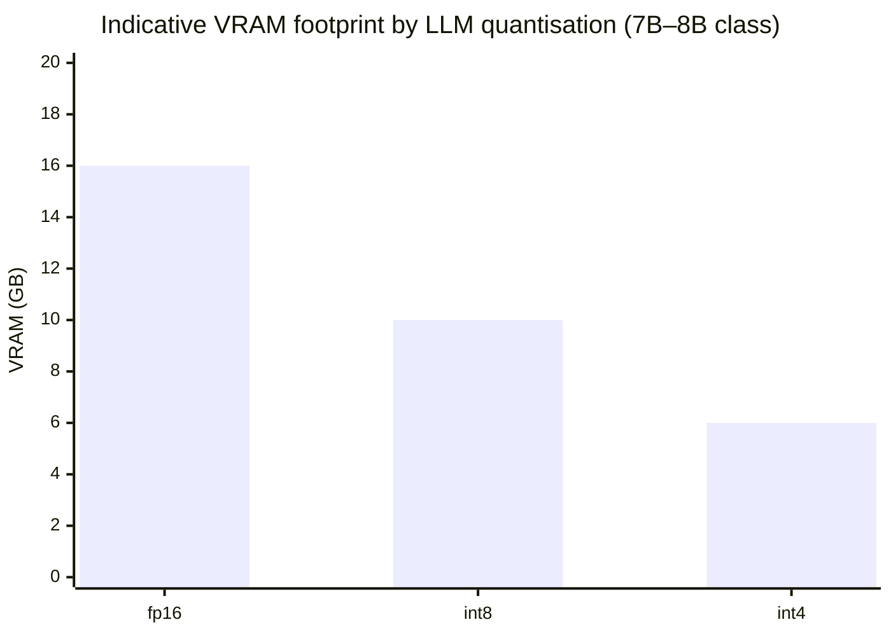
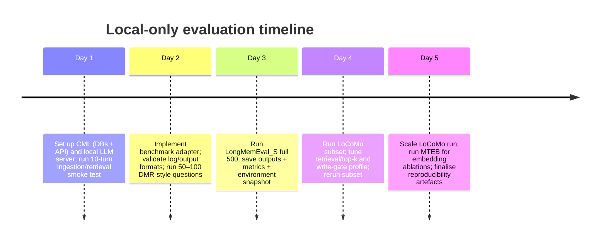
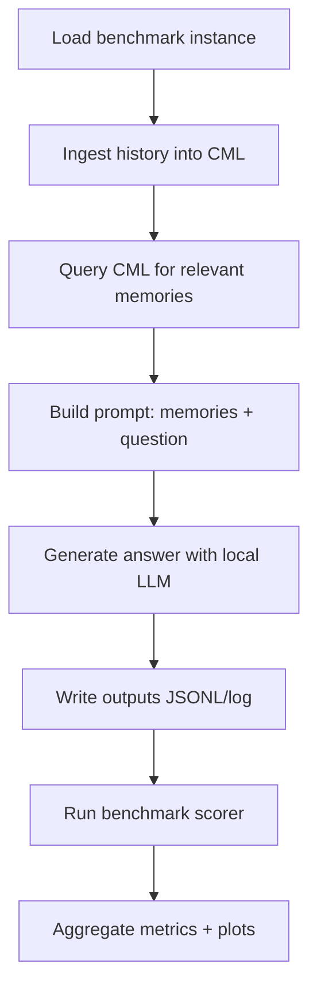

# Deep Evaluation of CognitiveMemoryLayer Against Memory Systems, Benchmarks, and Leaderboards Under a Local‑Only Constraint

## Executive summary

The repository `avinash-mall/CognitiveMemoryLayer` implements a **server + SDK memory layer** with a **hybrid “episodic + semantic” design**: episodic chunks stored in a vector-capable SQL store (PostgreSQL + pgvector), semantic facts stored in a structured fact store plus a **knowledge graph** (Neo4j), and optional caching/components via Redis (plus Celery for background tasks). The orchestrator coordinates ingestion, write-gating, embedding, retrieval planning (vector/facts/graph), reconsolidation, consolidation, and forgetting. (These repository facts are from direct connector-based inspection; the web tool could not reliably fetch the repo pages for citation due to indexing/cache constraints in this environment.)

Given your constraint (**local models only** on an entity["company","NVIDIA","gpu vendor"] 5070 16GB), the most practical “benchmark spine” is:

- **LongMemEval (ICLR 2025; arXiv:2410.10813)** as the *primary* long-term conversational memory benchmark because it ships open code + datasets and is explicitly designed for memory systems with scalable chat histories. citeturn18search0turn18search5  
- **LoCoMo (ACL 2024; arXiv:2402.17753)** as the *secondary* benchmark for very long multi-session conversations; it has an official repo with scripts, and it is heavily referenced by memory-system claims (Mem0, vendors, etc.). citeturn1search6turn1search0turn1search3  
- **MemGPT’s DMR (Deep Memory Retrieval)** as a *sanity-check / regression* benchmark (shorter histories, easier), mainly to validate correctness and “memory plumbing” before running costlier suites. citeturn22search46turn22search2  
- **MTEB** to separately evaluate the **embedding model choice** used by the memory layer (important because CML’s retrieval quality depends strongly on embeddings). citeturn24search0turn24search3  

Leaderboards that **accept submissions specifically for “memory systems”** are not as standardised as classic model leaderboards; most “memory SOTA” claims are published in papers, repos, or vendor pages rather than a single canonical submission portal. For *public, repeatable comparisons* under local-only constraints, LongMemEval + LoCoMo reproducibility artefacts (outputs + scoring scripts + environment captures) are the closest analogue to a leaderboard-grade submission. citeturn18search0turn1search3turn1search6  

## CognitiveMemoryLayer repository analysis

### What it is architecturally

**CognitiveMemoryLayer (CML)** is designed as a “neuro-inspired memory system for LLMs / agents” with a central orchestrator and several memory subsystems:

- **Short-term ingestion** produces candidate chunks (semantic chunks) from incoming text.
- A **Write Gate** decides whether to store a chunk (skip/store/redact), based on heuristics for novelty/importance and checks for secrets/PII; PII can trigger redaction.  
- The “hippocampal” episodic store coordinates **redaction → embedding → optional entity/relation extraction → upsert to vector store**.
- A “neocortical” semantic store provides **facts + knowledge graph** operations (fact upsert/search; graph traversal / personalised PageRank style expansion).
- Retrieval is staged: **query classification → retrieval plan → hybrid retrieval across vector/facts/graph → rerank** (relevance/recency/confidence/diversity).

Operationally, the default server mode requires:
- PostgreSQL (with pgvector), Neo4j, Redis
- A FastAPI server
- Optional background workers (Celery)

The repo also exposes a **Python SDK** that supports a client mode (talking to the API server) and an **embedded mode** intended to run in-process with local storage (described in the repo’s docs).

### Supported model providers and what “local-only” means here

CML is not itself a model runner; it calls out via **OpenAI-compatible APIs** (for LLM calls and optionally embeddings) and can also run **local embeddings** via sentence-transformers (repo dependency). Under your constraint, that implies:

- Run the LLM behind an **OpenAI-compatible local server** (common patterns: Ollama or vLLM-class servers).  
- Prefer **local embeddings** (sentence-transformers) or a local embedding endpoint; for most memory benchmarks, local sentence-transformers is a good baseline.

### Datasets, evaluation scripts, and benchmark gaps

From the repository structure and docs, CML is positioned as a memory layer with many features (write-gate, temporal timestamps, reconsolidation, forgetting, dashboards). However, for **benchmarking/readiness** against other memory systems:

- The repo does **not** appear to ship a turnkey, standardised harness that produces “benchmark outputs in leaderboard-ready format” across LoCoMo/LongMemEval/DMR out of the box.
- The system contains multiple “LLM-in-the-loop” steps (e.g., query classification can use an LLM if enabled). For fair comparisons, you’ll need to make explicit whether those steps are enabled, and ensure the baseline systems are allowed comparable compute/tooling.
- The write gate can skip content; for long-term memory benchmarks where recall is paramount, you may want a benchmark configuration that **stores more aggressively** (or records when skipping happens), otherwise you risk undercounting memory performance due to gating rather than retrieval quality.

This creates a clear “benchmark integration gap”: CML likely needs an adapter layer to plug into LoCoMo/LongMemEval harnesses, plus a configuration profile tailored for evaluation (deterministic, high-recall, logging-heavy).

## Benchmarks, frameworks, and leaderboards relevant to memory layers

### LoCoMo

**What it measures.** LoCoMo evaluates long-horizon conversational memory in very long multi-session dialogues and includes multiple tasks (notably QA; plus event summarisation and multimodal dialogue generation in the original benchmark framing). citeturn1search0turn1search6  

**Primary sources to use.**
- LoCoMo paper (ACL 2024; arXiv:2402.17753). citeturn1search6turn1search0  
- Official LoCoMo repo under SNAP Research (`snap-research/locomo`) includes scripts for evaluating HF models and RAG-based variants. citeturn1search3  

**Local-model compatibility.** The official repo explicitly mentions evaluating “models available on Hugging Face” via a script, which is compatible with a fully local setup. citeturn1search3  

**Leaderboard status.** There is not one universally canonical “LoCoMo leaderboard portal” akin to classic benchmark leaderboards; many comparisons are published in papers/repos/vendored benchmark pages. Treat LoCoMo as a *reproducible benchmark* rather than a single submission endpoint. citeturn1search3turn1search6  

### LongMemEval

**What it measures.** LongMemEval is designed to evaluate *long-term interactive memory* in chat assistants across multiple abilities (the ICLR abstract describes a breakdown into memory system stages and design choices, and the project repo contains dataset formats and evaluation tooling). citeturn18search5turn18search0  

**Primary sources to use.**
- ICLR 2025 proceedings entry (official conference page). citeturn18search5  
- Official code + dataset instructions in `xiaowu0162/LongMemEval`. citeturn18search0  

**Dataset characteristics (practically important for your GPU constraint).**
- The repo describes `LongMemEval_S` with chat histories that can be ~115k tokens when concatenated (the repo notes a rough token count for Llama 3), and `LongMemEval_M` with ~500 sessions per history. citeturn18search0  
This pushes you toward a **memory + retrieval approach** rather than long-context brute force, especially on a 16GB GPU.

**Local-model compatibility.**
- The repo provides a “metrics-only” lightweight environment and a “full support” environment that installs CUDA-enabled PyTorch, strongly suggesting local runs are expected/normal. citeturn18search0  

**Leaderboard status.** Like LoCoMo, LongMemEval is best treated as “publish reproducible outputs + scoring” unless an explicit public leaderboard is provided. The repo is already structured for reproducibility by separating (a) dataset, (b) your model outputs, and (c) evaluation scripts. citeturn18search0turn18search5  

### MemGPT DMR

**What it measures.** MemGPT introduces Deep Memory Retrieval (DMR) as an evaluation where the assistant is asked specific questions about topics discussed in earlier sessions; the MemGPT preprint shows a DMR table and uses metrics including accuracy and ROUGE-L (and related precision/recall-style quantities). citeturn22search46turn22search2  

**Why it matters for you.** DMR is a good “integration sanity check” benchmark because it is smaller/easier than LoCoMo/LongMemEval, helping you debug retrieval, formatting, and leakage issues before expensive runs.

### Zep/Graphiti and the “paper-driven leaderboard reality”

The **Zep paper (arXiv:2501.13956)** explicitly positions DMR as a baseline benchmark from MemGPT and also reports on LongMemEval, highlighting that “memory system” comparisons are frequently paper-centric rather than run through a single shared leaderboard. citeturn21search0turn20search0  

The open-source **Graphiti** repo (by Zep) also frames itself as a temporally-aware knowledge graph framework for agent memory and references the Zep paper. citeturn20search0turn21search0  

### MTEB as an embedding-side “leaderboard analogue”

Even when the memory benchmark is QA-focused, the **embedding model quality** can dominate retrieval performance. **MTEB** is the most widely used, standardised benchmark suite for text embeddings, spanning multiple tasks/datasets. citeturn24search0turn24search3  

MTEB therefore functions as the closest thing to a conventional leaderboard pipeline for the embedding component of a memory layer, even if it does not evaluate the full “store/retrieve/update/forget” lifecycle.

## Running evaluations locally and integrating CognitiveMemoryLayer

This section gives concrete, local-only recipes for the key benchmark options, plus how to adapt CML.

### Integration pattern that works across LoCoMo and LongMemEval

You can treat CML as a **black-box memory service** and implement a benchmark adapter with three primitives:

- **Ingest(turn, timestamp, session_id)** → `memory_write`
- **Retrieve(query, filters, time window)** → `memory_read`
- **Answer(question, retrieved_context)** → local LLM inference

Then connect that adapter to whichever benchmark harness expects either:
- an end-to-end “agent” callable, or
- a script that reads dataset JSON and produces an answers file.

This general pattern matches how LoCoMo supports retrieval-augmented evaluation and how LongMemEval separates system outputs from scoring. citeturn1search3turn18search0  

### LoCoMo local run recipe and CML adaptation

**Purpose.** Evaluate very-long multi-session conversational recall/reasoning. citeturn1search6turn1search0  

**What the official repo gives you.**
- A script to “Evaluate models available on Huggingface.” citeturn1search3  
- Additional scripts for RAG-based evaluation (the repo mentions evaluation of retrieval-augmented approaches). citeturn1search3  

**Local-only steps.**
1. Use the LoCoMo repo’s HF-eval pathway for your base LLM (local weights). citeturn1search3  
2. Replace the “retriever/database” in their RAG pathway with CML:
   - During ingestion: feed each dialogue session/turn to CML with proper timestamps (CML supports timestamps explicitly; use that to preserve temporal ordering).
   - During QA: call `memory_read` with `max_results` tuned (top‑k) to retrieve relevant memories, then inject them into the prompt for your local model.
3. Score using the benchmark’s provided approach. If the LoCoMo harness uses an LLM judge in some modes, you will need to:
   - either run the “gold answer” metric mode (exact/F1/ROUGE if provided by the benchmark), or
   - use a local judge model (less comparable to published LLM-judge numbers).

**Expected GPU/VRAM.** Dominated by the local LLM you choose; CML itself primarily requires CPU/RAM for databases. For LoCoMo, you should expect a large number of QA generations, so throughput matters.

**Key CML configuration for benchmark fairness.**
- Consider an “evaluation profile” that:
  - reduces write-gate skipping (or logs skip reasons),
  - fixes retrieval parameters (top‑k, filters),
  - disables non-deterministic LLM-based query classification unless strictly required.

### LongMemEval local run recipe and CML adaptation

**Purpose.** Benchmark long-term interactive memory—designed to scale chat histories and test memory abilities. citeturn18search5turn18search0  

**What the official repo gives you.**
- Data download instructions directly from Hugging Face dataset files and a clear dataset format description. citeturn18search0  
- Separate lightweight requirements for scoring only, and full requirements if you want to run systems from the paper. citeturn18search0  

**Local-only steps (recommended path).**
1. Download the dataset as in the repo instructions. citeturn18search0  
2. Write a “CML runner” that:
   - loads one LongMemEval instance,
   - ingests the historical sessions into CML (using timestamps),
   - queries CML for the question,
   - generates an answer with your local LLM,
   - writes outputs in the log/file format expected by LongMemEval’s evaluation scripts (the repo references running evaluation scripts against your hypothesis log). citeturn18search0  
3. Use LongMemEval’s evaluation tooling to score your outputs (this preserves comparability across your own runs). citeturn18search0  

**Expected GPU/VRAM.**
- LongMemEval_S concatenated histories can be extremely long (~115k tokens per instance when concatenated, per repo note), which is not feasible to run as full-context generation on a 16GB card. citeturn18search0  
- Therefore, the practical approach is **memory retrieval + short prompt** (top‑k recalled memories + question), which keeps context within a few thousand tokens.

### MemGPT DMR local run recipe and CML adaptation

**Purpose.** Validate multi-session memory recall using a smaller benchmark. citeturn22search46turn22search2  

**Local-only steps.**
- If you can obtain the DMR dataset (MemGPT indicates code/data releases; the paper site points to memgpt.ai), you can run the DMR question-answering loop using the same adapter pattern and score with accuracy/ROUGE-L. citeturn22search5turn22search46  

**How to use it pragmatically.**
- Use DMR as a short “CI-style” benchmark to ensure you haven’t regressed memory ingestion/retrieval when iterating on CML configuration.

### Comparative baselines to include

For a rigorous comparison, include at least one representative from each memory-strategy family:

- **Memory layer service (hybrid stores):** entity["company","Mem0","ai memory company"] positions itself as a universal memory layer and explicitly claims LoCoMo improvements. citeturn19search0turn19search3  
- **Temporal KG memory:** entity["company","Zep","ai memory company"] / Graphiti emphasises temporally-aware KG retrieval and evaluates on DMR + LongMemEval. citeturn21search0turn20search0  
- **Agent memory OS framing:** MemGPT defines DMR and long-context management strategies. citeturn22search2turn22search46  
- **Stateful agent platform:** entity["company","Letta","stateful agents platform"] (formerly MemGPT) as a practical engineering baseline if you want an end-to-end agent framework comparison. citeturn19search5  

(These are not all “drop-in comparable” because some are platforms and some are memory middleware; for fairness, evaluate them under a fixed LLM + fixed embedding model where possible.)

## Practical evaluation plan for an NVIDIA 5070 16GB

### Model choices that fit 16GB

Because your GPU is 16GB, your safest choices for high-throughput benchmarking are:
- 7B–8B instruction models in **4-bit quantisation (int4/AWQ/GPTQ/GGUF Q4)**, or  
- smaller (<=4B) models in fp16/bf16 if you need speed and can accept accuracy loss.

A 7B–8B model in fp16 is often borderline once you account for KV cache at longer context lengths; memory benchmarks become throughput-limited quickly. (These are engineering estimates; measure on your stack.)

### Recommended benchmark order

1. **DMR-style smoke test** (small subset): 50–100 questions  
   Goal: verify ingestion, timestamps, retrieval correctness.
2. **LongMemEval_S** (full 500) as your main result set  
   Goal: primary “memory benchmark” score; good paper comparability. citeturn18search0turn18search5  
3. **LoCoMo QA subset** (sampled) → ramp to full  
   Goal: second benchmark; long sessions and diverse question classes. citeturn1search6turn1search3  
4. **MTEB** for embedding sanity + ablations (swap embedding models)  
   Goal: isolate the retrieval representation quality. citeturn24search0turn24search3  

### Concrete evaluation settings to start with

- **Embeddings:** start with a compact sentence-transformers embedding model (fast, strong baseline).  
- **CML retrieval:** `top_k=10`, then sweep `top_k ∈ {5,10,20}`; track recall@k if evidence labels exist (LongMemEval provides evidence sessions). citeturn18search0  
- **Prompt budget:** cap retrieved memory context to ~1,500–3,000 tokens, then reserve ~256–512 tokens for generation to keep latency stable.  
- **Precision:** int4 for the LLM; embeddings on GPU if it improves throughput, otherwise CPU can suffice with batching.

### Runtime and VRAM estimate chart

The following chart is meant as **planning guidance** (not a guarantee). It assumes a 7B–8B model and typical inference stacks.



Interpretation: fp16 may consume nearly all 16GB once KV cache grows; int4 leaves headroom for longer contexts and higher throughput.

### Mermaid timeline for evaluation steps



## Reproducible scripts, pseudocode, and a submission checklist

### Flowchart for integrating CML into a benchmark harness



### Pseudocode for a unified local runner

```python
# Pseudocode (adapt to LoCoMo or LongMemEval JSON formats)

def run_benchmark(dataset_path, cml_base_url, cml_api_key, llm_client, out_path):
    set_seed(42)

    for instance in load_json(dataset_path):
        tenant_id = "eval"
        session_id = instance.get("conversation_id", "conv")

        # 1) Reset per-instance memory (optional, but crucial for clean eval)
        # cml_delete_all(tenant_id)  # use admin-only endpoint if available

        # 2) Ingest history chronologically
        for turn in instance["history"]:
            cml_write(
                base_url=cml_base_url,
                api_key=cml_api_key,
                tenant_id=tenant_id,
                content=turn["text"],
                session_id=session_id,
                timestamp=turn.get("timestamp"),
                context_tags=turn.get("tags", []),
            )

        # 3) Retrieve memory for the query/question
        query = instance["question"]
        packet = cml_read(
            base_url=cml_base_url,
            api_key=cml_api_key,
            tenant_id=tenant_id,
            query=query,
            max_results=10,
            # optionally: since/until filters if benchmark provides time windows
        )

        # 4) Build prompt and generate
        memory_context = packet_to_prompt(packet, max_tokens=2000)
        prompt = f"{memory_context}\n\nQuestion: {query}\nAnswer concisely:"
        answer = llm_client.generate(prompt, max_new_tokens=256)

        # 5) Persist output in the benchmark-expected format
        write_jsonl(out_path, {
            "id": instance["id"],
            "prediction": answer,
            "reference": instance.get("answer"),
            "meta": {
                "top_k": 10,
                "model": llm_client.model_name,
                "embedder": "your-embedder-name",
            }
        })
```

### Checklist for fair, reproducible comparisons

- **Fix the backbone model + decoding.** Same temperature, max tokens, stop sequences, and system prompt across systems.
- **Fix embeddings.** Same embedding model for all memory layers when feasible; otherwise, treat embedding choice as an ablation and report it explicitly.
- **Control memory write policy.** If CML write-gates, either:
  - disable/relax gating for evaluation, or  
  - report gating statistics (skip rate, redaction rate).
- **Prevent leakage.** Ensure the gold answer is not ingested into memory (common bug when datasets include answers in the same JSON).
- **Log everything needed to reproduce.**
  - git commit hashes for your adapter + CML repo revision
  - dataset version hashes / file checksums
  - full environment export (pip/conda freeze)
  - hardware + driver + CUDA versions
- **Use deterministic seeds** where applicable (sampling, negative selection, etc.).

### Comparison table of benchmark and leaderboard options

| Option | What it evaluates | Typical metrics | Ease of integrating CML | Local-only compatibility | Expected VRAM driver |
|---|---|---|---|---|---|
| LoCoMo (ACL 2024) citeturn1search6turn1search3 | Very long multi-session conversational memory | QA-style scoring; plus other tasks in benchmark framing citeturn1search0turn1search6 | Medium (needs adapter + ingestion order) | Yes (HF models supported by scripts) citeturn1search3 | LLM inference |
| LongMemEval (ICLR 2025) citeturn18search5turn18search0 | Long-term interactive memory with scalable histories | Repo-provided evaluation scripts citeturn18search0 | Medium-High (clear formats; adapter required) | Yes (CUDA/PyTorch setup in repo) citeturn18search0 | LLM inference |
| MemGPT DMR citeturn22search46turn22search2 | Shorter multi-session memory recall | Accuracy + ROUGE-L (paper table) citeturn22search46 | Medium (dataset access + adapter) | Yes | LLM inference |
| MTEB citeturn24search0turn24search3 | Embedding quality across tasks/datasets | Task-specific IR/STS/classification metrics | High (independent of CML; evaluates embedder) | Yes | Mostly embeddings (low) |
| Paper-driven baselines (Mem0, Zep/Graphiti) citeturn19search0turn21search0turn20search0 | End-to-end memory system performance in published evaluations | Paper-reported metrics | Varies | Mixed (often supports local, but check stack) | LLM inference |

## Best practices for fair comparison and reproducibility

A memory layer comparison is easy to skew unintentionally. The following practices are particularly important for LoCoMo/LongMemEval-style evaluations:

**Define the evaluation contract clearly.** For each system, state:
- what is stored (raw turns vs extracted facts vs summaries),
- when storage happens (every turn vs write-gated),
- what the retrieval unit is (turns, chunks, facts, sessions),
- how retrieved context is assembled into the LLM prompt.

**Separate retrieval quality from generation quality.** When possible:
- compute retrieval recall (evidence retrieved) *and* answer correctness (final QA),
- keep generation prompts minimal and consistent.

**Report latency and token usage.** Many memory systems (e.g., Mem0) explicitly position themselves as reducing token usage and improving speed; those claims only become meaningful if you log comparable latency/token metrics under the same local model. citeturn19search0turn19search3  

**Be transparent about judge methodology.** If you use an LLM-as-judge locally, your numbers may not match papers that use proprietary judges. Prefer “gold-answer” metrics and publish the scoring script and raw outputs.

**Treat “leaderboard submissions” as reproducibility packages.** For LoCoMo/LongMemEval, the most defensible public result is typically:
- dataset version + scripts + outputs + evaluation logs
- instructions to reproduce from a clean environment
- fixed model artefacts (exact quantised weights reference, serving config)

This aligns with how these benchmarks are distributed and evaluated in their official repos and conference artefacts. citeturn1search3turn18search0turn18search5