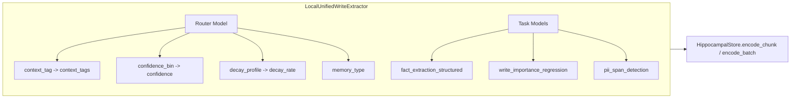

# Model Pipeline

This folder contains the consolidated custom-model pipeline used by CML runtime.

- Prepare script: `packages/models/scripts/prepare.py`
- Train script: `packages/models/scripts/train.py`
- Config: `packages/models/model_pipeline.toml`
- Output models: `packages/models/trained_models`

## Model Families (Baseline)

The pipeline trains three model families that serve as the backbone for all classification tasks:

1. `router_model.joblib`
- Tasks: `memory_type`, `query_intent`, `query_domain`, `constraint_dimension`, `context_tag`, `salience_bin`, `importance_bin`, `confidence_bin`, `decay_profile`

2. `extractor_model.joblib`
- Tasks: `constraint_type`, `constraint_scope`, `constraint_stability`, `fact_type`, `pii_presence`

3. `pair_model.joblib`
- Tasks: `conflict_detection`, `constraint_rerank`, `scope_match`, `supersession`

All families use TF-IDF + `SGDClassifier` for composite labels (`task::label`).

Some tasks still exist inside the family models for compatibility, but upgraded tasks such as `memory_type`, `constraint_dimension`, `context_tag`, `schema_match_pair`, `novelty_pair`, and the dedicated pair-ranker tasks are now treated as dedicated-only at runtime.

## Task-Level Models

Beyond the three family-level classifiers, the pipeline now ships dedicated task models for the weak spots where the family architecture was the bottleneck.

### Current Inventory

| Model | Trainer | Notes |
|---|---|---|
| `retrieval_constraint_relevance_pair` | `embedding_pair` | HistGradientBoosting ranker over cached sentence embeddings plus lexical interaction features. |
| `memory_rerank_pair` | `embedding_pair` | Dense pair ranker with lexical interaction features and query-group top-1 scoring. |
| `reconsolidation_candidate_pair` | `embedding_pair` | Dense pair ranker with lexical interaction features and query-group top-1 scoring. |
| `novelty_pair` | `classification` | 3 labels: `duplicate`, `changed`, `novel`. |
| `schema_match_pair` | `classification` | Pair classifier for gist/schema compatibility. |
| `memory_type` | `hierarchical_text` | Two-stage macro-group then fine-label classifier. Stage1 classifies into 5 macro groups (analytical, conversational, factual, personal, procedural); Stage2 has one sub-classifier per group including a personal sub-classifier (preference / episodic_event). |
| `constraint_dimension` | `classification` | Dedicated text classifier for query constraint dimensions. |
| `context_tag` | `classification` | Dedicated text classifier for local write-path topic tagging. |
| `salience_bin` | `ordinal_threshold` | Cumulative calibrated binary boundaries over TF-IDF text features. |
| `importance_bin` | `ordinal_threshold` | Cumulative calibrated binary boundaries over TF-IDF text features. |
| `confidence_bin` | `ordinal_threshold` | Cumulative calibrated binary boundaries over TF-IDF text features. |
| `decay_profile` | `ordinal_threshold` | Ordered 5-class cumulative boundary classifier. |
| `write_importance_regression` | `single_regression` | Regression model with baseline/data-profile diagnostics. |
| `fact_extraction_structured` | `token_classification` | Token/span extraction artifact. |
| `pii_span_detection` | `token_classification` | Token/span redaction artifact. |
| `consolidation_gist_quality` | `classification` | Includes hardened synthetic rows and calibrated confidence outputs. |
| `forgetting_action_policy` | `classification` | Includes hardened synthetic rows and calibrated confidence outputs. |

### Dataset Strategy by Model

**`retrieval_constraint_relevance_pair`** - MS MARCO positives/negatives for general relevance. BEIR provides domain-shift coverage. Preparation now mines hard negatives from the cached embedding space, and training uses embedding plus lexical interaction features with query-group top-1 evaluation.

**`memory_rerank_pair`** - Same IR backbone datasets plus NLI/FEVER contradiction signals so the reranker avoids semantically incompatible memories. Synthesize "same topic, wrong memory type/timeframe" hard negatives and train the dense pair model on both embedding similarity and low-cost lexical features.

**`novelty_pair`** - Quora/PAWS/GLUE give paraphrase-vs-non-paraphrase signal. Synthetic memory-style perturbations collapse temporal updates and contradictions into `changed`, alongside `duplicate` and `novel`. Outputs both class and calibrated novelty score. Also serves `InterferenceDetector`: replaces word-level Jaccard overlap and cosine-threshold duplicate detection with learned similarity.

**`fact_extraction_structured`** - DocRED/Re-TACRED give relation extraction supervision. Mandatory synthesis maps extracted relations into CML fact schema (`key = user:{category}:{predicate}`, `category in FactCategory`, stable predicate normalization). Replaces `_PREDICATE_KEYWORDS` mapping and dependency-based relation extraction with fixed `confidence=0.65`.

**`schema_match_pair`** - Supervision comes from SNLI with a corrected label mapping (`entailment + contradiction → match`, `neutral → no_match`; SNLI contradictions describe the *same scenario* so they share a schema). The original FEVER rows were removed because FEVER evidence text is stored as `"Title sentence N"` references rather than real sentences. CML-format template rows (`"{gist} Summary N." vs "{fact} Fact N."` from `_TEMPLATE_TOPIC_PACKS`) are included in training — 600 rows per label (`match` and `no_match`) to close the train/test distribution gap against memory-entry text format. Focal loss (gamma=1.5) is applied during DeBERTa fine-tuning to down-weight easy NLI pairs and focus training on hard neutral pairs that look semantically similar but share no schema. Preparation enforces train-source coverage and caps template rows.

**`reconsolidation_candidate_pair`** - MS MARCO covers retrieval candidate ranking. FEVER/NLI/ANLI improve conflict candidate prioritization. Preparation mines nearest hard negatives from different `group_id` buckets, and training uses the same dense+lexical feature path as the other ranking tasks.

**`write_importance_regression`** - Mixed `structured`, `derived`, and `llm` supervision built during preparation from public seed corpora plus router-style metadata. Training now requires real train/eval/test splits from prepare and no longer fabricates holdouts from train.

**`constraint_dimension`** - Dedicated transformer classification seeded from public topic corpora plus adversarial synthetic rows that sharpen the `value` vs `state` vs `other` boundary.

**`context_tag`** - Dedicated transformer classification seeded from internet-sourced topical corpora (`travel`, `health`, `finance`, `tech`, `social`, and general conversation) and hardened with borderline-`general` negatives.

**`pii_span_detection`** - PII-Masking-200k as primary span supervision (~30k English rows from the full 200k dataset). Synthesis for secrets patterns not fully covered by generic PII datasets (`api_key=`, tokens, credentials). Backbone: bert-base-multilingual-cased (8 epochs, LR=5e-5, max_seq=256, stride=64). With this training set size, `span_exact_match` achieves ~0.850; reaching ≥0.88 would require the full multilingual corpus. BPE tokenizers (roberta, xlm-roberta) cause systematic off-by-one span boundary errors due to preceding-whitespace inclusion in character offsets — `token_runtime.py::_decode_chunk` trims leading/trailing whitespace from span boundaries at inference time. Regex fallback augmentation (`_regex_pii_spans`) covers EMAIL, PHONE, SSN, CREDIT_CARD, IP_ADDRESS, and SECRET patterns independent of model output.

**`consolidation_gist_quality`** - SummEval/FRANK/TRUE provide consistency/factuality quality supervision. Synthesize CML-specific labels (accept/reject, fallback-needed) using consolidation replay + reviewer labels. Preparation injects hardened shared-shell rows and caps template usage.

**`forgetting_action_policy`** - Mixed `structured`, `template_hardened`, and LLM-seeded supervision. Labels: `keep`, `decay`, `silence`, `compress`, `delete`. Inputs include text + metadata features (`importance`, `access_count`, `age`, `type`, `dependency_count`). Preparation injects near-boundary hardened examples, enforces train-source coverage, and caps template usage. Two compound metadata tokens sharpen class boundaries: `fap_keep_signal=yes` fires when `access_count ≥ 6 AND age_days < 21` (exclusive to keep); `fap_decay_signal=yes` fires when `access_count ∈ [2,5] AND age_days ∈ [21,89]` (exclusive to template-hardened decay rows). Hardened decay rows must use `support_count` base `≤ 2` so that odd-indexed rows (which get `support_count + 1`) stay in the medium bucket and do not overlap with the high-support-count profile of keep/compress rows.

## Automatic Model Download

Model weights are hosted at **[avinashm/CognitiveMemoryLayer-models](https://huggingface.co/avinashm/CognitiveMemoryLayer-models)** on HuggingFace Hub. They are automatically downloaded on first startup when the `trained_models/` directory is empty.

**How it works:**

1. `ModelPackRuntime._load_all()` calls `ensure_models()` before loading joblib files.
2. If `manifest.json` or the three family models are missing, `huggingface_hub.snapshot_download()` fetches the artifacts.
3. In Docker, `docker/entrypoint.sh` runs the download before the container CMD (e.g. `uvicorn`).
4. Models are cached in a named Docker volume (`cml-models`) and persist across container restarts.

**Configuration:**

| Variable | Default | Description |
|---|---|---|
| `CML_MODELS_DIR` | `packages/models/trained_models` | Local path to model weights |
| `CML_MODELS_AUTO_DOWNLOAD` | `true` | Set `false` to skip auto-download |
| `CML_MODELS_HF_REPO` | `avinashm/CognitiveMemoryLayer-models` | HuggingFace Hub repo ID |
| `HF_TOKEN` | *(unset)* | HuggingFace token (only needed for private repos) |

## Runtime Wiring

Modelpack inference is consumed from `src/utils/modelpack.py`.

### Existing integrations (family-level)

- `query_domain`: classifier/planner/retriever
- `scope_match`: retriever/reranker
- `constraint_stability`: reranker
- `supersession`: constraint extraction/supersession checks
- `fact_type`: write-time fact extractor gates named heuristic fact families (preference, identity, location, occupation); model can suppress all heuristics or target a single family
- `pii_presence` + `importance_bin`: write gate non-LLM path
- `salience_bin`: write gate non-LLM salience refinement; blended with `importance_bin` (40%/20%/40% importance/salience/chunk.salience weighting)
- `confidence_bin`: write path content-derived confidence (via `LocalUnifiedWriteExtractor`)
- `decay_profile`: write path per-memory decay rate (via `LocalUnifiedWriteExtractor`)

### Task-level integrations

| Task | Primary Files/Functions | Integration Behavior |
|---|---|---|
| `retrieval_constraint_relevance_pair` | `retriever.py::_rescore_constraints` | Replace domain keyword bonus with learned relevance score; keep deterministic tie-break floor. |
| `memory_rerank_pair` | `reranker.py::_calculate_score` | Model score as primary relevance component; subsumes stability-based recency weights. MMR diversity post-pass retained. |
| `novelty_pair` | `write_gate.py::_compute_novelty`, `interference.py::detect_duplicates`, `detect_overlapping` | Replace Jaccard heuristic with pair scoring. Replace interference detector's word-overlap and cosine-threshold detection. |
| `fact_extraction_structured` | `write_time_facts.py::extract`, `ner.py::extract_relations`, `service.py::_extract_new_facts` | Primary non-LLM structured fact path. Relation fallback is model-first, with spaCy dependency parsing used only as a best-effort fallback when parser annotations are available. |
| `schema_match_pair` | `schema_aligner.py::_calculate_similarity` | Replace Jaccard with semantic pair match score. |
| `reconsolidation_candidate_pair` | `service.py::_top_k_similar_memories` | Replace word-overlap top-k with pair candidate relevance. |
| `write_importance_regression` | `write_gate.py::_predict_importance` | Calibrated regression output; retain clipping/floor. |
| `pii_span_detection` | `redactor.py::redact`, `write_gate.py::_predict_pii` | Merge model spans with regex/NER; regex remains safety baseline. |
| `consolidation_gist_quality` | `worker.py::_is_valid_gist` | Model score gates gist acceptance; replaces string-match blacklist and rule-based mixed-topic detection. Deterministic overlap ratio check remains as guardrail. |
| `forgetting_action_policy` | `scorer.py::_suggest_action` | Model proposes action; hard protected-type rules remain deterministic. |
| `memory_type` | `local_unified_extractor.py::extract` | Dedicated classifier supplies local write-path `memory_type` when the LLM extractor is unavailable. |
| `context_tag` | `local_unified_extractor.py::extract` | Dedicated classifier supplies local write-path `context_tags` when the LLM extractor is unavailable. |
| `constraint_dimension` | `classifier.py::analyze_query` | Dedicated classifier fills query constraint dimensions when the LLM analyzer does not provide them. |

If model artifacts are not present, runtime falls back to safe heuristic defaults for all paths. Upgraded dedicated-only tasks do not fall back to router/pair family predictions; they either use the dedicated artifact or fall through to the original heuristic path. All model calls are wrapped in `try/except` with graceful fallthrough.

spaCy fallback defaults to `xx_ent_wiki_sm`, then falls back to `en_core_web_sm` when the multilingual model is not installed. Install it explicitly with:

```bash
python -m spacy download xx_ent_wiki_sm
```

### Dashboard integration

The dashboard Components page displays live modelpack status via `GET /api/v1/dashboard/models/status` (admin-only). This endpoint returns:

- `available: bool` — whether the modelpack runtime loaded successfully
- `families: list[str]` — loaded family model names (e.g. `router`, `extractor`, `pair`)
- `task_models: list[str]` — loaded task-specific model names
- `load_errors: dict[str, str]` — any models that failed to load with error messages
- `models_dir: str` — path to the models directory on disk

Backend: `src/api/dashboard/models_routes.py`.

### Modelpack APIs

Runtime capability helpers:

- `supports_task(task)` checks whether a task can be served by the loaded runtime. Some upgraded tasks now require a dedicated task model and no longer fall back to router/pair family models.
- `capability_report()` returns load diagnostics (`available_families`, `available_tasks`, `pending_families`, `dedicated_required_tasks`, `retired_family_tasks`, `load_errors`, `manifest_schema_version`).

- `predict_single(task, text)` — single-text classification (existing)
- `predict_pair(task, text_a, text_b)` — text-pair classification (existing)
- `predict_score_pair(task, text_a, text_b)` — text-pair numeric score output
- `predict_score_single(task, text)` — single-text numeric score output
- `predict_spans(task, text)` — token/span extraction output
- `has_task_model(task)` — check if a task-specific model is loaded

### Local Unified Write Extractor

`src/extraction/local_unified_extractor.py` provides `LocalUnifiedWriteExtractor`, a model-based alternative to the LLM-centric `UnifiedWritePathExtractor`. It composes:

- `fact_extraction_structured` for structured fact extraction
- `write_importance_regression` for importance scoring
- `pii_span_detection` for PII detection
- `memory_type` dedicated task model for memory type classification
- `context_tag` dedicated task model for content-derived categorization
- `confidence_bin` router task for content-derived confidence (maps low/medium/high -> 0.35/0.65/0.9)
- `decay_profile` router task for per-memory decay rate (maps very_fast/fast/medium/slow/very_slow -> 0.35/0.2/0.1/0.05/0.02)

Optional tasks remain capability-gated: local extraction uses them only when corresponding task artifacts are present.

Wired into `HippocampalStore` via `MemoryOrchestrator.create()` and `create_lite()` when LLM is disabled. Both `encode_chunk` and `encode_batch` consume context_tags, confidence, and decay_rate from the local extractor when the LLM unified result is unavailable.



## Data Preparation

`prepare.py` performs:

1. Dataset loading (auto-download via Hugging Face IDs in config)
2. Merge with existing local prepared data when available
3. Stable `group_id` assignment for public, synthetic, template, and hardened rows
4. Router hardening, structured ordinal synthesis, and schema source-balancing passes
5. Missing-only balancing plus structured/LLM synthetic backfill where deficits remain
6. Hard-negative mining and `pair_text_embeddings.parquet` generation for `embedding_pair` tasks
7. Group-aware split output (`train`, `test`, `eval`) with split-integrity and source-coverage validation

Prepared outputs are written to `packages/models/prepared_data/modelpack`.

### Task registries

The script maintains separate task registries:

- **Single-text tasks** (`ROUTER_TASK_LABELS` + `NEW_SINGLE_TASK_LABELS`): classification and regression on individual text inputs.
- **Pair tasks** (`PAIR_TASK_LABELS` + `NEW_PAIR_TASK_LABELS`): classification, ranking, and scoring on text pairs.
- **Token-level tasks**: span/entity tagging via `_TokenTaskStore`.

### Dataset mappers

Public dataset mappers transform standard NLP datasets into CML task formats:

- `PAWS/GLUE (QQP, MRPC, STS-B)` -> `novelty_pair`
- `DocRED/Re-TACRED` -> `fact_extraction_structured`
- `FEVER-NLI/VitaminC/Climate-FEVER+/SciTail` -> `schema_match_pair`, `retrieval_constraint_relevance_pair`, `memory_rerank_pair`, `reconsolidation_candidate_pair`
- `TripAdvisor/medical/support/reddit seed corpora` -> `llm_seed` pools for `context_tag`, `constraint_dimension`, `forgetting_action_policy`

### Output split formats

- **Classification/ranking**: parquet schema (`text` or `text_a`/`text_b`, `task`, `label`)
- **Regression**: adds numeric target column (`score`) via `_RegressionTaskStore`
- **Token**: adds token-level fields (`tokens`, `tags`) and span metadata via `_TokenTaskStore`
- **Split integrity key**: `group_id` is preserved across prepared rows and used to keep related examples in exactly one split
- **Router enrichment columns**: `text_length_chars`, `question_mark_count`, `has_imperative_hint`, `temporal_marker_count`, `named_entity_like_count`, `has_json_like_shape`, `has_first_person_pronoun`
- **Embedding pair cache**: `pair_text_embeddings.parquet` keyed by `text_hash` with normalized float32 embeddings for embedding-backed pair tasks

### Manifest fields

The preparation manifest includes:

- Per-task row counts and task-label distributions
- Per-family split integrity summaries (`rows_without_group_id`, `unique_group_ids`, cross-split overlap counts)
- Per-family train source diagnostics (template ratio, non-template rows, source bucket mix)
- Per-task required source-coverage summaries for train splits
- Regression provenance summaries for train splits
- Source mix per task (including `template_hardened:*` sources for hardened router rows)
- Synthetic ratio per label (counts `llm:*`, `template:*`, and `template_hardened:*`)
- Adversarial fixture inventory for the hardened router/schema tasks
- Top source breakdown
- `dataset_shortlist` path used for public-data intake documentation

### Existing dataset folder

Raw dataset cache/downloads use existing flat folder: `packages/models/datasets`

## Synthetic Generation (LLM-only)

Synthetic generation does not use rule-based labeling.

Datasets marked `usage_role = "llm_seed"` in `model_pipeline.toml` feed seed pools only; they are not treated as direct supervision. Datasets marked `usage_role = "eval_only"` are excluded from seed-pool construction.

Flow:

1. Randomly select seed samples from related datasets.
2. Prompt LLM for target `(task, label)` generation.
3. Parse/validate and keep accepted rows until target count is reached.

Current behavior:

1. Requests are sent concurrently (`synthetic_llm.concurrency`).
2. Per-label generation uses adaptive batch sizing when outputs are repeatedly unparseable.
3. Best-effort recovery extracts `text` / `text_a` / `text_b` from partial JSON responses.
4. Periodic LLM telemetry is printed with request, parse, and acceptance stats.

Prepare now requires a working synthetic LLM configuration for dataset synthesis. If `LLM_EVAL__BASE_URL`/model settings are missing or unreachable, the prepare command fails instead of falling back to non-LLM synthetic completion.

Expected env settings (OpenAI-compatible endpoint example, including vLLM):

```bash
LLM_EVAL__PROVIDER=vllm
LLM_EVAL__MODEL=Qwen/Qwen3.5-9B
LLM_EVAL__BASE_URL=http://localhost:8000/v1
```

When the backend exposes `/models` (for example vLLM OpenAI-compatible servers), `prepare.py` now queries that endpoint during startup and applies model-aware thinking suppression automatically:

- vLLM-compatible requests send `extra_body.chat_template_kwargs` with both `enable_thinking=false` and `thinking=false`
- models identified as `gpt-oss` also receive assistant-prefill with `<think></think>` as a fallback
- if a response still looks like reasoning text instead of JSON, prepare retries once with forced no-thinking prefill before counting a parse failure

Documented provider/model handling currently includes:

- **vLLM / self-hosted OpenAI-compatible**: Qwen, DeepSeek, GLM, Granite, and Holo families use `chat_template_kwargs`; `gpt-oss` additionally uses assistant-prefill
- **OpenAI**: `gpt-5.1*` / `gpt-5.2*` use `reasoning_effort=none`; `gpt-5*` uses `reasoning_effort=minimal` with sampling controls omitted when required by the API; older reasoning families such as `o3` / `o4-mini` are reduced to the lowest documented effort (`low`)
- **Gemini OpenAI compatibility**: `gemini-2.5` non-Pro models use `reasoning_effort=none`; Gemini 2.5 Pro and Gemini 3 are detected and logged as not fully disable-able
- **DeepSeek official API**: `deepseek-chat` is already the documented non-thinking model; `deepseek-reasoner` is detected and logged with a recommendation to switch models if no-thinking behavior is required

Example telemetry line:

```text
[prepare] LLM stats: req=... fail=... retries=... parse_fail=... req/s=... gen=... acc=... parse_recovered=... finish_reason=stop:...,length:...
```

Quick interpretation:

1. `parse_fail` high: output format is breaking badly; lower `temperature` and `batch_size`.
2. `finish_reason=length` high: responses are getting truncated; lower `batch_size` or increase `max_tokens`.
3. `acc/gen` low: many candidates are duplicates/invalid for the label; reduce randomness and inspect seed diversity.

The prepare pipeline now also reacts automatically when a label stalls:

- batch size is reduced after truncation-heavy or parse-failure-heavy rounds
- multilingual generation is disabled per-label after repeated no-progress rounds
- a label is abandoned early after sustained stalled rounds at batch size `1` to avoid burning the full retry budget

### Multilingual data generation

When `[multilingual]` is enabled in config (default), synthetic LLM generation is distributed across **15 languages** (top by global internet usage): English, Chinese (Simplified), Spanish, Arabic, Hindi, Portuguese, French, Japanese, Russian, German, Korean, Turkish, Indonesian, Vietnamese, Italian. Each concurrent job picks a language via weighted random selection (English ~30%, others ~5% each) so models stay strong in English while covering multiple languages.

- **Prompt definitions**: `packages/models/scripts/multilingual_prompts.py` defines `SUPPORTED_LANGUAGES`, `pick_language()`, and language-specific system/user prompt builders (`system_prompt_single`, `user_prompt_single`, etc.). Label guidance stays in English (semantic intent); the LLM generates text in the chosen language.
- **Config**: `model_pipeline.toml` section `[multilingual]` with `enabled = true` and `english_weight = 0.30`. Disable with `--no-multilingual` for English-only synthetic data (e.g. faster iteration).
- **Output**: Prepared parquet includes a `language` column (ISO 639-1 code, e.g. `en`, `zh`, `es`). Existing prepared data without `language` is treated as `en` when loaded.

For `fact_extraction_structured`, token prep now guarantees multilingual template coverage per `(label, language)` combination before filling the remainder of the target count. The prep manifest records `language_counts` so multilingual coverage is visible in shipped artifacts.

## Training

`train.py` supports two modes:

By default, training runs in strict mode (`--strict`) with preflight validation and post-train artifact validation. Use `--allow-skips` only for exploratory runs.

### Family-level training (baseline)

Trains all selected families (`router`, `extractor`, `pair`) using TF-IDF + `SGDClassifier` with composite labels. This is the default when no task specs are present.

### Task-level training

When `[[tasks]]` blocks are defined in `model_pipeline.toml`, the trainer dispatches by configured trainer:

| Objective | Configured trainer | Model |
|---|---|---|
| `classification` | `_train_classification_task` | TF-IDF + SGDClassifier |
| `pair_ranking` | `_train_pair_ranking` | TF-IDF baseline pair classifier |
| `pair_ranking` | `_train_embedding_pair` | `HistGradientBoostingClassifier` over cached sentence embeddings + lexical interaction features |
| `single_regression` | `_train_single_regression` | TF-IDF + SGDRegressor |
| `token_classification` | `_train_token_classification` | Hugging Face token-classification trainer |
| `classification` | `_train_ordinal_threshold` | Cumulative calibrated binary `LogisticRegression` boundaries |
| `classification` | `_train_hierarchical_text` | Two-stage macro/fine classifier for `memory_type` |

Task specs now accept additive fields:

- `trainer`
- `feature_backend`
- `label_order`
- `embedding_model_name`

Train config now also supports:

- `early_stopping`
- `early_stopping_patience`
- `early_stopping_metric`
- `early_stopping_min_delta`
- `calibration_method`
- `calibration_split`

For classification-style outputs, calibration now applies to:

- family models trained with TF-IDF + SGD via task-conditional calibration wrappers
- dedicated classification tasks
- TF-IDF pair-ranking task models
- embedding-backed pair models
- hierarchical `memory_type`
- ordinal boundary classifiers

### Evaluation metrics

Metrics are computed per objective type:

- **Classification**: accuracy, macro/weighted F1, Expected Calibration Error (ECE), per-class precision/recall.
- **Ranking**: group-aware top-1 accuracy/F1 from pair classification plus `MRR@10`, `NDCG@10`, and `recall@10` when grouped candidate lists are available.
- **Ordinal**: classification metrics plus `ordinal_mae` and `off_by_two_rate`.
- **Regression**: MAE, RMSE, calibration buckets.
- **Token**: entity/span F1 and strict span exact-match (when transformer path is active).

When calibration is enabled, `*_metrics_test.json` and `*_metrics_eval.json` include a top-level `calibration` block:

- `method`
- `split`
- `rows`
- `pre_ece`
- `post_ece`
- `pre_accuracy`
- `post_accuracy`
- `accuracy_delta`

For `memory_type`, the same top-level field is present with nested `stage1` and `stage2` summaries.

### Artifacts

Per-family artifacts:

- `*_model.joblib`
- `*_label_map.json`
- `*_metrics_test.json`
- `*_metrics_eval.json`
- `*_report_test.json`
- `*_report_eval.json`
- `*_epoch_stats.json`
- `*_training_metadata.json`

Per-task artifacts:

- `<task>_model.joblib`
- `<task>_epoch_stats.json`
- `<task>_metrics_test.json`
- `<task>_metrics_eval.json`
- `<task>_thresholds.json` (when `--export-thresholds` is set; includes threshold choice plus calibration/selection metadata when available)

Pair embedding tasks also require:

- `pair_text_embeddings.parquet` in the prepared-data directory
- runtime lazy-loading of the configured sentence-transformer checkpoint
- runtime pair feature reconstruction from raw texts using the same lexical+dense feature builder as training
- post-hoc calibration of the dense sklearn classifier when `train.calibration_method` is enabled

`memory_type` training and runtime now share the same derived-feature path. Training prefers the prepared router enrichment columns when present and falls back to text-derived heuristics; runtime applies the same token derivation from the serialized feature text before scoring the hierarchical classifier.

Generated prepared/trained artifacts are expected to stay in sync with source. After pipeline or config changes, rerun prepare/train before expecting `scripts/models_artifact_probe.py --fail-on-mismatch` to pass.

Manifest (`manifest.json`):

- `manifest_schema_version` (v3)
- `configured_tasks` from `model_pipeline.toml`
- `configured_tasks[*].trainer`, `feature_backend`, `label_order`, `embedding_model_name`
- `families` map with artifact paths, metrics summary, labels.
- `families[*].calibration.tasks` with task-conditional family calibration summaries when enabled.
- `task_models` map with objective type, artifact path, train rows, test/eval metrics, and additive fields such as `actual_epochs`, `best_epoch`, `early_stopped`, `selection_metric`, `selection_value`, `calibration`, and regression `data_profile`.
- `task_training_status` with per-task status (`trained`, `disabled`, `filtered_out`, `failed`, `skipped`) and reason.
- `preflight_validation` with objective/data/coverage checks run before task training.
- `build_metadata` with Python/dependency versions and git state.
- `runtime_thresholds` section with per-task confidence thresholds plus calibration and checkpoint-selection metadata.

Per-epoch training logs are printed to console and persisted in epoch stats files.

## Usage

From repository root:

```bash
python -m packages.models.scripts.prepare
python -m packages.models.scripts.train
```

Common overrides:

```bash
python -m packages.models.scripts.prepare --target-per-task-label 10000 --llm-temperature 1.35
python -m packages.models.scripts.prepare --target-per-task-label 5002 --llm-temperature 0.3 --llm-concurrency 32
python -m packages.models.scripts.prepare --force-full
python -m packages.models.scripts.prepare --no-multilingual   # English-only synthetic data
python -m packages.models.scripts.train --max-iter 25 --max-features 250000 --strict
python -m packages.models.scripts.train --max-iter 25 --max-features 250000 --allow-skips
```

Task-level training overrides:

```bash
python -m packages.models.scripts.train --tasks retrieval_constraint_relevance_pair,novelty_pair
python -m packages.models.scripts.train --objective-types pair_ranking,single_regression
python -m packages.models.scripts.train --max-seq-length 512 --learning-rate 5e-5
python -m packages.models.scripts.train --calibration-split eval --export-thresholds
python -m packages.models.scripts.train --tasks novelty_pair --strict
```

Post-hoc maintenance:

```bash
# Regenerate manifest.json from existing metrics files (after targeted retrains or recalibration)
python packages/models/scripts/regenerate_manifest.py

# ECE-optimal temperature sweep for pair ranker models
python packages/models/scripts/recalibrate_pair_ranker_temperature.py
```

Contract and probe checks:

```bash
python scripts/models_artifact_probe.py --fail-on-mismatch
python scripts/package_surface_probe.py live-sync --write "User prefers tea" --query tea --expect-min-stored 1 --expect-min-memories 1
python scripts/constraint_retrieval_probe.py --scenario budget_decision --mode compare
```

## Model Performance

Current test-set results. Commit `f60cac8` (2026-03-25). All 13 release gates pass.

### Family models

| Family | Train rows | Test rows | Accuracy | Macro F1 | ECE |
|---|---|---|---|---|---|
| router | 498k | 69k | 91.2% | 92.2% | 0.0061 |
| extractor | 288k | 36k | 99.7% | 99.9% | 0.0008 |
| pair | 757k | 95k | 64.5% | 64.0% | 0.0061 |

The pair family's 64.5% accuracy is expected — it serves as a compatibility baseline for legacy tasks; all active pair ranking paths use dedicated transformer models.

### Task models

| Model | Accuracy | Macro F1 | ECE | Notes |
|---|---|---|---|---|
| memory_type | 100% | 100% | 0.0008 | Two-stage hierarchical; DeBERTa-v3-base per macro group |
| confidence_bin | 100% | 100% | 0.0 | Ordinal; off_by_two_rate=0 |
| decay_profile | 100% | 100% | 0.0 | Ordinal; off_by_two_rate=0 |
| forgetting_action_policy | 99.95% | 99.95% | 0.0165 | decay_recall=100%, delete_recall=99.9% |
| context_tag | 94.7% | 94.6% | 0.0247 | DeBERTa-v3-base |
| novelty_pair | 93.9% | 94.1% | 0.0281 | changed_f1=91.2%; duplicate_recall=100% |
| constraint_dimension | 88.3% | 88.3% | 0.0434 | DeBERTa-v3-base |
| schema_match_pair | 85.5% | 85.5% | 0.0334 | match recall 87.3%; no_match recall 83.8%; T=1.3 |
| pii_span_detection | — | span_F1=93.3% | — | span_exact_match=84.5%; precision=92.1%, recall=94.5% |
| memory_rerank_pair | 82.9% | 82.6% | 0.0647 | MRR@10=1.0, NDCG@10=1.0, recall@10=1.0; T=2.0 |
| reconsolidation_candidate_pair | 79.4% | 78.6% | 0.0752 | MRR@10=1.0, NDCG@10=1.0; T=3.0 |
| retrieval_constraint_relevance_pair | 78.9% | 78.1% | 0.0650 | MRR@10=0.50, NDCG@10=0.63, recall@10=1.0; T=3.0 |
| write_importance_regression | — | MAE=0.019 | — | RMSE=0.024; mean baseline MAE≈0.26 |
| fact_extraction_structured | — | span_F1=99.6% | — | span_exact_match=99.8% |

## Training Notes

Non-obvious constraints that must be preserved when rerunning prepare or train.

### forgetting_action_policy — hardened decay support_count ceiling

Hardened `decay` rows in `_FAP_HARDENED_PROFILES` must use `support_count ≤ 2` (base value, before the odd-index +1 increment applied during preparation). At `support_count=2`, odd-indexed rows land at `support_count=3` (medium bucket). At `support_count=3`, odd-indexed rows land at `support_count=4` (high bucket) — the same bucket used by `keep` and `compress` rows — making the classes indistinguishable and causing `decay_recall` to collapse to ~0.77.

### memory_type — personal stage2 sub-classifier required

The `HierarchicalTextClassifier` has a stage2 sub-classifier for every macro group including `personal`. Without a trained `personal` stage2, all `preference` and `episodic_event` inputs fall through with recall=0, pulling macro_f1 below gate. Training must produce (or load from checkpoint) a binary DeBERTa model for the personal group as part of the `memory_type` task.

### schema_match_pair — SNLI contradiction mapping

SNLI contradiction pairs describe the *same scenario* from opposing angles and therefore share a schema: they must be labeled `match`, not `no_match`. The correct SNLI mapping is `entailment + contradiction → match`, `neutral → no_match`. Any preparation pass that sources from SNLI (`stanfordnlp/snli`) must apply this mapping — using entailment-only match produces ~0.70 macro_f1 vs ~0.855 with the full correction.

### pair ranker temperature — NLL-optimal vs ECE-optimal

DeBERTa pair rankers trained with cross-entropy converge to NLL-optimal T≈2.0, but ECE is minimized at T=3.0 for the bge-reranker-base backbone. After any retrain of `retrieval_constraint_relevance_pair` or `reconsolidation_candidate_pair`, run `recalibrate_pair_ranker_temperature.py` to restore ECE-optimal calibration.

## Release Gates and Post-hoc Calibration

### Release gates

`_RELEASE_GATES` in `train.py` defines per-task metric thresholds that must pass before a model is considered shippable. Gates are checked after training and recorded in `manifest.json` under `release_gates`.

Current gates (test set):

| Task | Gate |
|---|---|
| `schema_match_pair` | macro_f1 ≥ 0.80, ECE ≤ 0.08 |
| `memory_type` | macro_f1 ≥ 0.90, plan_f1 ≥ 0.90 |
| `novelty_pair` | changed_f1 ≥ 0.80 |
| `confidence_bin` | macro_f1 ≥ 0.75 |
| `decay_profile` | macro_f1 ≥ 0.75 |
| `pii_span_detection` | span_exact_match ≥ 0.84, span_f1 ≥ 0.93 |
| `forgetting_action_policy` | macro_f1 ≥ 0.90, decay_recall ≥ 0.90, delete_recall ≥ 0.90 |
| `constraint_dimension` | macro_f1 ≥ 0.80, ECE ≤ 0.08 |
| `context_tag` | macro_f1 ≥ 0.85 |
| `retrieval_constraint_relevance_pair` | ECE ≤ 0.08 |
| `memory_rerank_pair` | ECE ≤ 0.08 |
| `reconsolidation_candidate_pair` | ECE ≤ 0.08 |
| `write_importance_regression` | test_mae ≤ 0.05 |

To regenerate `manifest.json` gate results from existing metrics files (e.g. after a targeted retrain or post-hoc recalibration) without rerunning full training:

```bash
python packages/models/scripts/regenerate_manifest.py
```

### Post-hoc temperature calibration for pair rankers

The DeBERTa-based pair rankers (`retrieval_constraint_relevance_pair`, `memory_rerank_pair`, `reconsolidation_candidate_pair`) use logistic regression temperature scaling. NLL-optimal training produces T=2.0, but ECE is minimized at T=3.0 for the bge-reranker-base backbone. To sweep temperatures on the eval set and update joblib models and metrics files:

```bash
python packages/models/scripts/recalibrate_pair_ranker_temperature.py
```

The script:
1. Loads raw logits from the HF model checkpoint on CPU.
2. Sweeps a temperature grid (0.7 → 5.0) and picks ECE-optimal T on eval.
3. Gates on test ECE ≤ 0.08 before applying the update.
4. Patches `runtime_model.temperature` in the joblib and rewrites the metrics JSON files.

## Validation and Safety Gates

For every model-assisted path:

1. **Offline**: objective-specific metrics + calibration.
2. **Runtime**: latency, dedicated-model hit rate, heuristic fallback rate, error rate.
3. **Safety**: secret/PII hard regex checks intact; bounded output/truncation guaranteed; deterministic keys and control-plane behavior unchanged.
4. **Shadow mode**: run heuristic + model in parallel via `ShadowModeLogger`; compare decisions and log deltas before switching defaults.

## Evaluation Infrastructure

### Conflict detector offline evaluation

`src/evaluation/conflict_eval.py` provides `ConflictDetectorEvaluator` for comparing heuristic vs. model-based conflict detection:

- Loads evaluation corpus from JSONL files (`old_memory`, `new_statement`, `expected_label`)
- Computes precision/recall/F1 for both heuristic and model paths
- Generates shadow comparison reports

### Shadow mode logging

`src/utils/shadow_logger.py` provides `ShadowModeLogger` for parallel heuristic/model execution:

- Runs both paths concurrently via `compare()`
- Logs latency deltas and decision disagreements
- Configurable `sample_rate` for production use

### Semantic lineage

`src/memory/neocortical/fact_store.py` provides lineage query APIs:

- `get_fact_lineage(tenant_id, key)` — full supersession chain (oldest to newest)
- `get_superseded_chain(tenant_id, fact_id)` — forward chain of all facts superseded by a given fact

Lineage metadata is captured during reconsolidation and consolidation operations and surfaced in retrieval API responses via the `supersedes_id` field.

## Deterministic Paths (Preserved)

The following paths are intentionally kept deterministic and are not candidates for model replacement:

| Area | Rationale |
|---|---|
| Query intent fallback (`classifier.py`) | Deterministic fallback; expand training coverage for rare intents. |
| Retrieval planner (`planner.py`) | Hard source constraints; optional learned re-ordering under SLA guardrails. |
| Packet budgets (`packet_builder.py`) | Control-plane guardrail; deterministic token budgets. |
| Secret detection (`write_gate.py`) | Regex hard block; never delegated to model. |
| Stable key generation (`store.py`) | Deterministic hash key path. |
| Belief revision strategy (`belief_revision.py`) | Deterministic strategy selection for auditability. |
| Gist fallback (`worker.py`, `summarizer.py`) | Deterministic fallback gist construction. |
| Scheduler triggers (`triggers.py`) | Deterministic schedule/quota/event triggers. |
| Compression fallback (`compression.py`, `actions.py`) | Deterministic truncation as final fallback. |
| Neo4j fallback (`storage/neo4j.py`) | Non-GDS fallback path. |
| Write gate type mapping (`write_gate.py`) | `_determine_memory_types` is deterministic schema logic. |
| Reranker stability rules (`reranker.py`) | `_get_recency_weight` stability sets kept as guardrails during rollout. |
| Interference resolution (`interference.py`) | `_recommend_resolution` strategy is deterministic; uses `novelty_pair` for similarity scoring input only. |
| Consolidation clustering (`clusterer.py`) | Deterministic greedy cosine clustering; tune thresholds via offline calibration. |
| Consolidation sampling (`sampler.py`) | Deterministic weighted sampling; tune weights via offline replay. |
| Seamless relevance threshold (`seamless_provider.py`) | Configurable control-plane parameter (`relevance_threshold=0.3`). |
| NER entity aliases (`ner.py`) | `_ENTITY_ALIAS_MAP` deterministic; expand via data-driven alias mining. |
| Consolidation fallback type mapping (`worker.py`) | Dominant-type-to-gist-type mapping is deterministic. |

## Config Reference

All settings are in `packages/models/model_pipeline.toml`:

- Paths
- Preparation targets/splits
- Training hyperparameters
- Per-task `[[tasks]]` blocks (family, input type, objective, labels, artifact name, metrics)
- `[[datasets]]` entries with links, HF IDs, required/optional flags, `usage_role`, and `task_targets`
- Synthetic LLM parameters
- `[multilingual]`: `enabled`, `english_weight` for multilingual synthetic generation

Public dataset intake, mapper ownership, and license/provenance notes are in the Dataset References section below.

Key synthetic knobs:

- `batch_size`
- `concurrency`
- `max_tokens`
- `temperature`
- `max_attempts_per_label`
- `log_stats_every_seconds`
- `log_zero_progress_every`
- `parse_failure_log_every`
- `log_request_failures`

## Dataset References

Hugging Face is the scripted primary source. Kaggle remains a manual secondary source when it offers better niche corpora or missing domains. `usage_role` and `task_targets` in `model_pipeline.toml` should match this table.

- `supervision` datasets provide direct labels or pair mappings.
- `llm_seed` datasets provide seed text only; they are not used as direct supervision.

### Direct Supervision

| Dataset | `usage_role` | Tasks | Prepare mapper | License / URL |
|---|---|---|---|---|
| MS MARCO | `supervision` | `retrieval_constraint_relevance_pair`, `memory_rerank_pair`, `reconsolidation_candidate_pair` | `_add_existing_pair_rows` | [HF](https://huggingface.co/datasets/microsoft/ms_marco) |
| SNLI | `supervision` | `schema_match_pair` (entailment+contradiction→match, neutral→no_match), pair-ranker tasks, `novelty_pair` | `_add_existing_pair_rows` | **Note**: SNLI contradictions map to `match` for schema_match_pair (same scenario). [HF](https://huggingface.co/datasets/stanfordnlp/snli) |
| MultiNLI | `supervision` | `schema_match_pair`, pair-ranker tasks, `novelty_pair` | `_add_existing_pair_rows` | [HF](https://huggingface.co/datasets/nyu-mll/multi_nli) |
| FEVER | `supervision` | `reconsolidation_candidate_pair` only — **excluded from `schema_match_pair`** (evidence text is `"Title sentence N"` references, not real sentences) | `_add_fever_schema_match_rows` | [HF](https://huggingface.co/datasets/fever/fever) |
| FEVER-NLI | `supervision` | `schema_match_pair`, pair-ranker tasks | `_add_verification_pair_rows` | [HF](https://huggingface.co/datasets/pietrolesci/nli_fever) |
| ANLI | `supervision` | `schema_match_pair`, pair-ranker hard negatives, `novelty_pair` | `_add_existing_pair_rows` | [HF](https://huggingface.co/datasets/facebook/anli) |
| VitaminC | `supervision` | `schema_match_pair`, pair-ranker hard negatives | `_add_verification_pair_rows` | [HF](https://huggingface.co/datasets/tals/vitaminc) |
| Climate-FEVER+ | `supervision` | `schema_match_pair`, pair-ranker hard negatives | `_add_verification_pair_rows` | [HF](https://huggingface.co/datasets/Jasontth/climate_fever_plus) |
| SciTail | `supervision` | `schema_match_pair`, pair-ranker hard negatives | `_add_verification_pair_rows` | [HF](https://huggingface.co/datasets/allenai/scitail) |
| QQP | `supervision` | `novelty_pair` duplicate/novel anchors | `_add_glue_novelty_rows` | [HF](https://huggingface.co/datasets/nyu-mll/glue) |
| MRPC | `supervision` | `novelty_pair` duplicate/novel anchors | `_add_mrpc_novelty_rows` | [HF](https://huggingface.co/datasets/nyu-mll/glue) |
| PAWS | `supervision` | `novelty_pair` duplicate/novel anchors | `_add_paws_novelty_rows` | [HF](https://huggingface.co/datasets/google-research-datasets/paws) |
| DocRED / Re-TACRED | `supervision` | `fact_extraction_structured` | `_build_fact_token_rows` | [DocRED](https://huggingface.co/datasets/docred) / [Re-TACRED](https://huggingface.co/datasets/DFKI-SLT/re-tacred) |
| PII-Masking-200k | `supervision` | `pii_presence`, `pii_span_detection` | `_add_existing_extractor_pii_rows`, `_build_pii_token_rows` | [HF](https://huggingface.co/datasets/ai4privacy/pii-masking-200k) |

### LLM Seed Corpora

| Dataset | `usage_role` | Tasks | Prepare mapper | URL |
|---|---|---|---|---|
| UltraChat 200k | `llm_seed` | `context_tag`, `constraint_dimension`, `forgetting_action_policy` | `_collect_seed_pools` | [HF](https://huggingface.co/datasets/HuggingFaceH4/ultrachat_200k) |
| OpenAssistant OASST1 | `llm_seed` | `context_tag`, `constraint_dimension`, `forgetting_action_policy` | `_collect_seed_pools` | [HF](https://huggingface.co/datasets/OpenAssistant/oasst1) |
| TripAdvisor hotel reviews | `llm_seed` | `context_tag`, `forgetting_action_policy` | `_collect_seed_pools` | [HF](https://huggingface.co/datasets/argilla/tripadvisor-hotel-reviews) |
| medical-qa-datasets | `llm_seed` | `context_tag`, `constraint_dimension`, `forgetting_action_policy` | `_collect_seed_pools` | [HF](https://huggingface.co/datasets/ZuoXiaojia/medical-qa-datasets) |
| customer-support-client-agent-conversations | `llm_seed` | `context_tag`, `constraint_dimension`, `forgetting_action_policy` | `_collect_seed_pools` | [HF](https://huggingface.co/datasets/Lakshan2003/customer-support-client-agent-conversations) |
| TechnicalSupport | `llm_seed` | `context_tag`, `constraint_dimension`, `forgetting_action_policy` | `_collect_seed_pools` | [HF](https://huggingface.co/datasets/ai-training-datasets/TechnicalSupport) |
| reddit-constructive | `llm_seed` | `context_tag`, `constraint_dimension`, `forgetting_action_policy` | `_collect_seed_pools` | [HF](https://huggingface.co/datasets/NiklasKoch/reddit-constructive) |
